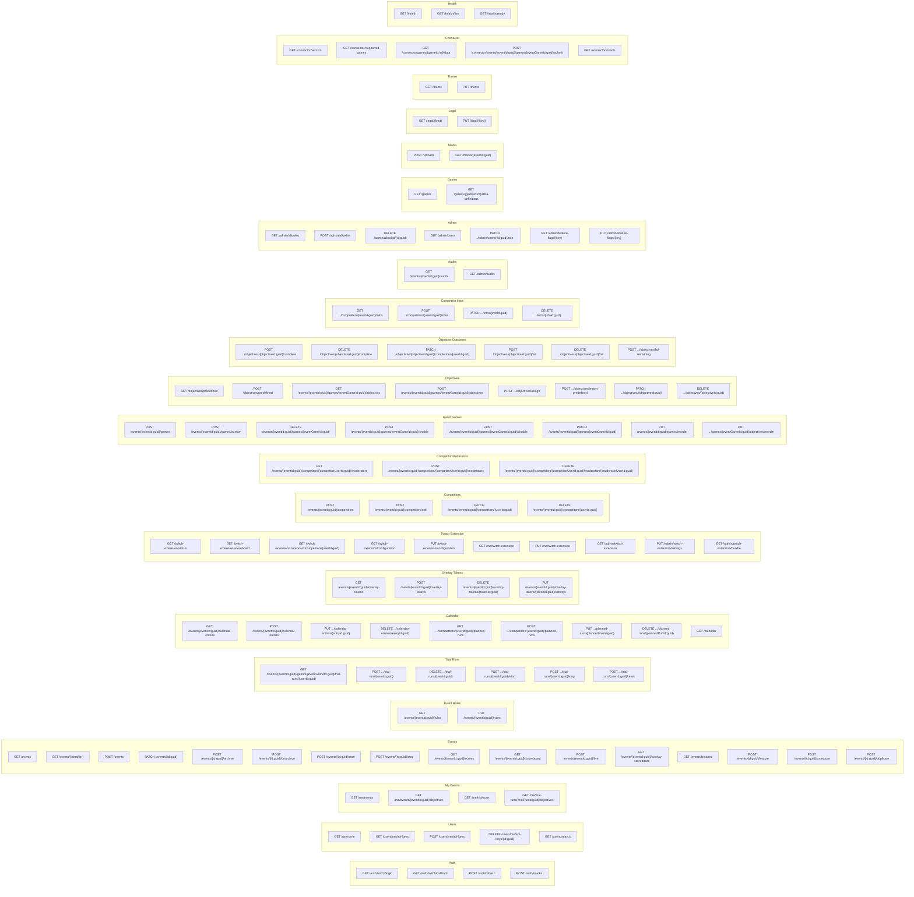

# API Reference

Application endpoints are prefixed with `/api/v1/`; health checks are not. Authentication uses either JWT bearer access tokens or API keys (`X-Api-Key` header).

**Rate Limiting (BE-025):** Any endpoint that declares its own named policy is exempt from the global fallback limiter — the two are never stacked, so a policy's number is authoritative for its endpoints. Auth endpoints (`/auth/twitch/login`, `/auth/twitch/callback`, `/auth/refresh`, `/auth/revoke`) are limited to 20 req/min, partitioned per client IP. The connector submit endpoint is limited to 120 req/min, partitioned per authenticated user. Every other endpoint falls under the global limiter: 100 req/min per authenticated user, or 60 req/min per IP for anonymous requests. All four numbers are configurable (`RateLimits:AuthPerIpPerMinute`, `RateLimits:ConnectorPerMinute`, `RateLimits:GlobalPerUserPerMinute`, `RateLimits:GlobalPerIpPerMinute`) with the values above as defaults. Exceeding any limit returns `429 Too Many Requests` with a `Retry-After` header naming the number of seconds until the window resets.

**Request Body Size:** Every request body is capped at 1 MiB by default; `POST /uploads` (≤ 5 MiB) and the connector submit endpoint (≤ ~516 KiB) override this explicitly. An oversized body returns `413 Payload Too Large`.

**Response Compression:** HTTPS responses support gzip and Brotli compression via `Accept-Encoding`.

**Unmatched Routes:** A `GET` to a path under `/api/v1/` that doesn't match any endpoint returns `404 application/problem+json` (BE-020) rather than falling through to the SPA shell. A non-`GET` request to a real route with the wrong HTTP method still gets the standard `405 Method Not Allowed`; a non-`GET` request to a path that matches no route at all also currently returns `405` rather than `404`.

## Endpoint Map



---

## Authentication Endpoints

### `GET /auth/twitch/login`
Initiates Twitch OAuth2 code flow.

| | |
|---|---|
| **Auth** | Anonymous |
| **Rate Limited** | Yes (20/min) |
| **Response** | `302` → Twitch authorization URL |

### `GET /auth/twitch/callback?code=...&state=...`
Handles Twitch OAuth callback. Exchanges code for a Twitch access token, upserts the user, and issues the refresh-token cookie.

| | |
|---|---|
| **Auth** | Anonymous |
| **Rate Limited** | Yes |
| **Response** | `302` → `/auth/callback` + sets `refresh_token` httpOnly cookie |
| **Errors** | `302` → `/auth/callback?error=access_denied` when the user cancelled on Twitch's consent screen (Twitch sends `?error=access_denied` and no `code`; the state cookie is consumed either way); `400` if the state cookie is missing or mismatched; `302` → `/auth/callback?error=twitch_unavailable` if the code exchange fails or Twitch's user-info response is unreachable, malformed, or oversized (see [Twitch client resilience](system-overview.md#security-architecture)); `302` → `/auth/callback?error=not_allowlisted&login=<login>` if the Twitch login isn't allowlisted |

### `POST /auth/refresh`
Exchanges refresh token cookie for a new access token. Rotates the refresh token.

| | |
|---|---|
| **Auth** | Anonymous (reads httpOnly cookie) |
| **Rate Limited** | Yes |
| **Response** | `200 { accessToken: string }` |
| **Errors** | `401` if cookie missing/invalid/expired/revoked |

### `POST /auth/revoke`
Revokes the current refresh token and clears the cookie.

| | |
|---|---|
| **Auth** | Anonymous (graceful if no cookie) |
| **Rate Limited** | Yes |
| **Response** | `200 OK` |

---

## User Endpoints

### `GET /users/me`
Returns the authenticated user's profile.

| | |
|---|---|
| **Auth** | Required |
| **Response** | `200 { id, twitchLogin, displayName, email?, profileImageUrl?, createdAt, role, isAllowlisted }` |

### `GET /me/events`
Returns all events involving the authenticated user, grouped into `competitor`, `delegated`, and `owned` arrays. Competitor/delegate summaries include score, rank, objective progress, and latest activity; owner summaries include competitor count and latest activity. Archived events remain visible.

| | |
|---|---|
| **Auth** | Required |
| **Response** | `200 { competitor: [...], delegated: [...], owned: [...], quickCompleteEnabled: bool }` |

### `GET /me/events/{eventId:guid}/objectives?competitorId=...`
Returns the current user's objectives grouped by event game. Delegated moderators must supply the assigned competitor's ID; other users cannot read another competitor through this endpoint.

| | |
|---|---|
| **Auth** | Required (competitor or assigned moderator) |
| **Response** | `200 { competitorId, competitorName, games: [{ gameId, gameName, objectives, isTrialActive, hasTrialRun }] }` |
| **Errors** | `403` unauthorized target; `404` event/competitor not found |

This list is official-only: a completion recorded during a trial run never appears
here. Two flags, with different jobs: `hasTrialRun` says a trial slot exists for that
game in **any** state, which is exactly when the server refuses official writes, so it
is what makes the controls read-only; `isTrialActive` narrows that to a *recording*
run, which is what decides the explanation shown (a recording run takes the tick —
go to the Trial tab; a dormant one takes nothing — start it or disable trial mode).
No trial figures are reported; those come from `GET /me/trial-runs` below.

### `GET /me/trial-runs`
Every trial run the authenticated user may see, with the progress recorded under it.
Access matches editing a competitor's info: an admin, the event owner, the
competitor themselves, or a moderator they delegated. Runs on archived events are
excluded. Runs in `NotStarted` are included — unlike the scoreboard, this is the
management surface, so an enabled-but-unstarted run has to be reachable to start it.

That rule scopes which runs this endpoint enumerates and addresses; it is **not** a
confidentiality guarantee about the figures. Trial score, counts, last-completed and
per-objective trial timestamps are all served anonymously on
`GET /events/{eventId}/scoreboard` — deliberately, since a trial run is meant to be
watchable practice, shown in amber behind a Trial badge. A rival can therefore poll the
public scoreboard and reconstruct what a competitor is practising and how fast; that is
an accepted consequence of the feature, not an oversight. Restricting it would mean
changing the scoreboard payload, not this endpoint.

| | |
|---|---|
| **Auth** | Required |
| **Response** | `200 [{ trialRunId, eventId, eventName, urlAlias?, eventGameId, gameName, isGameEnabled, competitorId, competitorName, isOwnTrial, state, startedAt?, score, completedCount, failedCount, totalObjectives, lastCompletedAt? }]` |

### `GET /me/trial-runs/{trialRunId:guid}/objectives`
A trial run's own completions and failures, in the same shape as
`GET /me/events/{eventId}/objectives` so the Trial tab can reuse the objective list.
Values here are the trial's rows, not the official ones.

| | |
|---|---|
| **Auth** | Required (admin, owner, self, or delegated moderator) |
| **Response** | `200 { competitorId, competitorName, games: [{ gameId, gameName, objectives }] }` |
| **Errors** | `403` not permitted to view this competitor's run; `404` trial run not found |

There is no trial-specific write endpoint. Completing or failing an objective inside a
trial goes through the ordinary completion endpoints, which attribute the row to
whichever run is `Running` for that competitor and game — so a client must only offer
those controls while the run is actually recording.

Because a client decides that from polled state, all four completion/failure endpoints
accept an optional `expectedTrialRunId`. When supplied, the server compares it — inside
the write transaction, against the run it actually resolved — and returns `409` rather
than writing. Without it, a run that stopped between the poll and the click would
silently land an **official** completion on the live scoreboard.

### `GET /users/me/api-keys?includeRevoked=false`
Lists API keys for the authenticated user.

| | |
|---|---|
| **Auth** | Required |
| **Query** | `includeRevoked` (default `false`, BE-035) — revoked keys are excluded unless set to `true` |
| **Response** | `200 [{ id, name, keyPrefix, createdAt, expiresAt?, lastUsedAt?, isRevoked }]` |

### `POST /users/me/api-keys`
Creates a new API key.

| | |
|---|---|
| **Auth** | Required |
| **Request** | `{ name: string (max 100), expiresAt?: DateTime }` |
| **Response** | `201 { id, name, key: "sk_...", keyPrefix, createdAt }` |
| **Errors** | `400` validation, `409` if the caller already has 10 active (un-revoked, un-expired) keys — revoke one first (BE-035) |
| **Notes** | The raw key is only returned once at creation time |

### `DELETE /users/me/api-keys/{id:guid}`
Revokes an API key (soft-delete via `isRevoked = true`).

| | |
|---|---|
| **Auth** | Required |
| **Response** | `204 No Content` |
| **Errors** | `404` if key not found or not owned |

### `GET /users/search?q=login&limit=20`
Searches users by Twitch login or display name for add-competitor and add-moderator pickers. Short queries under 2 characters return an empty list; `limit` is clamped to 1–20.

| | |
|---|---|
| **Auth** | Required |
| **Response** | `200 [{ id, twitchLogin, displayName, profileImageUrl?, isPending }]` |

---

## Event Endpoints

### `GET /events?page=1&pageSize=20&search=query&status=all`
Lists events with pagination, optional search, and optional status filtering.

| | |
|---|---|
| **Auth** | Anonymous |
| **Response** | `200 { items: EventListItemResponse[], totalCount, page, pageSize, hasNextPage, hasPreviousPage }` — `EventListItemResponse` is the list-view row shape: `{ id, name, urlAlias, description, createdById, isArchived, isStarted, isFeatured, tieBreakMode, allowTrialRuns, createdAt, updatedAt, competitorCount, gameCount }`. **Breaking (BE-019/XC-3):** items no longer carry `competitors[]`/`games[]` — fetch `GET /events/{id}` for the full graph. |
| **Pagination** | Default 20, max 100 per page |
| **Filters** | `search` matches name/description via a case-insensitive trigram-indexed `ILIKE '%…%'` (BE-019/XC-3, was `LOWER(col).Contains(...)`, a forced sequential scan). `status` may be `all`, `live`, `stopped`, `archived`, or `featured`; `includeArchived=true` includes archived rows in `all`. |
| **Archived visibility** | `status=archived`/`includeArchived=true` is honoured only for authenticated, non-archived-excluded rows the caller may see (BE-018): anonymous callers get zero archived rows regardless of these params; an authenticated non-admin gets archived rows only for events they own, compete in, or moderate; admins get every archived row. Non-archived rows are unaffected and always visible to everyone. |

### `GET /events/featured`
Returns the single currently-featured event (see `POST /events/{id:guid}/feature`), with the same shape as `GET /events/{identifier}`. Used by the public landing page for unauthenticated visitors.

| | |
|---|---|
| **Auth** | Anonymous |
| **Response** | `200 EventResponse` |
| **Errors** | `404` if no event is featured |

### `GET /events/{identifier}`
Returns a single event with competitors, games, and objectives. `identifier` may be the event UUID or its optional URL alias. Games are ordered by `SortOrder`, and each game's objectives are ordered by their own `SortOrder` — see the reorder endpoints below.

| | |
|---|---|
| **Auth** | Anonymous |
| **Response** | `200 EventResponse` |
| **Errors** | `404` — a genuinely missing id/alias, or an archived event the caller isn't a member of (BE-018: only the owner, competitors, delegated moderators, and admins may read an archived event; everyone else gets the exact same 404 a missing id would, never a 403 that would confirm the id exists) |

### `POST /events`
Creates a new event. Admin-only.

| | |
|---|---|
| **Auth** | Required (admin) |
| **Request** | `{ name: string (max 200), description: string (max 2000) }` |
| **Response** | `201 EventResponse` |
| **Errors** | `403` non-admin |

### `PATCH /events/{id:guid}`
Updates event name, description, `tieBreakMode`, `allowTrialRuns`, and/or URL alias. Sending an empty
`urlAlias` clears the alias. Aliases are globally unique lowercase slugs of 3–64
letters or numbers separated by single hyphens; UUID-shaped aliases are rejected.
`allowTrialRuns` (default `true`) gates whether new trial runs (see Trial Run Endpoints)
can be created for this event going forward — it never retroactively touches trial
rows that already exist.

| | |
|---|---|
| **Auth** | Required (owner or admin) |
| **Request** | `{ name?: string, description?: string, tieBreakMode?: string, urlAlias?: string, allowTrialRuns?: boolean }` — `tieBreakMode` is `SharedPlace` (the default for new events) or `ByTime` |
| **Response** | `200 EventResponse` |
| **Errors** | `400` invalid alias, `403` not owner/admin, `404`, `409` duplicate alias or concurrent modification |

### `POST /events/{id:guid}/archive`
Soft-deletes an event.

| | |
|---|---|
| **Auth** | Required (owner or admin) |
| **Response** | `204 No Content` |
| **Errors** | `403`, `404` |

### `POST /events/{id:guid}/unarchive`
Restores a soft-deleted event.

| | |
|---|---|
| **Auth** | Required (owner or admin) |
| **Response** | `204 No Content` |
| **Errors** | `403`, `404` |

### `POST /events/{id:guid}/start`
Marks an event as started.

| | |
|---|---|
| **Auth** | Required (owner or admin) |
| **Response** | `204 No Content` |
| **Errors** | `403`, `404` |

### `POST /events/{id:guid}/stop`
Marks an event as stopped. Rejected while any of the event's games is still enabled — disable all games first.

| | |
|---|---|
| **Auth** | Required (owner or admin) |
| **Response** | `204 No Content` |
| **Errors** | `403`, `404`, `409` (a game is still enabled) |

### `POST /events/{id:guid}/feature`
Marks an event as featured, atomically clearing the flag on whatever event was previously featured (at most one event is ever featured — DB-enforced by a partial unique index, not only by this endpoint's own logic). Admin-only. Idempotent if the event is already featured.

| | |
|---|---|
| **Auth** | Required (admin) |
| **Response** | `204 No Content` |
| **Errors** | `403` non-admin, `404`, `409` (another event was featured concurrently — retry) |

### `POST /events/{id:guid}/unfeature`
Clears the featured flag on an event. Admin-only.

| | |
|---|---|
| **Auth** | Required (admin) |
| **Response** | `204 No Content` |
| **Errors** | `403` non-admin, `404` |

### `POST /events/{id:guid}/duplicate`
Duplicates an event's configuration — games and objectives only. Admin-only, matching event creation. Works on archived source events (bypasses the `IsArchived` query filter).

Copied: `Name` (+ `" (Copy)"`), `Description`, `TieBreakMode`, `EventGames` (`KnownGameId`/custom name+description, `IsEnabled`, `SortOrder`), `Objectives` (`Name`, `Score`, `Category`, `Metadata`, `Rule`, `FailRule`, `IsPredefined`, `SortOrder`).

**Not** copied: competitors, moderators, completed/failed objectives, per-competitor game info, overlay tokens, rules, calendar entries, planned runs, audit history.

The copy starts `IsStarted = false`, `IsArchived = false`, `IsFeatured = false`, `UrlAlias = null` (aliases are unique), `CreatedById` = the caller. Every copied game starts `IsEnabled = false` — the copy has no active game until its owner enables one — so the `active-game` partial-unique-index invariant holds trivially.

| | |
|---|---|
| **Auth** | Required (admin) |
| **Response** | `201 Created` → `EventResponse` (same shape as `GET /events/{identifier}`) |
| **Errors** | `403` non-admin, `404` source not found |

### `GET /events/{eventId:guid}/scores`
Returns the summary score list for an event without per-game or per-objective breakdowns.

| | |
|---|---|
| **Auth** | Anonymous |
| **Cached** | Yes (1h, evicted on objective or live-status changes) |
| **Response** | `200 [{ userId, displayName, twitchLogin, profileImageUrl?, isLive, totalScore, completedCount, isFinished, lastCompletedAt, totalInGameTimeMs?, rank, failedCount, status, isTrialing }]` sorted and ranked according to the event tie-break mode. In `SharedPlace` mode, equal scores receive the same competition rank regardless of completion times. |

Every figure here is the official record only. `isTrialing` is a flag, not a
figure: it says the competitor has a started trial run somewhere (paused
included) so a viewer can be told the badge's story, and it is deliberately the
only trial field on this payload — the trial's own score lives on
`/scoreboard`, per game. `ScoreEntry` implements `IScoreboardSortable`, whose
surface is `TotalScore`/`TotalInGameTimeMs`/`LastCompletedAt`, so no trial value
is even reachable from the ranking code.

### `GET /events/{eventId:guid}/scoreboard`
Returns the full public scoreboard for an event, including per-game and per-objective breakdowns for every competitor.

> Renamed from `leaderboard` on 2026-09-11 — hard cutover, no alias; the old route now 404s.

| | |
|---|---|
| **Auth** | Anonymous |
| **Cached** | Yes (1h, tagged `Scoreboard`) |
| **Response** | `200 { entries: [{ userId, displayName, twitchLogin, profileImageUrl?, isLive, totalScore, completedCount, isFinished, lastCompletedAt, totalInGameTimeMs?, rank, games: [{ eventGameId, gameName, score, completedCount, totalObjectives, objectives: [{ objectiveId, name, score, category, isCompleted, completedAt, trial: TrialObjectiveState \| null }], infos: CompetitorInfoResponse[], hasDeathClip, isEnabled, isTrialActive, trial: TrialProgress \| null, hasTrialRun }] }], tieBreakMode }` |
| **Errors** | `404` if event not found |

Every figure directly on an entry — `totalScore`, `completedCount`, `failedCount`,
`isFinished`, `status`, `lastCompletedAt`, `rank` — is official-only, computed from
rows where `TrialRunId IS NULL`.

Trial/training progress is reported **beside** those figures and never
folded into them:

- `GameBreakdown.trial` — `{ trialRunId, state, score, completedCount, failedCount, lastCompletedAt }`,
  or `null`. Present once the run has started (so also while `Paused`), and present whether
  or not the game `isEnabled` — a trial is deliberately not restricted to the event's active
  game. `isTrialActive` stays narrower: it is `state === 'Running'` only.
- `ObjectiveDetail.trial` — `{ isCompleted, completedAt, isFailed, failedAt, status }`, or
  `null`. Independent of the official `isCompleted`/`isFailed` on the same objective, because
  a trial is a fresh attempt whose rows are discarded when it is reset or disabled.

There is deliberately **no** per-competitor trial total on the entry. Clients sum
`trial` across the games they are actually displaying, which is the only total that
stays correct when the visible game set is filtered (as the overlay's `games=` pin does).
Because the figures are absent from the entry, they are also absent from the interface
ranking is computed over, so trial progress cannot move a competitor's position.

`SharedPlace` uses standard competition ranking, so ties create gaps (for
example, `1, 1, 3`). Completion times remain recorded and order equal-score
entries within their shared place, which can visually imply precedence even
though their awarded rank is identical.

`score`/`completedCount` per game (and the entry's own `totalScore`/`completedCount`)
always exclude trial completions — a `TrialRunId IS NULL` filter is
applied at the query level, not just hidden client-side. `isTrialActive` is `true`
only while that competitor has a `Running` trial run for that specific game; see
Trial Run Endpoints below.

### `GET /events/{eventId:guid}/overlay-scoreboard`
Returns the scoreboard for OBS overlays together with the token's saved look, authenticated by an overlay token instead of a JWT or API key. The token can be sent as an `X-Overlay-Token` request header (preferred — never ends up in a URL, so it can't leak via logs, browser history, or a `Referer` header) or as a `?token=…` query parameter (kept for an OBS browser source, which is a bare URL and can't set headers). The header wins when both are present; both forms return an identical body for the same token.

| | |
|---|---|
| **Auth** | Overlay token required, via `X-Overlay-Token` header or `?token=` query parameter (`AllowAnonymous` only skips session/API-key auth) |
| **Cached** | Yes (5s, varies by both `token` and the `X-Overlay-Token` header, tagged `Scoreboard`) |
| **Response** | `200 { scoreboard: ScoreboardResponse, settings: OverlayTokenSettings \| null }` — `settings` is the look saved on the token (see [Overlay Token Endpoints](#overlay-token-endpoints)), null for a token that never had one, in which case the overlay's URL parameters apply. Sets `Referrer-Policy: no-referrer` (overriding the global `strict-origin-when-cross-origin`) since the query form of this URL carries a secret. |
| **Errors** | `401` for a missing, malformed, revoked, or expired token — all four return an identical body, so the endpoint is not an oracle. `404` if event not found. |
| **Notes** | One poll carries both the data and the look on purpose: a saved look rides the same per-event `Scoreboard` cache tag as a score change, so `PUT …/settings` evicts it and an OBS source already on screen follows within its refresh interval. |

### `POST /events/{eventId:guid}/live`
Sets a competitor's live status. By default this updates the authenticated competitor; admins and delegated moderators may set `?onBehalfOfUserId=` for a streamer they are allowed to act for.

| | |
|---|---|
| **Auth** | Required |
| **Request** | `{ isLive: boolean }` |
| **Response** | `204 No Content` |
| **Errors** | `403`, `404` |

---

## Event Rules Endpoints

An event's rules document — 1:1 with the event, Markdown, nullable. Rendered through the shared `renderMarkdown`/`MarkdownView` pipeline.

### `GET /events/{eventId:guid}/rules`
Gets an event's rules document.

| | |
|---|---|
| **Auth** | Anonymous |
| **Response** | `200 { content: string \| null, updatedAt: DateTime \| null }` — `content` is `null` until an owner/admin first sets it. When a document exists, the response carries an `ETag` header (the row's Postgres `xmin`) for optimistic concurrency on the next `PUT`. |
| **Errors** | `404` if event not found |

### `PUT /events/{eventId:guid}/rules`
Sets an event's rules document.

| | |
|---|---|
| **Auth** | Required (owner or admin) |
| **Request** | `{ content: string \| null }`, ≤ 64 KiB (UTF-8 byte count). An optional `If-Match` request header (the `ETag` from a prior `GET`) rejects the write with `409` if the document changed since — a missing `If-Match` behaves as last-write-wins, same as before this existed. |
| **Response** | `200 { content, updatedAt }`, with a fresh `ETag` header |
| **Errors** | `400` validation (over 64 KiB), `403`, `404`, `409` (stale `If-Match`, or a concurrent write raced this one) |
| **Notes** | The audit row records a SHA-256 digest and byte length of the document, not its full text (BE-036) — the document itself can be up to 64 KiB, and duplicating that on both sides of every edit bloated `AuditLogs` disproportionately to every other audited action. |

---

## Trial Run Endpoints

Per-competitor trial/training runs, scoped to (event, game, competitor).
At most one `TrialRun` "slot" exists per (event game, competitor); enabling creates it,
disabling deletes it outright — which cascades away every completion/failure recorded
under it. Trial completions/failures never reach official scoring, ranking, or
cross-competitor fail-rule cascades (`TrialRunId IS NULL` filter, applied
server-side); they are reported separately on the scoreboard/overlay payload (see
`GameBreakdown.trial`) and on the Trial tab (`GET /me/trial-runs`). They work whether
or not the game is the event's active (`IsEnabled`) game — that's the point, training
between matches — so the "game not enabled" `403` on the completion and failure
endpoints is skipped while the competitor has a `Running` trial for that game.

**Official progress and a trial are mutually exclusive per (event game, competitor).**
Two rules enforce it, both resolved through `TrialRunLookup` so every write surface —
manual complete/uncomplete, manual fail/reset, and the connector — answers identically:

1. Enabling or starting a trial is refused with `409` when the competitor already has
   an official completion **or failure** on that game. A practice run must not sit
   beside a real attempt. `POST .../trial-runs/{userId}` stays idempotent for a slot
   that already exists; the check only guards creating one, and `start` re-checks.
2. While a slot exists in any state other than `Running`, every official write is
   refused with `409` — including unticks and fail-resets. It is *not* silently made
   official, which was the trap: enable-but-never-start, or stop-then-keep-ticking,
   used to land straight in the real record while the UI showed a trial chip. Starting
   the run, or disabling trial mode, resolves it explicitly.

So a `Paused`, `NotStarted` or `Completed` slot blocks the game entirely: stopping a
run is not a way back to official scoring, only disabling is. Both rules run inside the
caller's transaction under the `objective-outcomes:{eventGameId}` advisory lock the
tick paths already take — without that, a tick and an enable that each read a clean
state would commit together into the state the rules forbid.

Authorization for every route below (except the anonymous `GET`) is the same as
`EventOwnership.RequireCanEditCompetitorInfoAsync`: an admin, the event owner, the
competitor themselves, or one of that competitor's delegated moderators.

### `GET /events/{eventId:guid}/games/{eventGameId:guid}/trial-runs/{userId:guid}`
Gets a competitor's trial run state for a game, if one is enabled.

| | |
|---|---|
| **Auth** | Anonymous |
| **Response** | `200 { id, eventId, eventGameId, userId, state, startedAt, endedAt }` — `state` is one of `NotStarted\|Running\|Paused\|Completed` |
| **Errors** | `404` if not enabled |

### `POST /events/{eventId:guid}/games/{eventGameId:guid}/trial-runs/{userId:guid}`
Enables trial mode for a competitor+game. Idempotent — calling it again while already
enabled returns the existing run (`200`) instead of erroring.

| | |
|---|---|
| **Auth** | Required (admin, owner, self, or delegated moderator) |
| **Response** | `201 TrialRunResponse` (first enable) or `200 TrialRunResponse` (already enabled) |
| **Errors** | `403` when `Event.AllowTrialRuns` is `false`, the event is archived, or the target user is not a competitor in this event; `404` event/game not found |

`/start` re-checks `AllowTrialRuns` and the archived flag rather than trusting that
they held when the slot was created: trial progress is rendered publicly, so a slot
that outlived the owner's switch must not be startable.

### `DELETE /events/{eventId:guid}/games/{eventGameId:guid}/trial-runs/{userId:guid}`
Disables trial mode: hard-deletes the `TrialRun` row, cascading away every
`CompletedObjective`/`FailedObjective` recorded under it — exactly this competitor's
trial data for exactly this game, nothing adjacent. Irreversible.

| | |
|---|---|
| **Auth** | Required (admin, owner, self, or delegated moderator) |
| **Response** | `204 No Content` |
| **Errors** | `403`, `404` if not enabled |

### `POST /events/{eventId:guid}/games/{eventGameId:guid}/trial-runs/{userId:guid}/start`
Starts (`NotStarted` → `Running`) or resumes (`Paused` → `Running`) a trial run. A
first start sets `startedAt`; resuming keeps the original value. Calling it while
already `Running` is a no-op (`200`).

| | |
|---|---|
| **Auth** | Required (admin, owner, self, or delegated moderator) |
| **Response** | `200 TrialRunResponse` |
| **Errors** | `403`, `404` if not enabled, `409` if the run is `Completed` (reset it first) |

### `POST /events/{eventId:guid}/games/{eventGameId:guid}/trial-runs/{userId:guid}/stop`
Pauses a running trial run (`Running` → `Paused`).

| | |
|---|---|
| **Auth** | Required (admin, owner, self, or delegated moderator) |
| **Response** | `200 TrialRunResponse` |
| **Errors** | `403`, `404` if not enabled, `409` if not currently `Running` |

### `POST /events/{eventId:guid}/games/{eventGameId:guid}/trial-runs/{userId:guid}/reset`
Resets a trial run to `NotStarted`, clearing `startedAt`/`endedAt` and deleting this
run's own recorded completions/failures — the `TrialRun` row itself is kept, so the
competitor doesn't have to re-enable to start again.

| | |
|---|---|
| **Auth** | Required (admin, owner, self, or delegated moderator) |
| **Response** | `200 TrialRunResponse` |
| **Errors** | `403`, `404` if not enabled |

---

## Calendar Endpoints

`event-calendar`: admin-authored calendar entries and competitor
planned runs, per event. `GlobalCalendarEndpoint` (T43) aggregates both across
every non-archived event for the `/calendar` page.

### `GET /events/{eventId:guid}/calendar-entries`
Lists an event's calendar entries, ordered by `startsAt`.

| | |
|---|---|
| **Auth** | Anonymous |
| **Response** | `200 CalendarEntryResponse[]` |
| **Errors** | `404` if event not found |

### `POST /events/{eventId:guid}/calendar-entries`
Creates a calendar entry.

| | |
|---|---|
| **Auth** | Required (owner or admin) |
| **Request** | `{ title, descriptionMarkdown?, startsAt, endsAt, isAllDay, isHighlighted, color, imageAssetId? }` — `title` ≤ 120 chars, `descriptionMarkdown` ≤ 64 KiB, `color` one of `CalendarEntryColor`'s six slot names; `startsAt`/`endsAt` accept a `Z` suffix, an explicit offset, or a zone-less value (interpreted as server-local) |
| **Response** | `201 CalendarEntryResponse` |
| **Errors** | `400` validation (`endsAt <= startsAt`, bad `color`, unknown `imageAssetId`, oversized fields), `403`, `404` |

### `PUT /events/{eventId:guid}/calendar-entries/{entryId:guid}`
Replaces a calendar entry's fields.

| | |
|---|---|
| **Auth** | Required (owner or admin) |
| **Request** | same shape as `POST`, plus an optional `version: number` (the `version` from a prior `CalendarEntryResponse` for this entry) — when present, rejects the write with `409` if the entry changed since; omitted, it behaves as last-write-wins, same as before this existed |
| **Response** | `200 CalendarEntryResponse` — every `CalendarEntryResponse` (list, create, update) now carries a `version: number` (the row's Postgres `xmin`), for round-tripping into a later `PUT`'s `version` field |
| **Errors** | `400`, `403`, `404`, `409` (stale `version`, or a concurrent write raced this one) |

### `DELETE /events/{eventId:guid}/calendar-entries/{entryId:guid}`
Hard-deletes a calendar entry.

| | |
|---|---|
| **Auth** | Required (owner or admin) |
| **Response** | `204 No Content` |
| **Errors** | `403`, `404` |

Planned runs are a competitor's own scheduled play sessions, several per
competitor. Authorization mirrors `EventOwnership.RequireCanEditCompetitorInfoAsync`:
an admin, the event owner, the competitor themselves, or one of that
competitor's delegated moderators.

### `GET /events/{eventId:guid}/competitors/{userId:guid}/planned-runs`
Lists a competitor's planned runs for an event, ordered by `startsAt`.

| | |
|---|---|
| **Auth** | Anonymous |
| **Response** | `200 PlannedRunResponse[]` |
| **Errors** | `404` if event not found |

### `POST /events/{eventId:guid}/competitors/{userId:guid}/planned-runs`
Adds a planned run.

| | |
|---|---|
| **Auth** | Required (admin, owner, self, or delegated moderator) |
| **Request** | `{ eventGameId, startsAt, endsAt }` — `startsAt`/`endsAt` accept a `Z` suffix, an explicit offset, or a zone-less value (interpreted as server-local) |
| **Response** | `201 PlannedRunResponse` |
| **Errors** | `400` (`endsAt <= startsAt`), `403`, `404` (event/game not found, or target not a competitor) |

### `PUT /events/{eventId:guid}/competitors/{userId:guid}/planned-runs/{plannedRunId:guid}`
Updates a planned run's schedule.

| | |
|---|---|
| **Auth** | Required (admin, owner, self, or delegated moderator) |
| **Request** | `{ startsAt, endsAt }` |
| **Response** | `200 PlannedRunResponse` |
| **Errors** | `400`, `403`, `404` |

### `DELETE /events/{eventId:guid}/competitors/{userId:guid}/planned-runs/{plannedRunId:guid}`
Removes a planned run.

| | |
|---|---|
| **Auth** | Required (admin, owner, self, or delegated moderator) |
| **Response** | `204 No Content` |
| **Errors** | `403`, `404` |

### `GET /calendar`
Aggregates every non-archived event's calendar entries and planned runs, within
a bounded date window, for the global `/calendar` page. Archived events are
excluded automatically — `Event` carries a global query filter on
`IsArchived`, and both `CalendarEntry` and `PlannedRun` have a required
navigation to it, so EF propagates the filter into this query without any
extra condition in the endpoint.

| | |
|---|---|
| **Auth** | Anonymous |
| **Request** | `from`/`to` (ISO-8601, optional) — default to `[today − 7 days, today + 60 days]`; the window must be 400 days or narrower. Entries/planned runs are matched by overlap (`StartsAt < to && EndsAt > from`), so one spanning a window boundary is still included. |
| **Response** | `200 { entries: GlobalCalendarEntryResponse[], plannedRuns: GlobalPlannedRunResponse[], truncated: boolean }` — each planned run carries `eventName`/`gameName`/`competitorName` pre-joined, rendered client-side as "Event name · competitor · time". `truncated` is `true` when either collection hit its 2,000-item cap for the window. Calendar entries in this list carry their `descriptionMarkdown` (there is no single-entry `GET`; the per-event list at `GET /events/{eventId}/calendar-entries` is the other way to read them). Output-cached for 60 seconds per `from`/`to` pair, evicted on any calendar entry or planned run write. |
| **Errors** | `400` `ValidationProblem` when `to` is not after `from`, or the window exceeds 400 days |

---

## Overlay Token Endpoints

Overlay tokens are event-scoped credentials intended for OBS/browser-source scoreboard overlays. Owners/admins can list, edit or revoke any token for the event; competitors can list, edit and revoke only tokens they created. The raw token is only returned once at creation time.

A token carries an optional saved **look** — `OverlayTokenSettings` — which the OBS source reads on every poll (see `GET …/overlay-scoreboard`) and which wins over the overlay URL's parameters for every knob it carries, so a change reaches a source already on screen without its URL being re-pasted. Its shape mirrors the overlay's query-string knobs ([streamer-overlay.md](streamer-overlay.md)); the page background (`bg`) is deliberately not part of it:

```
{
  view: "objectives" | "scores" | "games",
  theme: "dark" | "light",
  gameIds: uuid[] | null,      // event-game ids; null = every game
  playerIds: uuid[] | null,    // competitor user ids; null = everyone
  pageSize: 1–50,
  cycleSeconds: 0–600,
  refreshSeconds: 2–120,
  showTitle, showProgress, showPagination, highlight, animate: boolean,
  highlightSeconds: 1–60,
  panelOpacity: 0–100,
  title: string (max 100) | null
}
```

Validation (`400`, keyed by field name): unknown `view`/`theme`, any number outside its range, an overlong title, a `gameIds` entry that is not one of the event's games, or a `playerIds` entry that is not a competitor in the event. An empty pin list is stored as `null`; a blank title as `null`, trimmed otherwise. Wire casing is camelCase; the stored document is the same JSON.

### `GET /events/{eventId:guid}/overlay-tokens`
Lists active overlay tokens visible to the caller.

| | |
|---|---|
| **Auth** | Required (owner/admin or event competitor) |
| **Response** | `200 [{ id, name, tokenPrefix, createdById, createdAt, lastUsedAt?, expiresAt?, settings }]` — `settings` is the saved look or null |
| **Errors** | `403`, `404` |

### `POST /events/{eventId:guid}/overlay-tokens`
Creates a new overlay token, expiring 90 days from creation, optionally with its look.

| | |
|---|---|
| **Auth** | Required (owner/admin or event competitor) |
| **Request** | `{ name: string (max 100), settings?: OverlayTokenSettings \| null }` |
| **Response** | `201 { id, name, token, tokenPrefix, createdAt, expiresAt, settings }` |
| **Notes** | `token` is the full raw overlay credential and is never returned again; later list responses expose only `tokenPrefix`. `expiresAt` is null only for tokens minted before expiry was introduced — they never expire. An invalid `settings` fails the whole request; nothing is minted. |
| **Errors** | `400` validation, `403`, `404` |

### `PUT /events/{eventId:guid}/overlay-tokens/{tokenId:guid}/settings`
Saves the token's look. Any OBS source already polling with the token follows within its refresh interval.

| | |
|---|---|
| **Auth** | Required (owner/admin, or token creator) |
| **Request** | `OverlayTokenSettings` (every field) |
| **Response** | `200` the token as in the list response, with the saved `settings` |
| **Side effects** | Audit `overlay_token.settings_updated` (before/after); evicts the event's `Scoreboard` cache tag so the next overlay poll is served fresh |
| **Errors** | `400` validation, `403`, `404` (unknown or revoked token) |

### `DELETE /events/{eventId:guid}/overlay-tokens/{tokenId:guid}`
Revokes an overlay token.

| | |
|---|---|
| **Auth** | Required (owner/admin, or token creator) |
| **Response** | `204 No Content` |
| **Errors** | `403`, `404` |

---

## Twitch Extension Endpoints

The backend of the Twitch extension ([twitch-extension.md](twitch-extension.md)). Everything under `/twitch-extension` (except `status`) authenticates with the JWT Twitch issues to a viewer of the extension, sent as `Authorization: Bearer …` and verified under the dedicated `TwitchExtension` scheme (HS256 over the base64-decoded extension secret). The channel is always the token's `channel_id` claim. The group has its own CORS policy (the extension's `https://<clientId>.ext-twitch.tv` origin) and rate-limit policy (`twitch-extension`, 40/min per viewer by default). When no client id and secret are configured only `status` is mapped; the others 404.

Shared shapes:

```
TwitchExtensionSettings   { eventId: guid|null, defaultScope: "AllGames"|"ActiveGame"|"PinnedGame", pinnedEventGameId: guid|null, highlightChannelCompetitor, showTrialProgress }
TwitchExtensionPolicy     { allowChannelEventChoice, allowViewerScopeSwitch, defaultScope: "AllGames"|"ActiveGame", defaultHighlightChannelCompetitor, defaultShowTrialProgress }
TwitchExtensionEvent      { id, name, urlAlias?, isStarted, isFeatured, tieBreakMode, activeEventGameId?, source: "None"|"Featured"|"Explicit" }
TwitchExtensionConfiguration { channelId, linkedUser: { id, displayName, twitchLogin }|null, policy: TwitchExtensionPolicy, settings, resolvedEvent: TwitchExtensionEvent|null,
                               events: [{ id, name, isStarted, isFeatured, isCompetitor, games: [{ eventGameId, name, isEnabled }] }] }
```

`eventId: null` means "follow the featured event". `linkedUser` is the Soulsjwa account signed in with the channel's Twitch account, which saving requires. `policy` is the admin-set, extension-wide rule set (see [Admin Twitch extension endpoints](#twitch-extension-admin-endpoints)); a channel without a saved row reports `settings` filled from the policy's defaults, and `settings.eventId` is always `null` while `allowChannelEventChoice` is `false`.

### `GET /twitch-extension/status`
Whether this server backs an extension, so the web app can show or hide its card.

| | |
|---|---|
| **Auth** | Anonymous |
| **Response** | `200 { configured: boolean, clientId: string|null }` |

### `GET /twitch-extension/scoreboard`
The board the calling viewer's channel shows: the broadcaster's explicit pick if it exists and is not archived, else the featured event, else nothing. A slim projection of the scoreboard (no objectives) so every viewer can poll it.

| | |
|---|---|
| **Auth** | Twitch extension token (any role) |
| **Cached** | Yes (5s per channel, keyed on the verified `channel_id`; tagged with the channel, the shown event's `Scoreboard` tag and the extension-wide `twitch-extension` tag). Strong `ETag`; `If-None-Match` → `304`. |
| **Response** | `200 { channelId, policy: TwitchExtensionPolicy, settings, event: TwitchExtensionEvent|null, channelCompetitorUserId?, games: [{ eventGameId, name, isEnabled, sortOrder, totalObjectives }], entries: [{ userId, displayName, twitchLogin, profileImageUrl?, isLive, rank, totalScore, completedCount, failedCount, isFinished, status, lastCompletedAt?, totalInGameTimeMs?, games: [{ eventGameId, score, completedCount, failedCount, lastCompletedAt?, isTrialActive, trial? }] }] }` — `event: null` with empty lists when the channel has nothing to show. |
| **Errors** | `401` |

### `GET /twitch-extension/scoreboard/competitors/{userId:guid}`
One competitor's objectives in the channel's event, for the expanded row.

| | |
|---|---|
| **Auth** | Twitch extension token (any role) |
| **Cached** | Same policy as the scoreboard |
| **Response** | `200 { userId, displayName, games: [{ eventGameId, gameName, isEnabled, isTrialActive, objectives: ObjectiveDetail[] }] }` |
| **Errors** | `401`, `404` when the channel shows no event or the user is not a competitor in it |

### `GET /twitch-extension/configuration`
The channel's settings and the events the broadcaster can pick from (newest 50, featured and started first).

| | |
|---|---|
| **Auth** | Twitch extension token with `role = broadcaster` |
| **Response** | `200 TwitchExtensionConfiguration` |
| **Errors** | `401`, `403` |

### `PUT /twitch-extension/configuration`
Saves the channel's settings. A pinned game must belong to the event the channel will show (the pick, or the featured event); any other scope drops the pin.

| | |
|---|---|
| **Auth** | Twitch extension token with `role = broadcaster`, and the channel's Twitch account must have signed in to Soulsjwa |
| **Request** | `{ eventId: guid|null, defaultScope, pinnedEventGameId: guid|null, highlightChannelCompetitor?: boolean, showTrialProgress?: boolean }` |
| **Response** | `200 TwitchExtensionConfiguration`. Evicts the channel's cache, writes a `twitch_extension.configuration_updated` audit row and pushes a `configuration` ping to the channel. |
| **Errors** | `400` validation (`EventId` — also when an admin has locked every channel to the featured event —, `DefaultScope`, `PinnedEventGameId`), `401`, `403` (viewer token, or no linked account), `409` concurrent edit |

### `GET /me/twitch-extension` / `PUT /me/twitch-extension`
The signed-in user's own channel (their Twitch id), for the web app's Broadcast tab. Same request and response shapes and rules as the two configuration routes above.

| | |
|---|---|
| **Auth** | Required (session JWT or API key) |
| **Errors** | `400` validation, `409` concurrent edit |

### Twitch extension admin endpoints

The admin area's **Twitch extension** tab. All three require the `Admin` role.

#### `GET /admin/twitch-extension`
Server status, the extension-wide rules and whether the built bundle is present.

| | |
|---|---|
| **Auth** | Admin |
| **Response** | `200 { configured, clientId, canPush, extensionOrigin, localTestOrigin, bundle: { available, fileCount, apiUrl }, settings: TwitchExtensionPolicy, updatedAt, updatedById }`. `ETag` of the settings row once one exists. |
| **Errors** | `403` non-admin |

#### `PUT /admin/twitch-extension/settings`
Saves the extension-wide rules (creates the singleton row on first save).

| | |
|---|---|
| **Auth** | Admin |
| **Request** | `{ allowChannelEventChoice, allowViewerScopeSwitch, defaultScope: "AllGames"|"ActiveGame", defaultHighlightChannelCompetitor, defaultShowTrialProgress }`, optional `If-Match` |
| **Response** | `200` same shape as `GET`. Writes a `twitch_extension.settings_updated` audit row with before/after snapshots and evicts every cached extension response. |
| **Errors** | `400` validation (`DefaultScope` — `PinnedGame` is not a global default), `403` non-admin, `409` concurrent edit |

#### `GET /admin/twitch-extension/bundle`
The zip to upload to the Twitch developer console, assembled from the built extension pages (`TwitchExtension:BundlePath`) with `extension-config.js` rewritten to this deployment's origin (`TwitchExtension:ApiUrl`, default `Frontend:Url`).

| | |
|---|---|
| **Auth** | Admin |
| **Response** | `200 application/zip` as `soulsjwa-twitch-extension.zip` |
| **Errors** | `403` non-admin, `404` when the built pages are not on disk |

---

## Competitor Endpoints

### `POST /events/{eventId:guid}/competitors`
Adds a user as a competitor to an event. Owners can pass an existing user id or a Twitch login; a Twitch login that matches no existing user creates a pending placeholder user and allowlist entry — this grants the handle the ability to sign in, so it's restricted to admins (a non-admin owner inviting an unknown handle gets `403`; they can still invite by `userId` or by the login of a user who already exists). Set `isStreamer: true` when the competitor streams and needs moderator delegation. The placeholder/allowlist creation, competitor row, and audit entries all commit atomically; a concurrent invite of the same brand-new handle resolves to the winner's row instead of erroring.

| | |
|---|---|
| **Auth** | Required (owner or admin; admin-only when `twitchLogin` doesn't match an existing user) |
| **Request** | `{ userId?: guid, twitchLogin?: string, isStreamer?: boolean }` |
| **Response** | `201 Created` |
| **Errors** | `403` (not owner/admin, or a non-admin owner inviting an unknown handle), `404`, `409` (already added, including the concurrent-invite race resolving to "already added") |

Adding, self-joining and removing a competitor all evict `CacheTags.Scoreboard`:
the roster decides which entries the scoreboard has rows for at all, and therefore
everyone's rank, so without it the public scoreboard, `/scores` and the overlay served
the old roster for up to the cache policy's hour. `PATCH` does not, since `isStreamer`
appears on no scoreboard payload.

Note that removing a competitor deletes only their `EventCompetitor` row — there is no
FK from `CompletedObjectives`/`FailedObjectives`/`TrialRuns` to it, so their outcome
rows and any trial run survive, and re-adding them restores the score and the trial
progress they had. The scoreboard omits a non-competitor entirely, and
`competitorCompletions` counts only enrolled competitors (both the cascade evaluator
and the connector filter by enrolment), so a departed competitor's rows affect nobody
while they are out.

### `POST /events/{eventId:guid}/competitors/self`
Adds the authenticated user as a competitor.

| | |
|---|---|
| **Auth** | Required |
| **Response** | `201 Created` |
| **Errors** | `404`, `409` (already joined, or the event has started — ask the owner to add you instead) |

### `PATCH /events/{eventId:guid}/competitors/{userId:guid}`
Updates whether a competitor is marked as a streamer. Turning this off revokes their delegated moderators for the event.

| | |
|---|---|
| **Auth** | Required (owner or admin) |
| **Request** | `{ isStreamer: boolean }` |
| **Response** | `204 No Content` |
| **Errors** | `403`, `404` |

### `DELETE /events/{eventId:guid}/competitors/{userId:guid}`
Removes a competitor from an event.

| | |
|---|---|
| **Auth** | Required (owner or admin) |
| **Response** | `204 No Content` |
| **Errors** | `403`, `404` |

---

## Event Game Endpoints

### `POST /events/{eventId:guid}/games`
Adds a predefined game to an event. The same catalog game may be added multiple times with different display names. Assigned the next `SortOrder` in the event. Blocked while the event is running.

| | |
|---|---|
| **Auth** | Required (owner or admin) |
| **Request** | `{ gameId: int, name?: string, description?: string }` |
| **Response** | `201 { id: guid }` |
| **Errors** | `403`, `404` (event/game not found), `409` (event is running), `400` (validation) |

### `POST /events/{eventId:guid}/games/custom`
Adds a custom (per-event) game. Assigned the next `SortOrder` in the event. Blocked while the event is running.

| | |
|---|---|
| **Auth** | Required (owner or admin) |
| **Request** | `{ name: string, description?: string }` |
| **Response** | `201 { id: guid }` |
| **Errors** | `403`, `404` (event not found), `409` (event is running), `400` (validation) |

### `DELETE /events/{eventId:guid}/games/{eventGameId:guid}`
Removes a game (predefined or custom) from an event by its EventGame UUID. Blocked while the event is running.

| | |
|---|---|
| **Auth** | Required (owner or admin) |
| **Response** | `204 No Content` |
| **Errors** | `403`, `404`, `409` (event is running) |

### `POST /events/{eventId:guid}/games/{eventGameId:guid}/enable`
Sets this event-game as the event's single active game — enabling is "set active", not "add to set": every other game in the event is disabled first (its own statement, ordered before the set — the partial unique index is checked per-statement, not at commit), then this one is enabled, both in one transaction. Only allowed while the event is running. A partial unique index on `EventGames(EventId) WHERE "IsEnabled"` enforces at most one enabled game per event at the database level; a concurrent enable of a different game in the same event that loses the race gets `409`, not a `500`.

| | |
|---|---|
| **Auth** | Required (owner or admin) |
| **Response** | `200 [{ eventGameId, knownGameId, gameName, knownGameName, connectorSupported, requiredConnectorVersion, isCustomGame, isEnabled, customGameDescription, objectives }]` — the event's games, reflecting the new active game |
| **Errors** | `403`, `404`, `409` (event is not running, or another game was enabled concurrently — retry) |

### `POST /events/{eventId:guid}/games/{eventGameId:guid}/disable`
Disables an event-game so completions and connector submissions are blocked for it. Allowed at any time, including so owners can satisfy the "no enabled games" precondition for stopping the event.

| | |
|---|---|
| **Auth** | Required (owner or admin) |
| **Response** | `204 No Content` |
| **Errors** | `403`, `404` |

### `PATCH /events/{eventId:guid}/games/{eventGameId:guid}`
Updates an event-game's display name/description. Fields omitted (null) are left unchanged. For `name`: an empty string reverts a predefined game's display to its catalog name (`CustomGameName = null`), but is rejected as a validation error for a custom game (name is required). For `description`: an empty string clears it.

| | |
|---|---|
| **Auth** | Required (owner or admin) |
| **Request** | `{ name?: string, description?: string }` |
| **Response** | `204 No Content` |
| **Errors** | `403`, `404`, `400` (validation, e.g. clearing a custom game's name), `409` (concurrent modification) |

### `PUT /events/{eventId:guid}/games/reorder`
Sets the display order of games within an event. The request must contain exactly the event's current game IDs (no missing, extra, or duplicate IDs) — each game's `SortOrder` is set to its index in the list.

| | |
|---|---|
| **Auth** | Required (owner or admin) |
| **Request** | `{ eventGameIds: guid[] }` |
| **Response** | `204 No Content` |
| **Errors** | `403`, `404`, `400` (ID set mismatch) |

### `PUT /events/{eventId:guid}/games/{eventGameId:guid}/objectives/reorder`
Sets the display order of objectives within a game. The request must contain exactly the event-game's current objective IDs (no missing, extra, or duplicate IDs) — each objective's `SortOrder` is set to its index in the list. A single flat list covers both objective-category order and objective order within a category; the backend has no notion of categories here — the frontend submits the full flattened order.

| | |
|---|---|
| **Auth** | Required (owner or admin) |
| **Request** | `{ objectiveIds: guid[] }` |
| **Response** | `204 No Content` |
| **Errors** | `403`, `404`, `400` (ID set mismatch) |

---

## Competitor Moderator Endpoints

Competitors marked as streamers may independently delegate moderators that can complete objectives on their behalf for that event.

### `GET /events/{eventId:guid}/competitors/{competitorUserId:guid}/moderators`
Lists the moderators delegated by this streamer competitor for this event.

| | |
|---|---|
| **Auth** | Public |
| **Response** | `200 [{ userId, displayName, addedAt }]` |
| **Errors** | `404` (streamer competitor not in event) |

### `POST /events/{eventId:guid}/competitors/{competitorUserId:guid}/moderators`
Delegates a user to mark objectives complete on the streamer competitor's behalf for this event.

| | |
|---|---|
| **Auth** | Required (that competitor or admin) |
| **Request** | `{ userId: guid }` |
| **Response** | `201 { userId, displayName, addedAt }` |
| **Errors** | `403`, `404`, `409` (already delegated / moderator not allowlisted) |

### `DELETE /events/{eventId:guid}/competitors/{competitorUserId:guid}/moderators/{moderatorUserId:guid}`
Revokes a moderator delegation.

| | |
|---|---|
| **Auth** | Required (that competitor or admin) |
| **Response** | `204 No Content` |
| **Errors** | `403`, `404` |

---

## Admin Endpoints

### `GET /admin/feature-flags/{key}`
Returns a runtime feature flag. The supported key for the My Events dashboard is `myevents.quick_complete.enabled`.

| | |
|---|---|
| **Auth** | Admin |
| **Response** | `200 { key, enabled }` |
| **Errors** | `403` non-admin; `404` unknown key |

### `PUT /admin/feature-flags/{key}`
Updates a runtime feature flag without a deployment. Changes are persisted and audited.

| | |
|---|---|
| **Auth** | Admin |
| **Request** | `{ enabled: bool }` |
| **Response** | `200 { key, enabled }` |
| **Errors** | `403` non-admin; `404` unknown key |

### `GET /admin/allowlist`
Lists all allowlisted Twitch logins.

| | |
|---|---|
| **Auth** | Required (admin) |
| **Response** | `200 [AllowlistEntry]` |

### `POST /admin/allowlist`
Adds a Twitch login to the allowlist. Lowercased server-side.

| | |
|---|---|
| **Auth** | Required (admin) |
| **Request** | `{ twitchLogin: string, note?: string }` |
| **Response** | `201 AllowlistEntry` |
| **Errors** | `409` (duplicate) |

### `DELETE /admin/allowlist/{id:guid}`
Removes an allowlist entry. If a user with that Twitch login already signed up, clears their `IsAllowlisted` flag and revokes all of their refresh tokens.

| | |
|---|---|
| **Auth** | Required (admin) |
| **Response** | `204 No Content` |
| **Errors** | `404` |

### `GET /admin/users?page=1&pageSize=20&search=login`
Paginated list of all users.

| | |
|---|---|
| **Auth** | Required (admin) |
| **Response** | `200 PaginatedResponse<AdminUserSummary>` |

### `PATCH /admin/users/{id:guid}/role`
Sets a user's role.

| | |
|---|---|
| **Auth** | Required (admin) |
| **Request** | `{ role: "User" \| "Admin" }` |
| **Response** | `200 AdminUserSummary` |
| **Errors** | `400` (invalid role), `404`, `409` (demoting the last remaining admin) |

### `GET /admin/audits?page=1&pageSize=20&type=...`
Lists all audit entries, including non-event-scoped admin actions. Supports optional filters and, alongside `page`/`pageSize`, keyset pagination via `cursor` (see the Audit Endpoints section below for the full pagination contract).

| | |
|---|---|
| **Auth** | Required (admin) |
| **Query** | `page`, `pageSize` (`10`, `20`, `30`, `40`, `50`; invalid values fall back to 20), `cursor`, `includeTotal`, `type[]`, `eventId`, `actorUserId`, `subjectUserId`, `eventGameId`, `objectiveId`, `from`, `to` |
| **Response** | `200 PaginatedResponse<AuditLogResponse>` |
| **Errors** | `400` (`page` beyond 100, or an invalid `cursor`), `403` |

---

## Audit Endpoints

Audit endpoints return `PaginatedResponse<AuditLogResponse>` where each item is `{ id, type, eventId?, eventGameId?, objectiveId?, actor, subject?, beforeJson?, afterJson?, reason?, createdAt }`. `actor` and `subject` use `{ id, displayName, twitchLogin }` summaries. Multi-value `type` filters are supplied as repeated query parameters such as `?type=ObjectiveCompleted&type=CompetitorAdded`.

**Pagination (BE-026):** both endpoints support offset (`page`/`pageSize`) and keyset (`cursor`) pagination side by side. Offset pages are capped at `page=100`; beyond that, `400` directs the caller to switch to `cursor`. A response's `nextCursor` (present whenever a full page was returned) can be passed back as the `cursor` query param to fetch the next page at constant cost regardless of depth — pass it instead of incrementing `page`. `totalCount` is populated by default on offset pages and omitted (`null`) by default on cursor pages, since computing it would defeat the point of avoiding `OFFSET`/`COUNT` on a large table; pass `includeTotal=true` or `includeTotal=false` to override either default explicitly.

### `GET /events/{eventId:guid}/audits?page=1&pageSize=20&type=...`
Lists audit entries for a single event.

| | |
|---|---|
| **Auth** | Required (admin, event owner, event competitor, or delegated moderator in the event) |
| **Query** | `page`, `pageSize` (`10`, `20`, `30`, `40`, `50`; invalid values fall back to 20), `cursor`, `includeTotal`, `type[]`, `actorUserId`, `subjectUserId`, `eventGameId`, `objectiveId`, `from`, `to` |
| **Response** | `200 PaginatedResponse<AuditLogResponse>` |
| **Errors** | `400` (`page` beyond 100, or an invalid `cursor`), `403`, `404` |

### `GET /admin/audits?page=1&pageSize=20&type=...`
Admin-only cross-event audit log. Also accepts `eventId` to filter to one event.

| | |
|---|---|
| **Auth** | Required (admin) |
| **Query** | `page`, `pageSize`, `cursor`, `includeTotal`, `type[]`, `eventId`, `actorUserId`, `subjectUserId`, `eventGameId`, `objectiveId`, `from`, `to` |
| **Response** | `200 PaginatedResponse<AuditLogResponse>` |
| **Errors** | `400` (`page` beyond 100, or an invalid `cursor`), `403` |

---

## Objective Endpoints

### `GET /objectives/predefined?gameId=7`
Lists predefined objectives for a game.

| | |
|---|---|
| **Auth** | Anonymous |
| **Query** | `gameId` (optional filter) |
| **Response** | `200 [{ id, gameId, name, score, metadata?, rule?, failRule? }]` — with `gameId`, the full set for that game; without it, capped at 2,000 rows (BE-030/XC-3 — the catalog is hand-curated and never realistically approaches that) |
| **Caching** | Output-cached 24h, tagged per `gameId` (or a separate tag for the unfiltered fetch) and evicted by `POST /objectives/predefined` for the affected game |

### `POST /objectives/predefined`
Creates a new predefined objective.

| | |
|---|---|
| **Auth** | Required (admin) |
| **Request** | `{ gameId, name, score, metadata?, rule?, failRule? }`. `metadata` must be valid JSON if present; `rule`/`failRule` must be a well-formed JSON object, ≤ 32 KiB, and evaluable (a rule that throws during evaluation is rejected; one that merely never matches is accepted) |
| **Response** | `201 { id, gameId, name, score, metadata?, rule?, failRule? }` |
| **Errors** | `400` (validation, including invalid `metadata`/`rule`/`failRule`), `403`, `404` (game not found) |

### `GET /events/{eventId:guid}/games/{eventGameId:guid}/objectives`
Lists objectives for a specific event-game.

| | |
|---|---|
| **Auth** | Anonymous |
| **Response** | `200 ObjectiveResponse[]` |

### `POST /events/{eventId:guid}/games/{eventGameId:guid}/objectives`
Creates a custom objective for an event-game.

| | |
|---|---|
| **Auth** | Required (owner or admin) |
| **Request** | `{ name, score, metadata?, rule?, failRule? }` — same `metadata`/`rule`/`failRule` validation as `POST /objectives/predefined` |
| **Response** | `201 ObjectiveResponse` |
| **Errors** | `400` (validation, including invalid `metadata`/`rule`/`failRule`), `403`, `404` |

### `POST /events/{eventId:guid}/games/{eventGameId:guid}/objectives/assign`
Copies a predefined objective into an event-game.

| | |
|---|---|
| **Auth** | Required (owner or admin) |
| **Request** | `{ objectiveId: guid }` |
| **Response** | `201 ObjectiveResponse` |

### `POST /events/{eventId:guid}/games/{eventGameId:guid}/objectives/import-predefined`
Imports predefined objectives for the game into this event. When the body's `objectiveIds` is `null`/omitted/empty, **every** predefined objective for the game is imported. When `objectiveIds` is provided, only those specific predefined objectives are imported. Idempotent: objectives whose name already exists on the event-game are skipped.

| | |
|---|---|
| **Auth** | Required (owner or admin) |
| **Request** | `{ objectiveIds?: guid[] }` (body optional) |
| **Response** | `200 { importedCount: int, skippedCount: int }` |
| **Errors** | `404` (game not in event, or no predefined objectives match), `403` |

### `PATCH /events/{eventId:guid}/games/{eventGameId:guid}/objectives/{objectiveId:guid}`
Updates an objective.

| | |
|---|---|
| **Auth** | Required (owner or admin) |
| **Request** | `{ name?, score?, metadata?, rule?, failRule? }`; send `null` to clear either rule; same `metadata`/`rule`/`failRule` validation as `POST /objectives/predefined` |
| **Response** | `200 ObjectiveResponse` |
| **Errors** | `400` (validation, including invalid `metadata`/`rule`/`failRule`), `403`, `404`, `409` (concurrent modification) |

### `DELETE /events/{eventId:guid}/games/{eventGameId:guid}/objectives/{objectiveId:guid}`
Deletes an objective and cascades any completions for that objective.

| | |
|---|---|
| **Auth** | Required (owner or admin) |
| **Response** | `204 No Content` |
| **Errors** | `403`, `404` |

---

## Completed Objective Endpoints

### `POST /events/{eventId:guid}/games/{eventGameId:guid}/objectives/{objectiveId:guid}/complete?onBehalfOfUserId={userId:guid}`
Marks an objective as completed. When `onBehalfOfUserId` is omitted, completes for the caller. When set, completes on behalf of the named streamer competitor — caller must be an admin or a moderator that competitor delegated for this event.

| | |
|---|---|
| **Auth** | Required. Self-complete: caller must be a competitor. On-behalf-of: caller must be admin OR a moderator delegated by the target competitor for this event; target must be a competitor marked as streamer. |
| **Response** | `201 Created` |
| **Errors** | `403` (permission / target not marked as streamer / not a competitor / event not started / game not enabled), `404`, `409` (already completed) |

The "game not enabled" `403` is skipped while the target competitor has a `Running`
trial run for this game — a trial is playable on a game that isn't the
event's active one, and the row is then attributed to that run. The check is evaluated
inside the write transaction against the same trial id the insert uses, so a run
stopping mid-request cannot land an official completion on a disabled game. Pass
`expectedTrialRunId` to have the server refuse with `409` when a different run (or
none) is recording by the time the write lands.

### `DELETE /events/{eventId:guid}/games/{eventGameId:guid}/objectives/{objectiveId:guid}/complete?onBehalfOfUserId={userId:guid}`
Removes a completion record. Same authorization rules as the POST variant above.

| | |
|---|---|
| **Auth** | Required (see above) |
| **Response** | `204 No Content` |
| **Errors** | `403` (permission / event not started / game not enabled), `404` |

Also skips the "game not enabled" `403` during a `Running` trial, and removes the
trial's own row rather than the banked official one — otherwise practising could not
be undone without erasing real score.

### `PATCH /events/{eventId:guid}/games/{eventGameId:guid}/objectives/{objectiveId:guid}/completions/{userId:guid}`
Edits the wall-clock completion time for an existing completion. This is for corrections by event operators; in-game time is not editable. Scoreboard caches are evicted so ranks recompute on the next read.

| | |
|---|---|
| **Auth** | Required (owner/admin only) |
| **Request** | `{ completedAt: DateTimeOffset, reason: string (required, max 2000) }` — accepts a `Z` suffix, an explicit offset, or a zone-less value (interpreted as server-local); an offset form is converted to the exact UTC instant, not relabeled |
| **Response** | `200 { objectiveId, userId, completedAt }` |
| **Errors** | `400` validation, `403`, `404` |

### `POST /events/{eventId:guid}/games/{eventGameId:guid}/objectives/{objectiveId:guid}/fail?onBehalfOfUserId={userId:guid}`
Marks a pending objective failed. Authorization and event/game lifecycle rules match manual completion. A completed objective must be uncompleted before it can be failed.

| | |
|---|---|
| **Auth** | Required (same self/on-behalf-of rules as completion) |
| **Response** | `201 Created` |
| **Errors** | `403`, `404`, `409` (already completed or failed) |

### `DELETE /events/{eventId:guid}/games/{eventGameId:guid}/objectives/{objectiveId:guid}/fail?onBehalfOfUserId={userId:guid}`
Removes a failure and returns the objective to pending.

| | |
|---|---|
| **Auth** | Required (same self/on-behalf-of rules as completion) |
| **Response** | `204 No Content` |
| **Errors** | `403`, `404` |

### `POST /events/{eventId:guid}/games/{eventGameId:guid}/objectives/fail-remaining?onBehalfOfUserId={userId:guid}&expectedTrialRunId={trialRunId:guid}`
Marks every objective of the game still pending for the target competitor failed, in one transaction under the game's outcome lock — the end of a run (a death in a no-death run) recorded in one call, so the competitor's outcome for the game is terminal and the scoreboards, overlay and Twitch extension show them finished. Objectives already completed or already failed are left alone rather than conflicting, so the call is idempotent. Authorization, the running-event and enabled-game gates, and trial attribution (`expectedTrialRunId`) are exactly those of the single-objective fail; a recording trial receives every failure on the run, never on the official record. One audit row (`objective.remaining_failed`) records the count and the objective ids.

| | |
|---|---|
| **Auth** | Required (same self/on-behalf-of rules as completion) |
| **Response** | `200 { failedCount, alreadyCompletedCount, alreadyFailedCount, totalObjectives }` |
| **Errors** | `403` (not a competitor, event not started, game not enabled), `404`, `409` (trial slot not recording, or `expectedTrialRunId` no longer recording) |

---

## Competitor Info Endpoints

Additional per-competitor, per-event-game metadata such as death clips, links, and notes. The group prefix is `/events/{eventId:guid}/games/{eventGameId:guid}/competitors/{userId:guid}/infos`.

### `GET /events/{eventId:guid}/games/{eventGameId:guid}/competitors/{userId:guid}/infos`
Lists info entries for a competitor on an event-game.

| | |
|---|---|
| **Auth** | Anonymous |
| **Cached** | Yes (1h, tagged `Scoreboard`) |
| **Response** | `200 [{ id, eventGameId, userId, type, url?, text?, createdById, createdAt, updatedAt }]` |
| **Errors** | `404` if the event-game is not part of the event |

### `POST /events/{eventId:guid}/games/{eventGameId:guid}/competitors/{userId:guid}/infos`
Adds an info entry.

| | |
|---|---|
| **Auth** | Required (admin, event owner, that competitor, or delegated moderator for that competitor) |
| **Request** | `{ type: "DeathClip" \| "Link" \| "Other", url?: string, text?: string }` |
| **Response** | `201 CompetitorInfoResponse` |
| **Validation** | `DeathClip` requires an https Twitch/YouTube URL; `Link` requires an http(s) URL; `Other` requires `text`; URLs max 2048 chars, text max 2000 chars. |
| **Errors** | `400` validation, `403`, `404` |

### `PATCH /events/{eventId:guid}/games/{eventGameId:guid}/competitors/{userId:guid}/infos/{infoId:guid}`
Updates an info entry. Missing PATCH fields keep their existing values.

| | |
|---|---|
| **Auth** | Required (admin, event owner, that competitor, or delegated moderator for that competitor) |
| **Request** | `{ type?: "DeathClip" \| "Link" \| "Other", url?: string, text?: string }` |
| **Response** | `200 CompetitorInfoResponse` |
| **Errors** | `400` validation, `403`, `404` |

### `DELETE /events/{eventId:guid}/games/{eventGameId:guid}/competitors/{userId:guid}/infos/{infoId:guid}`
Hard-deletes an info entry.

| | |
|---|---|
| **Auth** | Required (admin, event owner, that competitor, or delegated moderator for that competitor) |
| **Response** | `204 No Content` |
| **Errors** | `403`, `404` |

---

## Game Endpoints

### `GET /games`
Lists all games in the catalog.

| | |
|---|---|
| **Auth** | Anonymous |
| **Response** | `200 [{ id, name, description, connectorSupported, requiredConnectorVersion }]` |

### `GET /games/{gameId:int}/data-definitions`
Returns connector data point definitions for a game.

| | |
|---|---|
| **Auth** | Anonymous |
| **Response** | `200 [{ id, displayName, description, unit, category, valueKind, allowedComparisons }]` |

### `POST /games`
Creates a game in the global catalog. New games do not support connector automation until definitions are added in code.

| | |
|---|---|
| **Auth** | Required (admin) |
| **Request** | `{ name, description? }` |
| **Response** | `201 { id, name, description, connectorSupported, requiredConnectorVersion }` |
| **Errors** | `400` (validation), `403`, `409` (duplicate name) |

### `PATCH /games/{gameId:int}`
Updates a catalog game's name and/or description.

| | |
|---|---|
| **Auth** | Required (admin) |
| **Request** | `{ name?, description? }` |
| **Response** | `200 { id, name, description, connectorSupported, requiredConnectorVersion }` |
| **Errors** | `400` (validation), `403`, `404`, `409` (duplicate name) |

---

## Media Endpoints

Content-addressed image storage (`MediaAsset`/`MediaStore`) shared by future admin-authored content (site theme backgrounds, calendar entry images). Format and dimensions are verified from the file's own magic bytes — the declared `Content-Type` and filename extension are never consulted. Every upload is stripped of EXIF/XMP/IPTC metadata (ICC profiles are kept) before storage.

### `POST /uploads`
Uploads an image. `multipart/form-data` with a single file part.

| | |
|---|---|
| **Auth** | Required (admin) |
| **Request** | `multipart/form-data`; file field, PNG/JPEG/WebP only, ≤ 5 MiB, ≤ 4096×4096 px |
| **Response** | `201 { assetId, url, width, height, byteSize, contentType }` |
| **Errors** | `400` (not a valid image, or dimensions out of bounds), `403`, `413` (over 5 MiB — enforced while streaming the body, not after buffering it), `415` (not PNG/JPEG/WebP — SVG, GIF, HTML, anything else) |

Two uploads of identical bytes return the same `assetId`; the file is stored once, content-addressed by the SHA-256 of the (post-stripping) bytes.

### `GET /media/{assetId:guid}`
Serves a previously uploaded image.

| | |
|---|---|
| **Auth** | Anonymous |
| **Response** | Streamed image bytes (BE-023: no longer buffered into memory); `Content-Type` from the verified magic bytes, `X-Content-Type-Options: nosniff`, `Content-Disposition: inline; filename="<assetId>.<ext>"`, `Cache-Control: public, max-age=31536000, immutable`, a strong `ETag` equal to the asset's SHA-256. Supports conditional requests (`If-None-Match` → `304` with no body) and `Range` requests (`206` with `Accept-Ranges: bytes`). |
| **Errors** | `404` if the asset doesn't exist, or if the row exists but its file is missing from disk (logged at `Warning` as a storage/database divergence) |

---

## Legal Endpoints

Two singleton documents (`Impressum`, `Datenschutz`), Markdown, nullable. Rendered through the shared `renderMarkdown`/`MarkdownView` pipeline, same as event rules. Per SPEC assumption 9, legal completeness is the operator's responsibility — no field validation, no compliance checklist.

### `GET /legal/{kind}`
Gets a legal document. `kind` is parsed with `Enum.TryParse<LegalDocumentKind>(kind, ignoreCase: false, ...)` — `Impressum` or `Datenschutz`, exact case.

| | |
|---|---|
| **Auth** | Anonymous |
| **Response** | `200 { content: string \| null, updatedAt: DateTime \| null }` — `content` is `null` until an admin first sets it. When a document exists, the response carries an `ETag` header (the row's Postgres `xmin`) for optimistic concurrency on the next `PUT`. |
| **Errors** | `400` if `kind` isn't `Impressum` or `Datenschutz` |

### `PUT /legal/{kind}`
Sets a legal document.

| | |
|---|---|
| **Auth** | Required (admin only) |
| **Request** | `{ content: string \| null }`, ≤ 64 KiB (UTF-8 byte count). An optional `If-Match` request header (the `ETag` from a prior `GET`) rejects the write with `409` if the document changed since — a missing `If-Match` behaves as last-write-wins, same as before this existed. |
| **Response** | `200 { content, updatedAt }`, with a fresh `ETag` header |
| **Errors** | `400` if `kind` is invalid or content exceeds 64 KiB, `403`, `409` (stale `If-Match`, or a concurrent write raced this one) |
| **Notes** | The audit row records a SHA-256 digest and byte length of the document, not its full text (BE-036) — same reasoning as `PUT /events/{eventId}/rules`. |

---

## Theme Endpoints

Singleton site-wide theme, applied to every page. `backgroundAssetId` is never a URL — an uploaded `MediaAsset` id or `null`; the response's `backgroundUrl` is a convenience `/api/v1/media/{assetId}` link (same pattern as `POST /uploads`'s `url`), never a third-party address. The six named palette slots (`Default`, `Accent`, `Danger`, `Info`, `Success`, `Highlight`) exist for both `light` and `dark` modes; `Default` is each mode's page-background reference colour, and the other five must reach WCAG AA (4.5:1) contrast against it.

### `GET /theme`
Gets the site-wide theme. Always resolves — the table is seeded with one row.

| | |
|---|---|
| **Auth** | Anonymous |
| **Response** | `200 { backgroundAssetId, backgroundUrl, backgroundTreatment, font, light*, dark*, updatedAt }` — see below for the palette field names. Carries an `ETag` header (the row's Postgres `xmin`) for optimistic concurrency on the next `PUT`. |

### `PUT /theme`
Sets the site-wide theme.

| | |
|---|---|
| **Auth** | Required (admin only) |
| **Request** | `{ backgroundAssetId: guid \| null, backgroundTreatment: "Cover"\|"Contain"\|"Tile"\|"None", font: "SystemSansSerif"\|"SystemSerif"\|"SystemMonospace", lightDefault, lightAccent, lightDanger, lightInfo, lightSuccess, lightHighlight, darkDefault, darkAccent, darkDanger, darkInfo, darkSuccess, darkHighlight: string (#rrggbb) }`. An optional `If-Match` request header (the `ETag` from a prior `GET`) rejects the write with `409` if the theme changed since — a missing `If-Match` behaves as last-write-wins, same as before this existed. |
| **Response** | `200` with the full theme, same shape as `GET`, with a fresh `ETag` header |
| **Errors** | `400` validation (unknown `backgroundTreatment`/`font`, a `backgroundAssetId` that doesn't reference an existing `MediaAsset`, a malformed `#rrggbb` value, or a palette slot below 4.5:1 contrast against its mode's `Default` — the message names the failing slot pair), `403`, `409` (stale `If-Match`, or a concurrent write raced this one) |

Every successful `PUT` is audit-logged with the full before/after theme.

---

## Connector Endpoints

### `GET /connector/version`
Returns the required connector version.

| | |
|---|---|
| **Auth** | Anonymous |
| **Response** | `200 { requiredVersion: "3.3.0" }` — `ConnectorConstants.Version`, the connector's single version source |

### `GET /connector/supported-games`
Lists games that have connector support.

| | |
|---|---|
| **Auth** | Anonymous |
| **Response** | `200 [{ id, name, requiredConnectorVersion }]` |

### `GET /connector/games/{gameId:int}/data`
Returns full data point definitions (with memory offsets and data types) for the connector.

| | |
|---|---|
| **Auth** | Required |
| **Response** | `200 { gameId, gameName, dataPoints: [{ id, displayName, offset, dataType, description, unit, category, valueKind, readerCapability, sourceId, allowedComparisons }] }` |
| **Errors** | `404` if game has no connector data |

### `POST /connector/events/{eventId:guid}/games/{eventGameId:guid}/submit`
Submits game state data for a specific event-game instance. The server evaluates all pending completion and failure rules. Completion takes precedence when both match. Failure rules may use `competitorCompletions`, the number of other event competitors who completed that objective; count-only rules cascade immediately after a completion. The submitting **user is derived from the authenticated API key** — there is no `userId` field in the body, so competitors cannot spoof other competitors' submissions.

| | |
|---|---|
| **Auth** | Required (API key) |
| **Rate Limited** | Yes (connector: 120/min per user) |
| **Request** | `{ data: string }` — JSON object mapping data-point IDs to values, e.g. `{"data":"{\"100\":1,\"111\":0}"}`. `data` is capped at 512 KiB and 8,192 properties (`ConnectorSubmissionValidator.MaxDataBytes`/`MaxDataPoints` — sized above the largest real catalog, Elden Ring Memory's ~7,550 data points) |
| **Response** | `200 { completedCount: int, failedCount: int }` |
| **Errors** | `400` (unknown data point, non-numeric/non-finite value, non-integer value for non-decimal data, flag outside 0/1, or `data` over the size/property cap), `403` (event not started, game not enabled, or caller not a competitor — BE-028: was `404` for the not-a-competitor case, made consistent with the same check elsewhere), `404` (event not found/archived, or event-game not found), `413` (request body over the endpoint's transport-level limit) |

`valueKind: "Decimal"` is reserved for finite world-position coordinates.
Other counter/duration/state values are integers and `Flag` values are `0` or `1`.

**Trial runs:** the "game not enabled" `403` is skipped while the
submitting competitor has a `Running` trial run for this game — training between
matches works even though the game isn't the event's active (`IsEnabled`) one.
Completions/failures recorded this way get the trial's `TrialRunId` instead of
`null`, so they never affect official scoring, never cascade count-only fail rules
onto other competitors, and are scoped to that trial's own pending/resolved state
rather than the official one (an objective already resolved officially is still
pending within the trial, and vice versa). A submission's `competitorCompletions`
count for fail-rule evaluation always reflects the official leaderboard, whether or
not the submission itself is a trial one.

### `GET /connector/events`
The connector's event picker. Lists the events the authenticated user **competes in** — the only events `submit` accepts from them — each with its full game list, so the connector can offer the connector-supported ones. The public `GET /events` list is a card shape with no games on it and is not what the connector reads. Archived events are never listed; not-started events are listed with `isStarted: false` so the connector can explain why submissions are refused. This is also the first authenticated call in the connector's connect sequence, so an invalid or revoked key fails here.

| | |
|---|---|
| **Auth** | Required (API key) |
| **Response** | `200 [{ id, name, description, isStarted, allowTrialRuns, games: [{ eventGameId, knownGameId, gameName, knownGameName, connectorSupported, requiredConnectorVersion, isEnabled }] }]` — games in the event's display order |

The response records for every `/connector/*` route are declared in `src/Soulsjwa.Shared/ConnectorContracts.cs` and compiled into both the API and the desktop connector, so the two cannot drift apart.

---

## Health Checks

| Route | Type |
|-------|------|
| `/health` | Combined health status |
| `/health/live` | Liveness probe |
| `/health/ready` | Readiness probe (includes DB check) |

---

## Response Shapes

### EventResponse
```json
{
  "id": "guid",
  "name": "string",
  "urlAlias": "summer-race",
  "description": "string",
  "createdById": "guid",
  "isArchived": false,
  "isStarted": false,
  "isFeatured": false,
  "tieBreakMode": "SharedPlace",
  "createdAt": "datetime",
  "updatedAt": "datetime",
  "competitors": [
    { "userId": "guid", "displayName": "string", "joinedAt": "datetime", "isStreamer": false, "isLive": false, "moderators": [] }
  ],
  "games": [
    {
      "eventGameId": "guid",
      "knownGameId": 7,
      "gameName": "Elden Ring",
      "knownGameName": "Elden Ring",
      "connectorSupported": true,
      "requiredConnectorVersion": "2.3.0",
      "isCustomGame": false,
      "isEnabled": false,
      "customGameDescription": null,
      "objectives": [
        { "id": "guid", "name": "string", "score": 100, "metadata": "json?", "isPredefined": false, "rule": "json?" }
      ]
    }
  ]
}
```

### ScoreEntry
```json
{ "userId": "guid", "displayName": "string", "twitchLogin": "string", "profileImageUrl": "string?", "isLive": false, "totalScore": 450, "completedCount": 5, "isFinished": true, "lastCompletedAt": "2026-05-18T12:34:56Z", "totalInGameTimeMs": 123456, "rank": 1 }
```

### CompetitorInfoResponse
```json
{ "id": "guid", "eventGameId": "guid", "userId": "guid", "type": "DeathClip", "url": "https://...", "text": "optional note", "createdById": "guid", "createdAt": "datetime", "updatedAt": "datetime" }
```

### AuditLogResponse
```json
{ "id": "guid", "type": "ObjectiveCompleted", "eventId": "guid?", "eventGameId": "guid?", "objectiveId": "guid?", "actor": { "id": "guid", "displayName": "string", "twitchLogin": "string" }, "subject": null, "beforeJson": null, "afterJson": "{}", "reason": null, "createdAt": "datetime" }
```

---

## Error Responses

The API returns standard HTTP status codes with [RFC 7807](https://tools.ietf.org/html/rfc7807) Problem Details:

```json
{
  "type": "https://tools.ietf.org/html/rfc7807",
  "title": "Forbidden",
  "status": 403,
  "detail": "You are not the owner of this event."
}
```

### Validation Errors (400)

```json
{
  "type": "https://tools.ietf.org/html/rfc9110#section-15.5.1",
  "title": "One or more validation errors occurred.",
  "status": 400,
  "errors": {
    "Name": ["Name is required."],
    "Score": ["Score must be greater than zero."]
  }
}
```

### Common Status Codes

| Code | Meaning |
|------|---------|
| `200` | Success |
| `201` | Created |
| `204` | No content (successful delete) |
| `400` | Validation error |
| `401` | Not authenticated |
| `403` | Not authorized (e.g., not event owner, event not started, or game not enabled) |
| `404` | Resource not found |
| `409` | Conflict (e.g., duplicate completion) |
| `429` | Rate limited |
