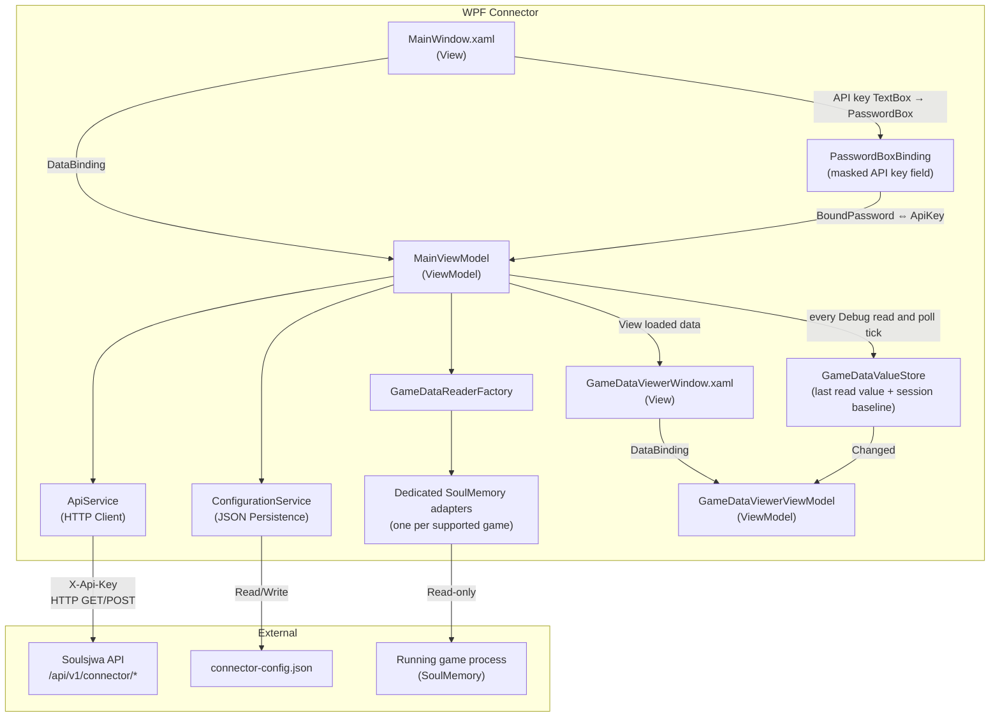

# WPF Connector

## Overview

The Soulsjwa Connector is a **Windows desktop application** (.NET 10 WPF) that communicates with the Soulsjwa API using API key authentication. It reads live game state from a running game process (via SoulMemory) and submits it for automatic objective evaluation.

## Architecture



**Pattern:** MVVM (Model-View-ViewModel) using CommunityToolkit.Mvvm v8.4.2

## Supported Games

| ID | Game | Data Source | Required Version |
|----|------|------------|:----------------:|
| 1 | Dark Souls: Remastered | SoulMemory (live process) | 3.2.0 |
| 2 | Dark Souls II: Scholar of the First Sin | SoulMemory (live process) | 3.2.0 |
| 3 | Dark Souls III | SoulMemory (live process) | 3.2.0 |
| 6 | Sekiro: Shadows Die Twice | SoulMemory (live process) | 3.2.0 |
| 9 | Elden Ring | SoulMemory (live process) | 3.3.0 |

The per-game minimum comes from `requiredConnectorVersion` in
`src/Soulsjwa.Api/Infrastructure/Data/Seed/games.json`; the connector's own
version is `ConnectorConstants.Version` in `src/Soulsjwa.Shared/ConnectorConstants.cs`,
which the connector csproj also reads for its assembly version and the download's
exe filename. A unit test fails the build if any game requires a newer connector
than the one that ships.

## Workflow

```mermaid
sequenceDiagram
  participant U as User
  participant C as Connector (WPF)
  participant S as Soulsjwa API
  participant G as Running game process

  U->>C: Enter server URL + API key
  U->>C: Connect
  C->>S: GET /connector/version
  C->>S: GET /connector/supported-games
  C->>S: GET /connector/events  (authenticated: bad key fails here)
  C-->>U: Show events the user competes in
  U->>C: Pick event & connector-supported game
  C->>S: GET /connector/games/{id}/data  (offsets + dataType)
  U->>C: Start
  C->>G: Read once (initial sync)
  C->>S: POST /connector/events/.../submit
  loop every 2s poll tick
    C->>G: Read game state
    C->>S: POST /connector/events/.../submit
    S-->>C: { completedCount, failedCount }
  end
  Note over C: A tick whose payload is unchanged skips the POST;<br/>a heartbeat submission goes up at least every 30 s
```

- The connector **never writes** to game process memory.
- Submissions identify the user from the API key — never from a body field, so a competitor cannot spoof another competitor.

## Current Functionality

### Configuration & Connection

| Feature | Status | Details |
|---------|:------:|---------|
| Server URL configuration | ✅ | Text input, saved to JSON config |
| API Key configuration | ✅ | Masked input (`PasswordBox`), saved to JSON config |
| API Key masking | ✅ | The key is masked at rest so it cannot be read off a stream, screenshot or screen recording. "👁 Hold to show" reveals it in a read-only plain-text box for exactly as long as the button is held down — mouse or Space — and it re-masks on release, on dragging off the button, and on losing mouse capture. `PasswordBox.Password` is not a dependency property, so the bind to `MainViewModel.ApiKey` goes through the `PasswordBoxBinding` attached behaviour |
| Persistent config | ✅ | Loads on startup from `connector-config.json` under `%LocalAppData%\Soulsjwa\Connector`; the API key is stored DPAPI-protected for the current Windows user (`ProtectedApiKey`), plain-text files from older builds still load and are re-written protected on the next save, and a blob another account wrote leaves the key empty instead of failing |
| Version check enforcement | ✅ | Connect refuses when local build is older than the server's required version |

### Event & Game Selection

| Feature | Status | Details |
|---------|:------:|---------|
| Event listing & selection | ✅ | `GET /api/v1/connector/events` — only events the API key's owner competes in, with their games |
| Connector-supported game filter | ✅ | Only games with `connectorSupported = true` are shown |
| Game data definition fetching | ✅ | `GET /api/v1/connector/games/{id}/data` |
| View loaded data | ✅ | "View loaded data" opens `GameDataViewerWindow`, a searchable/filterable/paginated browser over the loaded `GameDataPoint`s (name, category, description) for the selected game, with the value each one last read back |
| Live values in the viewer | ✅ | Every Debug read and every poll tick merges its payload into `GameDataValueStore`, which pushes it to every open viewer window — so windows already open refresh in place and a window opened mid-session shows what is already known. A value the adapter never returns reads `—`; a payload missing a point keeps that point's previous value, since a failed attach returns `{}` and must not blank the grid |
| Changed since session start | ✅ | Start snapshots the status quo on the session's **first successful read** (never on a failed attach), shown per row in an "At start" column. A "Changed since session start" checkbox then hides every point whose value has not moved. The flag is sticky — a value that changes and changes back stays listed — and Stop clears the snapshot, which also unchecks and disables the filter |

### SoulMemory Reader (DS1R, DS2 SOTFS, DS3, Sekiro, Elden Ring — Games 1-3, 6, 9)

| Feature | Status | Details |
|---------|:------:|---------|
| Live process attach | ✅ | [`FrankvdStam/SoulSplitter`](https://github.com/FrankvdStam/SoulSplitter) `SoulMemory` NuGet (GPL-3 — linking it is why the whole repository is GPL-3, and why a distributed connector build must come with its source; see `THIRD-PARTY-NOTICES.md`) |
| Boss kill detection | ✅ | DS1R/DS3/Sekiro/ER via event flags; DS2 via `GetBossKillCount` |
| Named progression/location flags | ✅ | DS1 known flags/bonfires; DS3 bonfires; Sekiro idols; ER endings, Great Runes, graces, known events, and pickup flags |
| Inventory | ✅ | Full DS1 quantity catalog; full ER readable inventory catalog as presence flags (SoulMemory does not expose ER stack quantities) |
| Runtime state and position | ✅ | Every game-specific public loading/player/blackscreen/credits/screen/map/position read exposed by SoulMemory |
| Game time reporting | ✅ | `GetInGameTimeMilliseconds()` — reported in milliseconds |
| Poll-based monitoring | ✅ | 2 s polling timer; the memory read runs off the UI thread and a tick is skipped while the previous submission is still in flight |
| Death counter | ❌ | SoulMemory's public API does not expose a death counter for any game |
| Debug mode | ✅ | Reads game state and prints JSON payload to status panel without submitting; also fills in the values shown by "View loaded data". Disabled while a session is running, since the poll already refreshes those values every tick |

#### Supported rule variables and future games

`GameDataDefinitions.ForGame` is the source of truth for both connector reads
and the per-game variables offered by the Blockly rule builder. Each
SoulMemory-backed game has a dedicated adapter that accepts only its typed
`GameDataReaderCapability` values:

- DS1R: bosses, known flags, bonfire states, inventory quantities, attributes,
  NG cycle, health, save slot, credits/warp/player state, position, and time.
- DS2 SOTFS: boss kill counts, attributes, loading state, and position.
  SoulMemory returns a constant zero for DS2 game time, so it is not advertised.
- DS3: bosses, bonfires, all named item-pickup flags, attributes, runtime state,
  position, and time.
- Sekiro: bosses, idols, Vitality, Attack Power, runtime state, position, and time.
- Elden Ring: complete upstream boss, grace, known-event, item-pickup,
  and readable inventory catalogs; NG level; runtime/screen state; map and
  position components; and time. Inventory is presence-only because the public
  item model has no quantity field.

The pinned upstream audit and exact catalog counts are documented in
[SoulMemory capability audit](soulmemory-capability-audit.md).

New games follow the same pattern: implement and test a dedicated connector
adapter capability first, then publish only those data points to the builder.
This keeps rules selectable per game and ensures every advertised variable is
actually submitted to the evaluator.

### Submission

| Feature | Status | Details |
|---------|:------:|---------|
| Initial sync on Start | ✅ | Reads once immediately after Start is pressed |
| On-change submission | ✅ | A tick whose payload equals the last submitted one skips the POST; a heartbeat submission goes up at least every 30 s |
| Status messages | ✅ | Color-coded (green success, red error) |
| Error handling | ✅ | 401, 403, connection errors, timeouts, attach failures |

### Not Yet Implemented

| Feature | Details |
|---------|---------|
| Auto-update | No update mechanism |
| Multiple concurrent games | Only one event + game watched at a time |
| Armored Core VI | SoulMemory has no named catalog and its pinned `TryRefresh()` always returns `ModLoadFailed` after injection, so advertising it would produce no connector data |

## UI Layout

```
┌──────────────────────────────────────────────┐
│  Soulsjwa Connector                          │
├──────────────────────────────────────────────┤
│  Configuration                               │
│  ┌──────────────────────────────────────────┐│
│  │ Server URL: [________________________]   ││
│  │ API Key:    [••••••••••] [Hold to show]  ││
│  │                                          ││
│  │ [Save Configuration]  [Test Connection]  ││
│  └──────────────────────────────────────────┘│
├──────────────────────────────────────────────┤
│  Event / Game Selection                      │
│  ┌──────────────────────────────────────────┐│
│  │ Event:    [select…▾]                     ││
│  │ Game:     [select…▾]  [connector-only]   ││
│  │ [Load game data]  [View loaded data]     ││
│  │ [Start]  [Stop]  [Debug]                 ││
│  └──────────────────────────────────────────┘│
├──────────────────────────────────────────────┤
│  Status: Monitoring — last submit: 3 bosses  │
└──────────────────────────────────────────────┘
```

"View loaded data" (`Debug` greyed out above while this session runs):

```
┌──────────────────────────────────────────────────────────────────────┐
│  Loaded game data — Elden Ring                                       │
├──────────────────────────────────────────────────────────────────────┤
│  Search [____________]  Category [all ▾]  Size [50▾]  ☑ Changed      │
│                                                       since session  │
│                                                       start          │
├──────────────────────────────────────────────────────────────────────┤
│  Name                 │ Value │ At start │ Category │ Description    │
│  Margit the Fell Omen │   1   │    0     │ Bosses   │ …              │
│  Godrick the Grafted  │   0   │    0     │ Bosses   │ …              │
├──────────────────────────────────────────────────────────────────────┤
│  12 of 4210 data point(s) match — 12 changed  [◀ Prev] 1/1 [Next ▶]  │
└──────────────────────────────────────────────────────────────────────┘
```

## Connector API Endpoints

| Endpoint | Purpose |
|----------|---------|
| `GET /api/v1/connector/version` | Check required connector version |
| `GET /api/v1/connector/supported-games` | List games with connector support |
| `GET /api/v1/connector/games/{id}/data` | Get data point definitions (offsets/dataType/eventFlags) |
| `GET /api/v1/connector/events` | List the events the caller competes in, with their games |
| `POST /api/v1/connector/events/{eid}/games/{eventGameId}/submit` | Submit game state for rule evaluation |

Every response shape above is declared once in `src/Soulsjwa.Shared/ConnectorContracts.cs`
and compiled into both the API and the connector. `tests/Soulsjwa.ApiTests/ConnectorRouteAvailabilityTests.cs`
boots a Production host and checks each of these routes exists there — the connector
must never call a route that is only mapped in Development.

## Adding New Game Data

This section explains how to add new data points (e.g., tracking additional boss kills) for an existing connector-supported game like Elden Ring.

> The SoulMemory-derived catalogs (`SoulMemoryCatalogData.cs`,
> `DarkSouls1RemasteredItemData.cs`) are **generated** — never edit them by
> hand. To take a newer SoulMemory: bump the commit in
> `tools/generate_soulmemory_catalog.py`, run it, review the diff, then bump
> `ConnectorConstants.Version`. CI fails if the committed files differ from
> the generator's output.

Three files need to be updated:

### Step 1 — Add data points in `GameDataDefinitions.cs`

**File:** `src/Soulsjwa.Api/Features/Games/Definitions/GameDataDefinitions.cs`

Each entry is a `GameDataPoint` with:

| Field | Description | Example |
|-------|-------------|---------|
| `Id` | Unique stable string identifier | `"g9_f117"` |
| `DisplayName` | Human-readable name shown in the connector | `"Commander Niall"` |
| `Offset` | SoulMemory key (decimal flag id, attribute name, etc.) | `"117"` |
| `DataType` | Data type: `event_flag`, `boss_kill_count`, `attribute`, etc. | `"event_flag"` |

> **Important:** Use the next available `Id` number. IDs must be unique within a game and must remain stable once assigned — connectors and objective rules reference data points by these IDs.

### Step 2 — Add predefined objectives in `PredefinedObjectives.cs`

**File:** `src/Soulsjwa.Api/Features/Games/Definitions/PredefinedObjectives.cs`

Each objective uses a [JsonLogic](https://jsonlogic.com/) rule referencing the data point IDs from Step 1:

```csharp
yield return new(gameId, "Commander Niall - Slain", 75,
    """{">":[{"var":"g9_f117"},0]}""");
```

The rule `{">":[{"var":"g9_f117"},0]}` means "data point `g9_f117` is greater than `0`".

### Step 3 — Bump the connector version in `ConnectorConstants.cs`

**File:** `src/Soulsjwa.Shared/ConnectorConstants.cs`

After changing any data definitions or objectives, bump the version string so older connectors know to update. This constant is the connector's only version: the csproj derives the assembly version and the download's zip filename from it, and `games.json`'s per-game `requiredConnectorVersion` values must not exceed it. The value below is an illustrative next patch version:

```csharp
public const string Version = "3.3.1"; // was "3.3.0"
```

The csproj derives the assembly version and the download's exe filename from
this same constant, so it can never disagree with what the running connector
reports.

### Checklist

- [ ] Each new data point has a **unique `Id`** that does not conflict with existing entries
- [ ] The **`Offset`** is correct for the game's format
- [ ] Each predefined objective's **JsonLogic rule** references the correct data point `Id`
- [ ] **`ConnectorConstants.Version`** has been bumped
