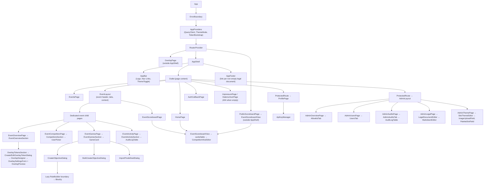
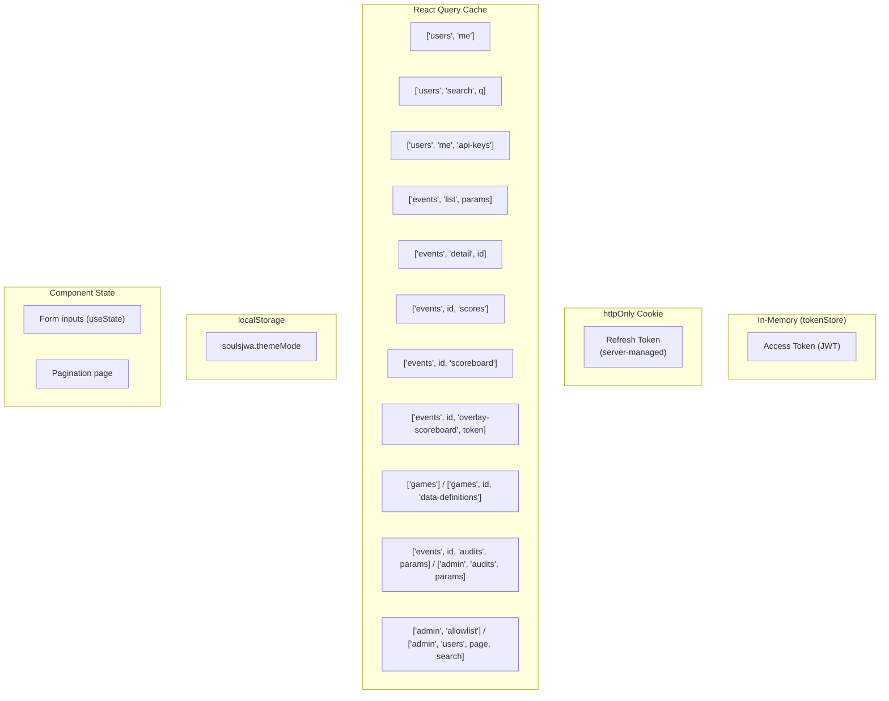

# Frontend — React SPA

## Stack

- **React 19** + **TypeScript 7** (the build runs `typescript-7`; the `typescript` package alias still resolves to the 6.x line for editor tooling and Vitest while the ecosystem catches up — see `package.json`)
- **Vite 8** (dev server & build tool)
- **MUI v9** (Material UI) + Emotion
- **TanStack React Query** (server state)
- **React Router** (client routing)
- **Blockly** (visual rule builder)
- **Vitest** (testing)
- **PWA shell** (manifest + service worker for cached UI and offline-friendly scoreboard reads)

The visual language is stock MUI plus the admin-defined site theme (see [Theming](#theming)). An earlier design-system rebuild proposal is kept under [history/](history/frontend-design-system.md); it was not implemented.

## Route Map

```mermaid
graph TD
    ROOT["/"] --> LAYOUT["AppShell"]
    ROOT --> OVERLAY["/events/:id/overlay → OverlayPage (no app chrome; token query required, or preview=1 fed by the app's designer)"]
    ROOT --> PUBLIC_SCOREBOARD["/scoreboard/:eventIdentifier → PublicScoreboardPage (no app chrome)"]
    LAYOUT --> HOME["/ → HomePage"]
    LAYOUT --> EVENTS["/events → EventsPage"]
    LAYOUT --> CALENDAR["/calendar → CalendarPage"]
    LAYOUT --> MY_EVENTS["/my-events/* → MyEventsPage 🔒"]
    LAYOUT --> EVENT_LAYOUT["/events/:id → EventLayout"]
    EVENT_LAYOUT --> DETAIL["index → EventOverviewPage"]
    EVENT_LAYOUT --> EVENT_COMPETITORS["competitors → EventCompetitorsPage"]
    EVENT_LAYOUT --> EVENT_GAMES["games → EventGamesPage"]
    EVENT_LAYOUT --> EVENT_TOKENS["tokens → EventTokensPage 🔒"]
    EVENT_LAYOUT --> EVENT_ACTIVITY["activity → EventActivityPage 🔒"]
    EVENT_LAYOUT --> SCOREBOARD["scoreboard → EventScoreboardPage"]
    EVENT_LAYOUT --> EVENT_RULES["rules → EventRulesPage (hidden in nav when empty)"]
    EVENT_LAYOUT --> EVENT_CALENDAR["calendar → EventCalendarPage"]
    LAYOUT --> RULES["/rules → RulesPage (featured event's rules)"]
    LAYOUT --> PROFILE["/profile → ProfilePage 🔒"]
    LAYOUT --> CALLBACK["/auth/callback → AuthCallbackPage"]
    LAYOUT --> IMPRESSUM["/impressum → ImpressumPage (404 when empty)"]
    LAYOUT --> DATENSCHUTZ["/datenschutz → DatenschutzPage (404 when empty)"]
    LAYOUT --> ADMIN["/admin → AdminLayout 🔒👑"]
    ADMIN --> ADMIN_ALLOWLIST["index → AdminOverviewPage"]
    ADMIN --> ADMIN_USERS["users → AdminUsersPage"]
    ADMIN --> ADMIN_CATALOG["catalog → AdminCatalogPage"]
    ADMIN --> ADMIN_AUDITS["audits → AdminAuditsPage"]
    ADMIN --> ADMIN_FEATURE_FLAGS["feature-flags → AdminFeatureFlagsPage"]
    ADMIN --> ADMIN_LEGAL["legal → AdminLegalPage"]
    ADMIN --> ADMIN_THEME["theme → AdminThemePage"]
    ADMIN --> ADMIN_TWITCH["twitch-extension → AdminTwitchExtensionPage"]

    style PROFILE fill:#9146ff,color:#fff
    style MY_EVENTS fill:#9146ff,color:#fff
    style ADMIN fill:#9146ff,color:#fff
    style OVERLAY fill:#38bdf8,color:#090b18
    style PUBLIC_SCOREBOARD fill:#38bdf8,color:#090b18
    style CALLBACK fill:#f5f5f5
```



> 🔒 = Protected route (redirects to `/` if not authenticated). The token and
> activity child routes are guarded explicitly at the router boundary because
> their data is event-sensitive; `EventLayout` additionally controls tab
> visibility and each endpoint enforces authorization. 👑 = Admin-only (the
> layout renders an error if the current user isn't an admin; the nav link is
> hidden for non-admins). The overlay route is public chrome-free UI but
> requires a valid `token` query parameter to fetch data.

---

## Pages

### HomePage (`/`)

| Feature                   | Details                                                             |
| ------------------------- | ------------------------------------------------------------------- |
| **Hero shell**            | Landing page with responsive feature cards and Twitch login tooltip |
| **Authenticated actions** | Shows links to My Events and Events                                 |
| **Featured event (unauthenticated)** | Below the hero, `useFeaturedEvent()` renders the admin-designated featured event for anonymous visitors: name, description, live/started status, and active games (reusing `PageHeader`), plus its scoreboard via `useScoreboard` and the existing `ScoreboardCard`/`ScoreboardTable` components. Renders nothing when no event is featured. |

### EventsPage (`/events`)

| Feature          | Details                                                                                                      |
| ---------------- | ------------------------------------------------------------------------------------------------------------ |
| **Event list**   | Responsive cards showing name, description, competitor count, game count, and a `Live`/`Stopped` status chip |
| **Filtering**    | Search plus status filter (`all`, `live`, `stopped`, `archived`)                                             |
| **Pagination**   | Previous/Next buttons with page indicator                                                                    |
| **Create event** | Admin-only dialog with name (max 200) + description fields → `POST /events`                                  |
| **Navigation**   | Click event card → `/events/:alias` when configured, otherwise `/events/:id`                                  |

### CalendarPage (`/calendar`)

| Feature | Details |
| --- | --- |
| **Aggregation** | `GET /api/v1/calendar` — every non-archived event's admin calendar entries and competitor planned runs in one response |
| **Rendering** | FullCalendar (`@fullcalendar/{react,core,daygrid,timegrid,list}`), month view by default, list view on narrow screens (`useMediaQuery`) |
| **Colour** | Each entry's `CalendarEntryColor` slot is resolved against the live MUI theme (`resolveCalendarEntryColor`) — never a hex value on the wire |
| **Planned runs** | Rendered as "Event name · competitor" |
| **Navigation** | Clicking any event opens that event's page |
| **Layout** | FullCalendar sits inside an `overflow-x: auto` container; the page itself never scrolls horizontally at 400 px |

### MyEventsPage (`/my-events`, `/my-events/{delegated,owned,trial}`) 🔒

| Feature | Details |
| --- | --- |
| **Tabs** | `MyEventsTabs` + `myEventsTabs.ts` nav model (mirroring the event detail page's `EventSectionTabs`/`sections.tsx`): Competing, Delegated, Owned, Trial runs. Each tab is its own route — the router derives those routes from the same nav model, so a tab cannot ship with a link to a path that 404s — and the active tab is derived from the pathname, never component state |
| **Event lists** | `MyEventsPanel` shows one tab's events as a pick-one list with the selected event's objectives beside it. Only the selected event fetches, so a competitor in a dozen events makes one request rather than twelve |
| **Summary** | Status, score/rank, objective progress, competitor count, and latest activity from authenticated API data |
| **Objectives** | `MyEventObjectiveList`, shared with the Trial tab so a trial attempt is presented exactly like a real one — the tab is what says which run the ticks belong to. Each editable game heading carries `FailRemainingObjectivesButton`, which after a confirmation fails every objective of that game still pending (own record, the delegated competitor's, or the trial run, matching the tab) |
| **Trial runs tab** | `MyTrialRunsPanel`: every run the viewer may see (own, delegated, or owned), the selected run's own objectives, its amber score, and the enable/start/stop/reset/disable controls. The only place on this page trial progress appears — the other tabs stay official-only |
| **Trial vs. official writes** | Official progress and a trial are mutually exclusive per (game, competitor): the server refuses every official write while a trial slot exists, recording or not. So the gate is `hasTrialRun`, never `isTrialActive` — `trialBlockReason` is the one helper that decides it, used by `useObjectiveCompletion`'s `trialBlockReasons` → `GameCard` on the event Games tab and by `MyEventsPanel` on the regular My Events tabs. `isTrialActive` only picks *which* explanation shows: a recording run takes the tick (go to the Trial tab), a dormant one takes nothing (start it, or disable trial mode). The Trial tab's own controls are disabled unless that run is `Running`. There is never a surface where a tick lands somewhere other than the label says, and never one that offers a tick the server will reject |
| **Which record am I editing** | The Trial tab's list carries a "Trial run" chip per game heading and an "in trial run" suffix on every checkbox's accessible name — the panel's alert and amber score scroll out of view on a long list, and the rows are otherwise identical to the official ones. The official list is deliberately left unmarked: only the exceptional mode is badged |
| **Live updates** | Summary, objective, and trial-run queries refresh every five seconds; disabling or resetting a run invalidates the trial list, its objectives, the scoreboard payload and the My Events summaries together, so cleared progress disappears everywhere at once |
| **Quick complete** | Runtime feature flag controls optimistic completion checkboxes; disabled mode is read-only and links to event editing |
| **Responsive/accessibility** | Scrollable tabs with `aria-current`, list/detail stacking to one column on mobile, labelled checkboxes, semantic headings, and visible focus |

### Event pages (`/events/:id/*`)

| Feature                        | Details                                                                                                           |
| ------------------------------ | ----------------------------------------------------------------------------------------------------------------- |
| **Event info**                 | Page header with title, description, creation date, status, tie-break mode, owner/admin actions, and stat cards  |
| **Focused subpages**           | Shared event layout and MUI tabs route to overview, competitors, games/objectives, scoreboard, activity, and broadcast pages |
| **Owner lifecycle controls**   | Owner/admin edit (including the optional URL alias), plus archive/unarchive and `Start Event` / `Stop Event` actions |
| **Overview**                   | Ranked scoreboard preview plus OBS overlay token controls for event owners and competitors                       |
| **Overlay tokens**             | Mint/edit/revoke token-gated OBS overlays; the look (view, pinned player, timing, title, theme, toggles) is designed against a live preview and saved on the token |
| **Competitors**                | Responsive roster cards, self-join action, owner/admin add/remove, streamer flag, and delegated moderator management |
| **Games & Objectives**         | Game definition cards listing objectives, scores, availability, custom/predefined games, and owner-only controls  |
| **Import predefined**          | Owner dialog selects all or filtered subsets of predefined objectives for connector-supported known games          |
| **Objective outcomes**         | Authorized users can complete, fail, uncomplete, or reset objectives; resolved failures are shown distinctly. `FailRemainingObjectivesButton` above the active game's card fails every objective still pending for the selected completion target after a confirmation — the one-click end of a no-death run |
| **Timestamp editing**          | Admin/owner `EditCompletionTimeDialog` corrects completion timestamps for completed objectives                    |
| **Game availability controls** | Owner-only enable/disable toggle per event-game, plus `Enabled`/`Disabled` status chip                            |
| **Connector badge**            | Shows "Connector Supported" label per game when known-game definitions support connector automation               |
| **Create/edit objective**      | Owner forms for name, score, optional completion and failure JsonLogic rules, plus delete controls                 |
| **Rule Builder**               | Visual Blockly editor for completion/failure JsonLogic; failure rules can combine game data with `competitorCompletions` |
| **Activity**                   | Members-only audit log on `/events/:id/activity` with type, actor, subject, and date filters                      |
| **Calendar tab**               | `/events/:id/calendar` — public list of the event's `CalendarEntry` rows; owner/admin add/edit/delete via `CalendarEntryEditorDialog` (title, `MarkdownEditor` description, all-day toggle, highlight, colour-slot selector, image upload) |
| **Planned runs**                | Each competitor tile lists their `PlannedRun` schedule per game; editable by the competitor, the owner, an admin, or a delegated moderator |

### EventScoreboardPage (`/events/:id/scoreboard`)

| Feature                | Details                                                                                                            |
| ---------------------- | ------------------------------------------------------------------------------------------------------------------ |
| **Public access**      | No authentication required                                                                                         |
| **Full scoreboard**   | Mobile cards and desktop table: position, player, score, completed/failed counts, terminal status, and activity    |
| **Live indicator**     | Red/green dot per player showing live/offline status                                                               |
| **Trial progress**     | A competitor with a started trial shows an outlined "Trial" chip — naming the game when it is not the active one — plus their trial score, completions and failures in amber beside the official figures. The chip follows the reported run rather than `isTrialActive`, so it also covers a paused one. Inside the breakdown a trialing game reports that attempt with the ordinary completion marks, and is appended to the breakdown so a trial on a non-active game is reachable at all. Official figures, ranking and sort order are never affected |
| **Twitch link**        | Purple Twitch icon per player linking to `twitch.tv/{login}`                                                       |
| **Expandable rows**    | Click player row/card to expand per-game breakdown with individual objective completion status                     |
| **Per-game breakdown** | Game name, score, resolved counts, objective completion/failure status, and timestamps                            |
| **Competitor info**    | Expanded games show death clips/links/notes; authorized viewers can add/remove them inline                         |

Rendering itself (loading/empty/error states, cards vs. table) lives in the shared `EventScoreboardView` component, so `EventScoreboardPage`, the home page's featured scoreboard, and `PublicScoreboardPage` below can never drift apart.

### PublicScoreboardPage (`/scoreboard/:eventIdentifier`)

| Feature                | Details                                                                                                            |
| ---------------------- | ------------------------------------------------------------------------------------------------------------------ |
| **Public access**      | No authentication required                                                                                         |
| **Purpose**            | A shareable, chrome-free deep link to one event's scoreboard — useful when several events run in parallel and each needs its own link |
| **Resolution**         | `:eventIdentifier` resolves by event id or `UrlAlias`, same as every other event route (`useEvent`)                |
| **Chrome**             | Rendered outside `AppShell` (like `OverlayPage`) — no nav, no tabs, no footer                                      |
| **Content**            | Event name heading + `EventScoreboardView`, restricted to the event's one active game (via `active-game`)          |

### ProfilePage (`/profile`) 🔒

| Feature             | Details                                                                                                                                 |
| ------------------- | --------------------------------------------------------------------------------------------------------------------------------------- |
| **User info**       | Profile surface with avatar, role, display name, Twitch login, email                                                                    |
| **Logout**          | Revokes refresh token, clears session, navigates to home                                                                                |
| **API Key Manager** | Full CRUD for API keys (create with name + optional expiry — "Never expires" / 30 d / 90 d / 1 y — list with prefix and expiry, revoke) |

### AuthCallbackPage (`/auth/callback`)

| Feature                 | Details                                                                                                                  |
| ----------------------- | ------------------------------------------------------------------------------------------------------------------------ |
| **Auto-login**          | Calls `POST /auth/refresh` to obtain JWT from cookie                                                                     |
| **Allowlist rejection** | If the API redirected here with `?error=not_allowlisted&login=…`, shows a friendly warning instead of attempting refresh |
| **Redirect**            | Success → `/my-events`, Failure → `/`                                                                                    |

### OverlayPage (`/events/:id/overlay`)

| Feature                 | Details                                                                                                                        |
| ----------------------- | ------------------------------------------------------------------------------------------------------------------------------ |
| **Chrome-free route**   | Renders outside `AppShell` with transparent background by default for OBS/browser-source use                                    |
| **Token-gated data**    | Requires `?token=…`; missing or invalid/revoked tokens render a clear overlay-local error                                      |
| **Views**               | `objectives` checklist, `scores` paginated scoreboard, and `games` one-page-per-game rotation                                  |
| **Configuration**       | The look saved on the token (returned with every poll) wins; otherwise the URL controls games, players/pinned competitor, page size, cycle/refresh, title/progress/pagination, highlight, animation, theme, and title override. `bg` (page background) is URL-only |
| **Polling & animation** | Re-fetches on the configured cadence (the saved look's, once known) and optionally fades between cycled pages and highlights fresh completions |
| **Preview mode**        | `?preview=1`: polls nothing and renders what its embedding window posts (`overlayPreviewProtocol.ts`), same-origin and parent-only; opened alone it just says it is waiting. Rendering is shared with the live mode through `OverlayRenderer` |

### EventTokensPage — Twitch extension card

Below the OBS overlay tokens, competitors and owners see the **Twitch extension** card (`TwitchExtensionSection`) when the server backs an extension: an install link to Twitch's extension manager and their own channel's settings, saved through `PUT /me/twitch-extension`. The extension's own viewer and config pages are not SPA routes; they live in the separate Twitch-hosted bundle described under [Twitch extension bundle](#twitch-extension-bundle-srctwitch-extension).

### Admin pages (`/admin/*`) 🔒👑

| Feature           | Details                                                                                                                                                                                 |
| ----------------- | --------------------------------------------------------------------------------------------------------------------------------------------------------------------------------------- |
| **Allowlist tab** | List, add (Twitch login + optional note), delete entries. Deleting also revokes the linked user's refresh tokens.                                                                       |
| **Users tab**     | Paginated list with search; promote / demote between `User` and `Admin`. The current user can't demote themselves below admin, and the server enforces "at least one admin must exist". |
| **Catalog tab**   | Browse, create, and edit global games; browse and create game-specific predefined objectives. |
| **Audits tab**    | System-wide audit table with type, actor, subject, event, and date filters; event options are populated from recent events including archived ones.                                      |
| **Feature flags tab** | Runtime toggle for My Events quick completion; updates are persisted and audited. |
| **Twitch extension tab** | `TwitchExtensionAdminTab`: status chips (configured, push, bundle present), the Client ID / API host / extension origin the server runs with, the extension-wide rules form (event choice, viewer scope switcher, default view and toggles, saved through `PUT /admin/twitch-extension/settings`), the Twitch console setup steps, and the **Download extension zip** button that streams `GET /admin/twitch-extension/bundle` to a file. |
| **Legal tab**     | `MarkdownEditor` per document (Impressum, Datenschutz), switched by a local tab, not the router — the only place an empty document can be reached, since the public routes below 404 on empty content. Each editor is preceded by an advisory callout linking the German and English baseline templates in `templates/legal/` (`legalTemplates.ts`) and reminding the operator that hosting, CDN/reverse-proxy (Cloudflare & co.) and telemetry recipients are theirs to declare; nothing here validates the document. |
| **Theme tab**     | Background image upload (`ImageUploadField`), background treatment, font, and a colour picker per palette slot per mode (`PaletteSlotField`) with a live WCAG contrast readout — a UI hint only; `SiteThemeValidator` on the server is authoritative and the failing-pair message it returns is surfaced verbatim on save. |

### ImpressumPage (`/impressum`) / DatenschutzPage (`/datenschutz`)

| Feature              | Details                                                                                                     |
| --------------------- | ------------------------------------------------------------------------------------------------------------ |
| **Public access**    | No authentication required                                                                                   |
| **Rendering**        | Document content rendered through `MarkdownView`, same pipeline as `EventRulesPage`                          |
| **Empty document**   | Renders the app's 404 page (`RouteErrorElement`), not a blank page — thrown in the shape React Router's `isRouteErrorResponse` duck-types, since raw `Response` throws outside a loader aren't recognized as route error responses |
| **Editing**          | Not available here; admins edit via `AdminLegalPage` (`/admin/legal`)                                         |

---

## Component Tree



## Key Components

| Component             | Location                      | Purpose                                                                                              |
| --------------------- | ----------------------------- | ---------------------------------------------------------------------------------------------------- |
| `AppShell`            | `components/`                 | Skip link, sticky stock-MUI header, responsive navigation (adds a "Rules" entry linking to the featured event's rules page when that event has published rules), main landmark, theme toggle, and connector download, and — for anonymous visitors — the Twitch sign-in button with its `TwitchConsentInfo` help icon |
| `EventLayout`         | `components/`                 | Shared event loading, heading, owner actions, routable local tabs, and child-route context |
| `AdminLayout`         | `components/`                 | Admin authorization, shared heading, routable tabs, and child-route context                 |
| `AppFooter`           | `components/`                 | Renders a link per non-empty legal document (Impressum/Datenschutz); renders nothing when both are empty |
| `TwitchConsentInfo`   | `features/legal/components/`  | Help icon next to "Sign in with Twitch"; a click opens a popover stating in German and English which Twitch data (ID, name, email) is stored on the allowlist, linking `/datenschutz` while that document has content |
| `ProtectedRoute`      | `components/`                 | Auth guard, redirects to `/` if unauthenticated                                                      |
| `ThemeToggle`         | `components/`                 | Cycles light → dark → system, persists to localStorage                                               |
| `ErrorBoundary`       | `components/`                 | Catches React errors outside the router and shows recovery UI                                        |
| `RouteErrorElement`   | `components/`                 | React Router `errorElement` for route render/loader/action failures and unmatched routes             |
| `Spinner`             | `components/ui/`              | Loading indicator                                                                                    |
| `LoadingState`        | `components/ui/`              | Spinner plus loading copy                                                                            |
| `CardListSkeleton`    | `components/ui/`              | Responsive card-list loading placeholders                                                            |
| `TableSkeleton`       | `components/ui/`              | Dense table loading placeholders                                                                     |
| `ErrorMessage`        | `components/ui/`              | Alert-style error display                                                                            |
| `ConfirmDialog`       | `components/ui/`              | Accessible destructive-action confirmation with safe initial focus and named consequences           |
| `PageHeader`          | `components/ui/`              | Shared page heading/action layout                                                                    |
| `Surface`             | `components/ui/`              | Stock outlined MUI paper with shared responsive padding                                               |
| `EmptyState`          | `components/ui/`              | Polished empty state panel                                                                           |
| `StatCard`            | `components/ui/`              | Compact metric display                                                                               |
| `PaginationControls`  | `components/ui/`              | Reusable previous/next pager with page indicator (Events, Admin users)                               |
| `CreateObjectiveDialog` | `features/events/components/` | Owner dialog: name + score + optional Blockly rule builder (`ObjectiveRuleSection`); `EditObjectiveDialog` is its edit counterpart |
| `BulkCreateObjectiveDialog` | `features/events/components/` | Owner dialog for adding several hand-authored objectives in one pass by looping the single-objective create mutation per row (no rule builder) |
| `AddGameDialog`       | `features/events/components/` | Owner dialog for assigning a predefined game with optional per-event name/description                |
| `ImportPredefinedDialog` | `features/events/components/` | Owner dialog for importing all or selected predefined objectives                                  |
| `CompetitorsSection`  | `features/events/components/` | Competitor list, self-join action, owner add/remove UI, streamer flag, delegated moderators, and a self/admin/delegate-gated Live/Offline toggle |
| `CompetitorInfosEditor` | `features/events/components/` | Inline death clip/link/note viewer/editor for per-game competitor metadata                         |
| `EventActivitySection` | `features/events/components/` | Members-only event audit log section backed by `AuditLogTable`                                     |
| `EditCompletionTimeDialog` | `features/events/components/` | Admin/owner dialog for correcting objective completion timestamps                              |
| `FailRemainingObjectivesButton` | `features/events/components/` | Button plus `ConfirmDialog` naming the game, the pending count and the competitor (or the trial run) before failing every still-pending objective of a game; disabled with the reason when nothing is pending, the game is disabled, or a trial blocks the surface. Shared by the event Games tab, My Events, Delegated and Trial tabs |
| `OverlayTokensSection` | `features/events/components/` | Mint/edit/revoke token-gated OBS overlay tokens; each row names its saved look                    |
| `OverlayDesigner`     | `features/events/components/` | `OverlaySettingsForm` beside `OverlayPreview`, shared by the create and edit dialogs               |
| `OverlaySettingsForm` | `features/events/components/` | Controlled form for a token's look: view, pinned player, restricted game, timings, title, theme, toggles, panel opacity |
| `OverlayPreview`      | `features/events/components/` | Live preview: the overlay route embedded in preview mode at a chosen source size over a backdrop, fed real or sample data, with a "Simulate a completion" button that completes a competitor's next open objective |
| `EditOverlayTokenDialog` | `features/events/components/` | Re-design and save an existing token's look                                                    |
| `RuleBuilderWrapper`  | `features/events/components/blockly/` | Lazy loading, loading state, and widget error boundary for Blockly                           |
| `RuleBuilder`         | `features/events/components/blockly/` | Labelled Blockly visual editor → JsonLogic output                                             |
| `ScoreboardTable` / `ScoreboardRow` | `features/events/components/scoreboard/` | Desktop scoreboard and expandable game/objective rows                         |
| `ScoreboardCard`     | `features/events/components/scoreboard/` | Mobile scoreboard card with expandable breakdown                                             |
| `ScoreboardGameBreakdown` | `features/events/components/scoreboard/` | Per-game objectives plus competitor info inside expanded scoreboard rows; each game folds independently, open by default only while active (`isEnabled`) |
| `LiveStatusLegend` / `TwitchIcon` | `features/events/components/scoreboard/` | Live/offline legend and Twitch link glyph                                        |
| `AuditLogTable`       | `features/audits/components/` | Shared cursor-paginated ("Load more") audit table with filters and expandable before/after JSON details |
| `AllowlistTab`        | `features/admin/components/`  | Admin allowlist management                                                                           |
| `UsersTab`            | `features/admin/components/`  | Admin user directory/search and role controls                                                        |
| `AdminAuditsTab`      | `features/admin/components/`  | System-wide audit log tab                                                                            |
| `TwitchExtensionAdminTab` | `features/admin/components/` | Twitch extension status, extension-wide rules, setup steps and zip download                     |
| `UserPicker`          | `features/users/components/`  | User search combobox; can allow raw Twitch handles for invitations                                  |
| `ApiKeyManager`       | `features/users/components/`  | Create, list, revoke API keys                                                                        |

---

## Feature Modules

### `features/auth/`

| File                 | Description                                                      |
| -------------------- | ---------------------------------------------------------------- |
| `api/authApi.ts`     | `refresh()` → POST /auth/refresh; `revoke()` → POST /auth/revoke |
| `hooks/useLogout.ts` | Calls revoke, stops token manager, clears cache, navigates home  |

### `features/events/`

| File | Description |
| --- | --- |
| `api/twitchExtensionApi.ts` | Twitch extension status and the signed-in user's own channel settings (`/me/twitch-extension`) |
| `hooks/useTwitchExtensionStatus.ts` | Query: whether the server backs a Twitch extension (never refetched) |
| `hooks/useMyTwitchExtensionConfiguration.ts` | Query: the signed-in user's channel settings, resolved event and pickable events |
| `hooks/useUpdateMyTwitchExtensionConfiguration.ts` | Mutation: save those settings; replaces the cached configuration |
| `components/TwitchExtensionSection.tsx` | Broadcast tab card: Twitch install link, "show this event on my channel" / "follow the featured event", default view, pinned game, toggles; hidden when the server backs no extension; explains the lock instead of offering event buttons when the admin rules forbid channel picks |
| `api/eventsApi.ts` | Event CRUD/listing, lifecycle, scores/scoreboards, audits, game assignment, predefined objectives, objective CRUD/completion, competitor/moderator management, and competitor info metadata |
| `api/overlayTokensApi.ts` | Overlay token CRUD (create takes the look; `updateSettings` saves it) plus the token-gated overlay poll (`{ scoreboard, settings }`) |
| `hooks/useEvents.ts` | Query: paginated event list with search/status/archive params |
| `hooks/useEvent.ts` | Query: single event detail; live events poll periodically |
| `hooks/useEventScores.ts` | Query: compact score summary for overview preview; live events poll periodically |
| `hooks/useScoreboard.ts` | Query: full scoreboard response for public scoreboard/detail completion state; live events poll periodically |
| `hooks/useOverlayScoreboard.ts` | Query: token-gated overlay poll (scoreboard + saved look), enabled only with event id + token; refetched at the URL's interval until a saved look supplies its own |
| `hooks/useGames.ts` | Query: known game catalog |
| `hooks/useGameDataDefinitions.ts` | Query: connector data definitions for a known game, used by Blockly rule building |
| `hooks/usePredefinedObjectives.ts` | Query: predefined objectives for a known game |
| `hooks/useEventAudits.ts` | Infinite query: cursor-paginated, filterable event audit log (BE-026) |
| `hooks/useCompetitorInfos.ts` | Query: per (event-game, competitor) death clips/links/notes |
| `hooks/useOverlayTokens.ts` | Query: list overlay tokens for an event |
| `hooks/useCreateEvent.ts` | Mutation: create event (admin only) |
| `hooks/useUpdateEvent.ts` | Mutation: edit event name/description/tie-break mode/URL alias |
| `hooks/useArchiveEvent.ts` | Mutation: archive (soft-delete) event |
| `hooks/useUnarchiveEvent.ts` | Mutation: restore an archived event |
| `hooks/useStartEvent.ts` | Mutation: start an event |
| `hooks/useStopEvent.ts` | Mutation: stop an event |
| `hooks/useFeaturedEvent.ts` | Query: the single featured event for the public landing page (`null` when none is featured) |
| `hooks/useFeatureEvent.ts` | Mutation: feature an event (admin only), unfeaturing whichever event previously held it |
| `hooks/useUnfeatureEvent.ts` | Mutation: clear the featured flag on an event (admin only) |
| `hooks/useDuplicateEvent.ts` | Mutation: duplicate an event's games+objectives (admin only), works on archived sources |
| `hooks/useTrialRun.ts` | Query: a competitor's trial run state for one game, or `null` if not enabled |
| `hooks/useEnableTrialRun.ts` | Mutation: enable trial mode for a competitor+game (idempotent) |
| `hooks/useDisableTrialRun.ts` | Mutation: disable trial mode (destructive; invalidates the whole trial scope so the run's ticks and score disappear everywhere) |
| `hooks/useStartTrialRun.ts` | Mutation: start/resume a trial run |
| `hooks/useStopTrialRun.ts` | Mutation: pause a running trial run |
| `hooks/useResetTrialRun.ts` | Mutation: reset a trial run to `NotStarted`, deleting its own recorded completions/failures |
| `api/trialRunCache.ts` | `invalidateTrialProgress` (trial list + its objectives + the scoreboard payload) for a tick inside a run, and `invalidateTrialState` — the same plus the My Events summaries that carry `isTrialActive` — for the five mutations that create, clear or change a run's state. A tick deliberately leaves the My Events keys alone: nothing it writes can show up there |
| `scoreboard/trialPresentation.ts` | Shared trial labels, tooltip, the amber accent hex the inline-styled overlay needs, the "a trial is recording" copy in both its lengths, and `trialBadgeLabel` (names the game when the trial is not on the displayed one) |
| `scoreboard/scoreboardMetrics.ts` | `activeGame`, `gameLastCompletedAt`, `trialGames`/`trialTotals` (trial figures summed across the games the caller actually displays, so a filtered view never reports a total the viewer cannot see), `recordingGames`, `objectiveState(objective, showTrial)` — the one place that decides whether a row draws the trial's attempt or the official record — `showsTrial(game, scoringGameIds)`, the rule both the in-app scoreboard and the overlay call to answer *whether* to show the trial for a given game (a scored game only while its run records; a game in view solely for its trial always, since nothing official about it is being reported), and `entryView`, the row/card-shared derivation of active game, scoring scope, trialed games and breakdown |
| `overlay/overlayScope.ts` | `ScopedEntry` carries `scoringGameIds`/`scoringTotalObjectives`/`scoringMaxScore` (the points on offer, shown as `score / max`): `games` is deliberately wider than the set the official figures were summed from (a trialed game stays visible for its amber figures), so no consumer may derive an official denominator from `games` — doing so collapsed the overlay's official percentage whenever a trial was in view |
| `hooks/useAddGame.ts` | Mutation: assign a predefined game to an event |
| `hooks/useAddCustomGame.ts` | Mutation: add a custom per-event game |
| `hooks/useRemoveEventGame.ts` | Mutation: remove an event-game |
| `hooks/useEnableEventGame.ts` | Mutation: enable a game within an event |
| `hooks/useDisableEventGame.ts` | Mutation: disable a game within an event |
| `hooks/useEditEventGame.ts` | Mutation: rename a game (or revert a predefined game to its catalog name) and set its description |
| `hooks/useReorderEventGames.ts` | Mutation: persist a new display order for an event's games |
| `hooks/useReorderObjectives.ts` | Mutation: persist a new display order for a game's objectives |
| `hooks/useCreateObjective.ts` | Mutation: create objective |
| `hooks/useEditObjective.ts` | Mutation: edit objective name, score, metadata, or rule |
| `hooks/useDeleteObjective.ts` | Mutation: delete an objective and refresh affected scores |
| `hooks/useImportPredefinedObjectives.ts` | Mutation: import all or selected predefined objectives into an event-game |
| `hooks/useCompleteObjective.ts` | Mutation: complete objective for self or `onBehalfOfUserId` |
| `hooks/useUncompleteObjective.ts` | Mutation: remove objective completion for self or `onBehalfOfUserId` |
| `hooks/useFailObjective.ts` / `useResetFailedObjective.ts` | Mutation: mark an objective failed, or return it to pending, for self or `onBehalfOfUserId` |
| `hooks/useFailRemainingObjectives.ts` | Mutation: fail every still-pending objective of a game for self or `onBehalfOfUserId` (`objectives/fail-remaining`); refreshes the progress scope |
| `hooks/useEditCompletionTime.ts` | Mutation: correct a completed objective timestamp |
| `hooks/useObjectiveCompletion.ts` | Local orchestration hook: completion-target selection, permission checks, completed/failed ids and timestamps, checkbox and fail/reset toggling, and `handleFailRemaining` for the bulk fail, all reporting through the one `completionError` |
| `hooks/useAddCompetitor.ts` | Mutation: add existing user or raw Twitch handle as competitor |
| `hooks/useSelfJoinEvent.ts` | Mutation: join current event as the signed-in competitor |
| `hooks/useUpdateCompetitor.ts` | Mutation: mark/unmark a competitor as a streamer (unmarking cascades moderator delegations) |
| `hooks/useSetLive.ts` | Mutation: manually toggle a competitor's live/offline status (self, admin, or a delegated moderator), optionally on behalf of another user |
| `hooks/useRemoveCompetitor.ts` | Mutation: remove a competitor from the event |
| `hooks/useAddModerator.ts` | Mutation: delegate moderator for a streamer competitor in an event |
| `hooks/useRemoveModerator.ts` | Mutation: revoke moderator delegation |
| `hooks/useAddCompetitorInfo.ts` | Mutation: add death clip/link/note metadata for a competitor's game |
| `hooks/useUpdateCompetitorInfo.ts` | Mutation: update competitor info metadata (available hook; current editor only adds/removes) |
| `hooks/useRemoveCompetitorInfo.ts` | Mutation: remove competitor info metadata |
| `hooks/useCreateOverlayToken.ts` | Mutation: mint overlay token with its look and reveal raw token once |
| `hooks/useUpdateOverlayTokenSettings.ts` | Mutation: save a token's look; invalidates the token list |
| `hooks/useRevokeOverlayToken.ts` | Mutation: revoke overlay token |
| `eventDetail/permissions.ts` | Pure, unit-tested authorization helpers: `canToggleFor`, `canEditCompetitorInfo`, `isEventMember`, `isoToLocalDateTime` |
| `eventDetail/sections.tsx` | Event section navigation model (`EVENT_SECTION_NAV`, `getEventSection`, section icons) |
| `overlay/overlayConfig.ts` | Query-string parser, `OVERLAY_DEFAULT_SETTINGS`/`OVERLAY_LIMITS` (mirrored by the API's `OverlayTokenSettingsLimits`), labels, and `applyOverlaySettings` (saved look wins over the URL; `bg` stays the URL's) |
| `overlay/overlayPreviewProtocol.ts` | The `postMessage` contract between `OverlayPreview` and the route in preview mode: same-origin typed messages, a ready signal from the frame, look + scoreboard + event name from the app |
| `overlay/useOverlayPreviewFeed.ts` | Hook: the route's preview-mode data source — announces ready to the parent, then holds the last payload posted by the parent window only |
| `overlay/overlayPreviewOptions.ts` | Source-size presets, custom-size limits and backdrops for the preview |
| `overlay/overlaySampleData.ts` | Deterministic fictional scoreboard over the event's real games (placeholder objectives when a game has none); each tick advances one competitor in turn, with fixed timestamps so only that row flashes |
| `overlay/overlayFlashNudge.ts` | `pickNudgeTarget`/`applyFlashNudges`: pretend completions for the preview's "Simulate a completion" — the objective is chosen once, at the press (next open one; the newest completed once all are done), then pinned, so the board later completing it for real changes nothing on screen; counts and score follow, and a later real completion time wins |
| `overlay/useFreshChanges.ts` | Generic "which items' shown timestamps just advanced" tracker with per-key expiry deadlines; the engine behind both highlight hooks |
| `overlay/useChangeHighlights.ts` | Flashes rows whose newest official or trial completion advanced (via `useFreshChanges`); takes a row key so the games view can key per competitor *and* game |
| `overlay/components/OverlayRenderer.tsx` | Draws a resolved look + scoreboard: page cycling with a cross-fade (old page out, new page in), indicator, row highlights detected over the paginated rows and fresh objective completions in the objectives view; a fresh flash on another page pulls the overlay to that page, and any fresh flash restarts the cycle and holds the page for the highlight duration; shared by the live and preview modes |
| `overlay/components/ProgressBar.tsx` | The overlay's one progress bar (track, edge, glowing fill), shared by the scores/games rows and the objectives view's header |
| `overlay/components/ObjectivesView.tsx` | One page of the objectives checklist; a fresh completion fades its row in, pops the tick, and sweeps the strikethrough across the name |
| `components/EventDetailHeader.tsx` | Event hero: back link, title/status metadata (including a Featured chip), owner/admin actions, an admin-only Feature/Unfeature toggle, an admin-only Duplicate action (available on archived events too, navigates to the copy), and stat cards |
| `components/EventSectionTabs.tsx` | Router-driven tab bar for overview/competitors/games/activity sections |
| `components/EventOverviewSection.tsx` | Overview tab: scoreboard preview + overlay tokens |
| `components/OverlayTokensSection.tsx` | Mint/edit/revoke OBS overlay tokens; rows name their saved look and open `EditOverlayTokenDialog` |
| `components/CreateOverlayTokenDialog.tsx` | Design first (name + `OverlayDesigner`), then mint with the look and reveal the token-only URL once |
| `components/EditOverlayTokenDialog.tsx` | Re-design an existing token's look and save it; explains URL-driven legacy tokens |
| `components/OverlayDesigner.tsx` | `OverlaySettingsForm` beside `OverlayPreview` |
| `components/OverlaySettingsForm.tsx` | Controlled look editor: view, pinned player, restricted game, page size, cycle/refresh, highlight duration, title, theme, toggles, panel opacity |
| `components/OverlayPreview.tsx` | The overlay route embedded in preview mode at a chosen source size, scaled to fit over a backdrop; posts the look and real or sample data into it, plus "Simulate a completion" for testing highlights, the objectives animation and page jumps |
| `components/CompetitorsSection.tsx` | Competitor self-join plus owner/admin add/remove UI with optional streamer flag, delegated moderators, a Live/Offline toggle, and a per-game `TrialRunControl` block on each competitor's tile |
| `components/TrialRunControl.tsx` | Per-(competitor, game) trial/training controls: enable, state chip, Start/Stop/Reset, and a `DisableTrialRunDialog`-gated Disable |
| `components/DisableTrialRunDialog.tsx` | Typed-confirmation dialog (must type the exact game name) before the irreversible trial-disable delete |
| `components/EventGamesSection.tsx` | Games tab: completion-target selector, game list with owner drag-and-drop game reordering, custom/predefined game controls (disabled with a tooltip while the event is running), and owner add/import controls |
| `components/GameCard.tsx` | A single event-game with metadata chips; edit/drag-to-reorder controls; enable (only while the event is running)/disable/remove (disabled with a tooltip while the event is running) controls; and its objectives grouped by category (owner drag-and-drop reorder controls for both categories and objectives within a category) |
| `components/ObjectiveItem.tsx` | A single objective row: completion checkbox, timestamp, auto-rule badge, manage actions (including owner drag-to-reorder within its category), and timestamp-edit affordance |
| `components/CreateObjectiveDialog.tsx` / `EditObjectiveDialog.tsx` | Objective creation/editing with optional Blockly rule builder (`ObjectiveRuleSection`) |
| `components/BulkCreateObjectiveDialog.tsx` | Owner dialog to add multiple hand-authored objectives at once (no rule builder); loops `useCreateObjective` per row, keeps failed rows for retry |
| `components/EditEventDialog.tsx` | Owner/admin dialog to edit event name/description/tie-break mode/URL alias |
| `components/EditEventGameDialog.tsx` | Owner dialog to rename a game (blank reverts a predefined game to its catalog name; required for custom games) and edit its description |
| `components/EditObjectiveDialog.tsx` | Owner dialog to edit an objective's name/score/rule |
| `components/EditCompletionTimeDialog.tsx` | Admin/owner dialog to correct an objective completion timestamp |
| `components/ImportPredefinedDialog.tsx` | Owner dialog to filter/select/import predefined objectives |
| `components/EventActivitySection.tsx` | Activity tab: cursor-paginated, filterable event audit log (members-only) |
| `components/EventScoreboardPreview.tsx` | Compact overview scoreboard linking to the full scoreboard page |
| `components/EventListCard.tsx` | Event summary card in the Events list (status chips including Featured, counts, admin unarchive, admin duplicate — available on archived events too, navigates to the copy) |
| `components/EventFilters.tsx` | Search + status filter bar for the Events list |
| `components/CreateEventDialog.tsx` | Admin-only focused dialog for creating an event |
| `components/AddGameDialog.tsx` | Owner UI to assign a predefined known game |
| `components/CompetitorInfosEditor.tsx` | Inline death clip/link/note viewer/editor for per-game competitor metadata |
| `components/blockly/RuleBuilder.tsx` | Blockly workspace → JsonLogic conversion |
| `components/blockly/blocks.ts` | Custom Blockly blocks: predefined objective, game variable, number, compare, and, or |
| `components/blockly/jsonLogicConverter.ts` | Blockly → JsonLogic JSON converter |
| `components/blockly/toolbox.ts` | Dynamic toolbox from predefined objectives and game data definitions |
| `scoreboard/formatIngameTime.ts` | Pure, unit-tested `H:MM:SS` / `M:SS` in-game-time formatter |
| `components/scoreboard/TwitchIcon.tsx` | Inline Twitch glyph for player links |
| `components/scoreboard/ScoreboardTable.tsx` | Dense desktop scoreboard table (md+ only) |
| `components/scoreboard/ScoreboardRow.tsx` | Expandable desktop scoreboard row with per-game breakdown |
| `components/scoreboard/ScoreboardCard.tsx` | Mobile scoreboard entry card with expandable breakdown |
| `components/scoreboard/ScoreboardGameBreakdown.tsx` | Per-game objective rows + competitor-info editor inside an expanded entry; independently foldable per game, defaulting open only while the game is active |
| `components/scoreboard/LiveStatusLegend.tsx` | Live/offline status-dot legend |

> **Event detail architecture:** `EventLayout` owns event context, the event
> header, owner lifecycle actions, and routable local navigation. Each URL has
> one lazy child page (`EventOverviewPage`, `EventCompetitorsPage`,
> `EventGamesPage`, `EventTokensPage`, `EventActivityPage`, or
> `EventScoreboardPage`) that consumes the layout's outlet context. Pure logic lives
> in `eventDetail/` (tested), completion state in `useObjectiveCompletion`, and
> each dialog owns its own form state.

> **Events & scoreboard architecture:** `EventsPage` and `EventScoreboardPage`
> follow the same orchestrator pattern — pages wire data hooks and layout while
> presentation lives in feature components (`EventListCard`/`EventFilters`/
> `CreateEventDialog` and the `components/scoreboard/*` set). The scoreboard
> renders mobile cards below `md` and the dense table at `md+`.

> **Hook convention:** one hook per file; the file name matches the exported hook name (e.g. `useAllowlist.ts` exports `useAllowlist`). Mutations colocate their `onSuccess` cache invalidation with the hook.

> **Event cache invalidation:** event-scoped mutations invalidate through
> `features/events/api/eventCache.ts`'s `invalidateEventScope(queryClient, eventId, scope)`
> rather than calling `invalidateQueries` with ad-hoc key combinations. Three
> named scopes cover every case: `'progress'` (objective completion/failure —
> scoreboard + scores), `'structure'` (games/objectives/competitors changed —
> detail + scoreboard + scores), and `'listing'` (event created/archived/
> featured/renamed/started/stopped — detail + the event list + the featured
> event). `EVENTS_QUERY_KEYS.detail(id)` is keyed `['events', 'detail', id]`
> (not a bare `['events', id]`) specifically so it never prefix-matches a
> sibling sub-resource like `scores`, `scoreboard`, or `overlay-tokens` — the
> scopes invalidate every key explicitly instead of relying on that
> prefix-matching as a side effect. A mutation touching a resource outside
> those three scopes (e.g. the paginated audit log, a competitor's info list)
> invalidates that key directly, alongside the scope call.

### `features/myEvents/`

| File | Description |
| --- | --- |
| `myEventsTabs.ts` | `MyEventsTab` union, `MY_EVENTS_TAB_NAV`, `getMyEventsTab(pathname)` — the nav model behind the dashboard tabs and the router's `/my-events*` routes, mirroring `features/events/eventDetail/sections.tsx`. Plain `.ts` and icon-free on purpose: the router imports it eagerly, the tab bar is lazy behind the page |
| `components/MyEventsTabs.tsx` | Router-driven tab bar over `MY_EVENTS_TAB_NAV`, owning the per-tab icons. The whole dashboard (tabs included) is replaced by an empty state for a user in no events at all |
| `components/MyEventsPanel.tsx` | One tab's events as a pick-one list plus the selected event's objectives; only the selection fetches |
| `components/MyEventObjectiveList.tsx` | Objectives grouped by game with the complete/fail controls, shared by the regular and Trial tabs. Takes per-game `canToggle`/`disabledHint` so a game whose trial mode is on can be read-only with the right explanation |
| `components/MyTrialRunsPanel.tsx` | The Trial tab: runs the viewer may see, the selected run's objectives and amber score, and `TrialRunControl` so a run can be cleared from the view that shows it |
| `api/myEventsApi.ts` | `GET /me/events`, `GET /me/events/{id}/objectives` (official-only) |
| `api/myTrialRunsApi.ts` | `GET /me/trial-runs`, `GET /me/trial-runs/{id}/objectives` |
| `hooks/useMyEvents.ts` | Query: the dashboard's role-grouped event summaries |
| `hooks/useMyEventObjectives.ts` | Query: the selected event's official objectives; polling pauses while a toggle is in flight |
| `hooks/useMyTrialRuns.ts` | Query: trial runs visible to the caller, with progress |
| `hooks/useMyTrialRunObjectives.ts` | Query: one run's own completions/failures |
| `hooks/useToggleMyEventObjective.ts` / `...Failure.ts` | Optimistic complete/uncomplete and fail/reset for the regular tab |
| `hooks/useToggleTrialObjective.ts` / `...Failure.ts` | The same for a trial run. There is no trial-specific write endpoint — the ordinary one attributes the row to whichever run is recording, which is why these are only offered while it is |
| `hooks/useFailRemainingMyEventObjectives.ts` / `useFailRemainingTrialObjectives.ts` | Fail every still-pending objective of a game on the regular tabs (self or delegated competitor) or on a trial run (asserting the run id); no optimistic update, since the server decides what was still pending — the list refetches |

### `features/admin/`

| File                               | Description                                                     |
| ---------------------------------- | --------------------------------------------------------------- |
| `api/adminApi.ts`                  | Allowlist, users, audits, feature flags, games, and predefined-objective administration |
| `hooks/useAllowlist.ts`            | Query: allowlist entries                                        |
| `hooks/useAddAllowlistEntry.ts`    | Mutation: add allowlist entry                                   |
| `hooks/useRemoveAllowlistEntry.ts` | Mutation: remove allowlist entry                                |
| `hooks/useAdminUsers.ts`           | Query: paginated user list with search                          |
| `hooks/useSetUserRole.ts`          | Mutation: promote/demote a user                                 |
| `hooks/useAdminAudits.ts`          | Infinite query: cursor-paginated, filterable system audits (BE-026) |
| `hooks/useAdminGames.ts`           | Query: global game catalog                                     |
| `hooks/usePredefinedObjectiveCatalog.ts` | Query: all predefined objective templates                |
| `hooks/useCreateGame.ts` / `hooks/useUpdateGame.ts` | Mutations: create/edit catalog games             |
| `hooks/useCreatePredefinedObjective.ts` | Mutation: create a game-specific objective template       |
| `components/AllowlistTab.tsx`      | Allowlist management tab (add/remove entries)                   |
| `components/UsersTab.tsx`          | Paginated user directory with role controls                     |
| `components/AdminAuditsTab.tsx`    | System-wide audit log tab (wires `AuditLogTable`)               |
| `components/CatalogTab.tsx`        | Game and predefined-objective catalog management                |
| `api/twitchExtensionAdminApi.ts`   | Twitch extension admin status/rules (`/admin/twitch-extension`) and the zip download as a blob |
| `hooks/useTwitchExtensionAdmin.ts` | Query: status, rules and bundle availability                    |
| `hooks/useUpdateTwitchExtensionSettings.ts` | Mutation: save the extension-wide rules; replaces the cached status |
| `hooks/useDownloadTwitchExtensionBundle.ts` | Mutation: fetch the zip with the session's credentials and hand it to the browser as a download |
| `components/TwitchExtensionAdminTab.tsx` | Status, rules form, setup steps, download button           |

> **Admin architecture:** `AdminLayout` owns authorization, shared chrome, and
> outlet context. Nested `AdminOverviewPage`, `AdminUsersPage`, and
> `AdminAuditsPage` routes each render one self-contained feature component.

### `features/calendar/`

| File | Description |
| --- | --- |
| `api/calendarApi.ts` | Per-event calendar entries and planned runs CRUD, plus `GET /calendar` |
| `colorResolver.ts` | Resolves a `CalendarEntryColor` slot against the live MUI theme — the wire never carries a hex value |
| `components/CalendarEntryEditorDialog.tsx`, `components/PlannedRunsSection.tsx` | Owner/admin entry editor (Markdown description, from/to, all-day, highlight, colour slot, image) and the competitor tile's planned-run editor |
| `hooks/*` | Queries for the event calendar and the global calendar; mutations invalidate both |

### `features/legal/`

| File | Description |
| --- | --- |
| `legalTemplates.ts` | Links to the baseline Impressum / Datenschutz templates (`/legal-templates/<file>`, served from `templates/legal/` — copied into `wwwroot` by the Dockerfile, mapped by a Vite dev plugin locally) and the hosting note shown under them |
| `components/TwitchConsentInfo.tsx`, `components/LegalDocumentEditor.tsx` | Sign-in consent popover; admin Markdown editor (ETag/If-Match via the axios interceptor) |

### `features/markdown/`

| File | Description |
| --- | --- |
| `renderMarkdown.ts` | The one sanitising Markdown → HTML pipeline (calendar descriptions, rules, legal documents); tested against script/handler injection |
| `components/MarkdownEditor.tsx` | Shared editor with preview |

### `features/media/`

| File | Description |
| --- | --- |
| `api/mediaApi.ts` | `POST /uploads` (admin) |
| `components/ImageUploadField.tsx` | Upload field used by the theme and calendar editors; the response's `/api/v1/media/{id}` URL is what gets stored |

### `features/theme/`

| File | Description |
| --- | --- |
| `siteTheme/paletteMapping.ts`, `siteTheme/contrast.ts` | Site theme → MUI palette values, background treatment styles, font stacks, WCAG contrast check |
| `siteTheme/components/SiteThemeEditor.tsx`, `PaletteSlotField.tsx` | Admin theme editor |
| `hooks/useSiteTheme.ts` | Query behind `ThemeModeProvider` |

### `features/audits/`

| File                              | Description                                                                 |
| --------------------------------- | --------------------------------------------------------------------------- |
| `auditEventTypes.ts`              | Audit event type constants and display labels used by audit filters/chips   |
| `components/AuditLogTable.tsx`    | Shared audit table with type, actor, subject, event/date filters, cursor-based "Load more" paging (BE-026), and expandable before/after JSON details |

### `features/users/`

| File                           | Description                                                                                   |
| ------------------------------ | --------------------------------------------------------------------------------------------- |
| `api/usersApi.ts`              | `getMe()`, `search()`, `getApiKeys()`, `createApiKey()`, `deleteApiKey()`                     |
| `hooks/useCurrentUser.ts`      | React Query hook (only when authenticated). Returns user including `role` and `isAllowlisted` |
| `hooks/useUserSearch.ts`       | Query: debounced/thresholded user search for `UserPicker`                                     |
| `hooks/useApiKeys.ts`          | React Query hooks for API key list/create/delete with cache invalidation                      |
| `components/UserPicker.tsx`    | Autocomplete for known users; optionally accepts raw Twitch handles for invitations           |
| `components/ApiKeyManager.tsx` | Full API key management UI                                                                    |

---

## State Management



| State Type    | Storage                  | Lifetime                                   |
| ------------- | ------------------------ | ------------------------------------------ |
| Access token  | In-memory (`tokenStore`) | 15 min (auto-refreshes 60s before expiry)  |
| Refresh token | httpOnly cookie          | 30 days                                    |
| User profile  | React Query cache        | 5 min stale time                           |
| Event data    | React Query cache        | 5 min stale time, invalidated on mutations |
| Theme mode    | localStorage             | Permanent                                  |
| Form state    | React useState           | Component mount                            |

## API Client

- **Base URL:** `/api/v1`
- **Credentials:** `withCredentials: true` (sends cookies)
- **Auth interceptor:** Attaches `Authorization: Bearer {token}` on every request
- **Retry interceptor:** On 401, calls `/auth/refresh`, retries original request (via `axios-auth-refresh`)
- **ETag/If-Match interceptor** (BE-014): remembers the `ETag` header from every response, per URL (`lib/axios/etagCache.ts`), and attaches it as `If-Match` on a later `PUT` to that same URL unless the caller already set one. This is what lets the theme, event rules, and legal document editors get a `409` instead of silently losing a concurrent edit — no per-feature code needed, since it's transparent at the HTTP client layer. Calendar entries use the same `xmin` token but round-trip it as a body field (`CalendarEntry.version` → `UpdateCalendarEntryRequest.version`) instead, since the list endpoint has no single-item `GET` to hang an `ETag` off of; `EventCalendarPage` passes the editing entry's `version` through explicitly.
- **Query config:** 5-min stale time, 2 retries (except 401/403/404)

## Theming

- **Foundation:** stock MUI surfaces, shape, spacing, elevation, component states, and semantic status colors
- **Site theme (admin-defined):** `ThemeModeProvider` fetches `GET /api/v1/theme` via `useSiteTheme()` and resolves it to MUI palette **values** through `features/theme/siteTheme/paletteMapping.ts` — never a CSS string, never `dangerouslySetInnerHTML`. The site theme's six named slots map onto MUI palette keys 1:1 (mirroring `event-calendar`'s `CalendarEntryColor` mapping in §6, so the two can never drift): `Accent → primary`, `Info → secondary`, `Danger → error`, `Success → success`, `Highlight → warning`, `Default → background.default`. Until the fetch resolves (or on error), a built-in fallback palette is used — matching the backend's seeded `SiteTheme` defaults — so every slot always resolves to a real value.
- **Background image:** `ThemeModeProvider` applies `siteTheme.backgroundUrl`/`backgroundTreatment` to `document.documentElement` as discrete `style` properties (never a built CSS string) — `backgroundTreatment` (`Cover` | `Contain` | `Tile` | `None`) maps to concrete `background-size`/`background-repeat`/`background-position` values via `BACKGROUND_TREATMENT_STYLES` in `paletteMapping.ts`. `OverlayPage`'s own `html, body, #root` override for OBS transparency is unaffected.
- **Font:** the theme's `font` (`SystemSansSerif` | `SystemSerif` | `SystemMonospace`, server-side allowlist) maps to a CSS stack via `SITE_FONT_STACKS`, defaulting to the system sans-serif stack.
- **Typography:** the Phase 1 `h1`/`h2`/`h3`/body/caption/button scale, independent of font family.
- **Mode options:** Light, Dark, System (resolves via `prefers-color-scheme` media query)
- **Persistence:** `localStorage['soulsjwa.themeMode']`; a pre-paint initializer applies the resolved browser color scheme before React starts

---

## Twitch extension bundle (`src/twitch-extension/`)

A second, self-contained build of this package that Twitch hosts on its own CDN — see [twitch-extension.md](twitch-extension.md) and [ADR 0008](adr/0008-twitch-extension-bundle.md). It shares `src/types/twitchExtension.ts` and the pure scoreboard helpers with the SPA but ships no MUI, router or axios.

| Path | Description |
| --- | --- |
| `twitch-extension/*.html` (package root) | The five entry pages Twitch's console points at: `panel`, `video_component`, `mobile`, `config`, `live_config`; each loads Twitch's Extension Helper |
| `entries/` | One `mount('<view>')` module per page plus the shared bootstrap |
| `twitch/twitchExt.d.ts`, `twitch/useTwitchExtension.ts` | Ambient types for the helper and the hook that mirrors `onAuthorized` / `onContext` / `onVisibilityChanged` into React state |
| `api/twitchExtensionClient.ts` | `fetch` client with the Twitch-issued bearer token, `If-None-Match` / 304 handling and the runtime API origin read from `window.SOULSJWA_TWITCH_EXTENSION.apiUrl` |
| `twitch-extension/public/extension-config.js` (package root) | The runtime config every page loads first; an empty `apiUrl` placeholder that the API rewrites to the deployment's origin when an admin downloads the zip |
| `scoreboard/scope.ts` | Pure: narrows the board to all games, the active game or one game, re-ranking within a game by the event's tie-break mode |
| `scoreboard/useScoreboardPolling.ts` | Polls every 5 s while the event runs (30 s otherwise), pauses while hidden, refetches on a PubSub `scoreboard` ping for the shown event or a `configuration` ping |
| `scoreboard/useChangeFlash.ts` | Flashes a row whose newest official or trial completion advanced |
| `components/ExtensionApp.tsx` | Root: waits for Twitch, mirrors its theme onto the document, renders `Board` (viewer views) or `SettingsForm` (broadcaster views) |
| `components/Board.tsx`, `ScopeSwitcher.tsx`, `CompetitorRow.tsx`, `CompetitorDetail.tsx` | The panel: header with status pill and freshness stamp, scope tabs and game chips (hidden when the admin rules disable viewer switching), ranked rows with YOU tag and trial figures, expandable per-game detail with objectives fetched on demand; `compact` renders the video component (top five plus the broadcaster) |
| `components/SettingsForm.tsx` | Config and live-config views: event picker (replaced by a notice when the admin rules lock channels to the featured event), default view, pinned game, toggles; read-only with an explanation until the broadcaster has a linked Soulsjwa account |
| `styles/extension.css` | Plain CSS tokens on Twitch's dark and light neutrals, `data-theme` driven |

## Build Configuration

### Vite (`vite.config.ts`)

- **Output directory:** `../Soulsjwa.Api/wwwroot` — the built frontend is served directly by the .NET API
- **Dev server proxy:** `/api` requests are proxied to `http://localhost:5000` during development

### Vite (`vite.twitch.config.ts`)

- **Root / entries:** `twitch-extension/` with five HTML inputs; **public dir** `twitch-extension/public/` (the `extension-config.js` placeholder); **output** `dist-twitch/` (git-ignored), copied into the Docker image as `/app/twitch-extension` and zipped on demand by the API, or locally by `scripts/zip-twitch-extension.mjs`
- **Relative asset paths** (`base: './'`) because Twitch serves the zip from a hashed CDN path
- **No build-time API origin:** the pages read it from `extension-config.js` at runtime; empty in dev, where the HTTPS dev server on port 8080 proxies `/api` to the local backend on port 5000 (`TWITCH_DEV_PORT` and `TWITCH_DEV_API_URL` override both, e.g. when the backend runs from Docker Compose on 8080; see [Testing on localhost](twitch-extension.md#testing-on-localhost))

### TypeScript

- Strict mode enabled, plus `noUncheckedIndexedAccess: true` — array/object
  indexing returns `T | undefined`, forcing explicit handling of the
  possibly-out-of-bounds case.
- Path aliases may be configured for clean imports

## Scripts

```bash
npm run dev      # Start Vite dev server (port 5173)
npm run build    # Production build (outputs to ../Soulsjwa.Api/wwwroot)
npm run dev:twitch    # Twitch extension pages on https://localhost:8080 (Twitch Local Test)
npm run build:twitch  # Twitch extension pages → dist-twitch/ (the API zips them with the deployment's origin for download) plus a local zip with the empty origin placeholder
npm run lint     # Run ESLint + Prettier check
npm run preview  # Preview production build locally
```

## Code Quality Tooling

| Tool                       | Purpose                                                         | Config                                                   |
| -------------------------- | --------------------------------------------------------------- | -------------------------------------------------------- |
| **ESLint**                 | Lint rules (TS, React hooks, React Refresh)                     | `eslint.config.js` (flat config)                         |
| **eslint-plugin-jsx-a11y** | Accessibility lint (missing `alt`, keyboard handlers, ARIA)     | Included in `eslint.config.js` with `recommended` preset |
| **Prettier**               | Code formatting (single quotes, no semicolons, trailing commas) | `.prettierrc`, `.prettierignore`                         |
| **Vitest**                 | Unit/component tests                                            | `vitest.config.ts`                                       |

### Bundle-Size Budget

`vite.config.ts` configures `chunkSizeWarningLimit: 750` and splits vendor
code into per-library chunks (`react`, `mui`, `query`, `router`, `blockly`)
via `manualChunks`. Every page is dynamically imported, and Blockly is
requested only after the rule builder is opened. The targets are
provisional — about 200 kB gzip for the shared shell (framework + API client
chunks, currently over it and not enforced) and 150 kB gzip per route chunk
(all pass). Exact sizes rot quickly; `npm run build` prints the current ones.

### ReactQueryDevtools

`<ReactQueryDevtools />` is lazy-imported behind `import.meta.env.DEV` in
`AppProviders.tsx`, so the devtools chunk is tree-shaken from production
builds entirely.

### React Query Defaults

`lib/react-query/queryClient.ts` sets project-wide defaults:

- `staleTime: 5min` — most reads are projections of the DB; dedupes the same
  query across components mounted on the same page.
- `gcTime: 15min` — keeps unused data hot in cache so bouncing between pages
  doesn't re-fetch from scratch.
- `refetchOnWindowFocus: false` — focus refetch causes a thundering herd
  when an admin alt-tabs between dashboards. Invalidate explicitly after
  mutations instead.
- `refetchOnReconnect: true` — coming back online is the right moment to
  refresh after the user has been offline.
- `retry` — retry transient failures up to 2 times; `401`/`403`/`404` are
  deterministic and never retried.
- Mutations are not retried (most are non-idempotent).

### Routing & Error Handling

| Layer       | Component                                             | Catches                                                                                      |
| ----------- | ----------------------------------------------------- | -------------------------------------------------------------------------------------------- |
| Route-level | `RouteErrorElement` (root route `errorElement`)       | Render / loader / action errors inside the router subtree, including unmatched routes (404). |
| App-level   | `ErrorBoundary` (`App.tsx`, wraps `<RouterProvider>`) | Errors thrown outside the router — providers, the root render itself. Last resort.           |

### Auth Refresh Failure

When the silent refresh flow (both the reactive 401-interceptor in
`apiClient.ts` and the proactive timer in `tokenManager.ts`) fails, it
emits a `soulsjwa:auth-refresh-failed` `CustomEvent` (see
`lib/axios/authEvents.ts`). `AppShell` subscribes, clears the React Query
cache, and navigates to `/`, so a user whose session has been revoked
elsewhere doesn't keep seeing logged-in chrome on stale data.

### Security Headers for CDN-Hosted SPA

Today the .NET API serves the built SPA from `wwwroot/` and injects all
security headers server-side (`Program.cs`). If the SPA is ever moved to a
CDN or static-hosting service (S3 + CloudFront, Vercel, Netlify, etc.) those
headers will **not** travel with the static assets — you must duplicate them
in the CDN edge config.

The following headers **must** be replicated:

| Header                      | Value (production)                                                                                                                                                                                                                  |
| --------------------------- | ----------------------------------------------------------------------------------------------------------------------------------------------------------------------------------------------------------------------------------- |
| `Strict-Transport-Security` | `max-age=31536000; includeSubDomains` (via HSTS middleware)                                                                                                                                                                         |
| `X-Content-Type-Options`    | `nosniff`                                                                                                                                                                                                                           |
| `X-Frame-Options`           | `SAMEORIGIN` (the overlay designer frames the overlay route from the app's own origin)                                                                                                                                                                                                                            |
| `Referrer-Policy`           | `strict-origin-when-cross-origin`                                                                                                                                                                                                   |
| `Permissions-Policy`        | `accelerometer=(), browsing-topics=(), camera=(), geolocation=(), gyroscope=(), interest-cohort=(), magnetometer=(), microphone=(), payment=(), usb=()`                                                                             |
| `Content-Security-Policy`   | `default-src 'self'; script-src 'self'; style-src 'self' 'unsafe-inline'; img-src 'self' data: https://static-cdn.jtvnw.net; font-src 'self' data:; connect-src 'self'; frame-ancestors 'self'; base-uri 'self'; form-action 'self' https://id.twitch.tv` |

> **Note:** `style-src 'unsafe-inline'` is required because MUI / Emotion
> injects inline `<style>` tags. If you adopt emotion's nonce-based
> stylesheet (`createCache({ nonce })`) and emit a per-request nonce from
> the edge, you can tighten this to `'nonce-<…>'`.

#### Where to configure per provider

| Provider       | Config surface                                             |
| -------------- | ---------------------------------------------------------- |
| **CloudFront** | Response headers policy → custom headers                   |
| **Vercel**     | `vercel.json` → `headers` array                            |
| **Netlify**    | `_headers` file in the publish directory                   |
| **nginx**      | `add_header` directives in the `server` / `location` block |
| **Caddy**      | `header` directive in `Caddyfile`                          |

Until the SPA is separated, no action is required — the API-served path
already provides all of the above.
