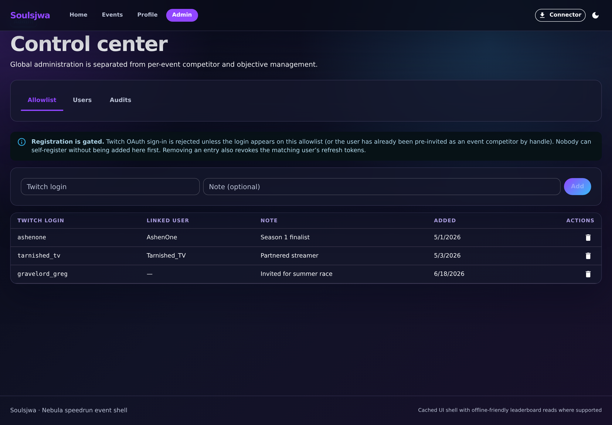
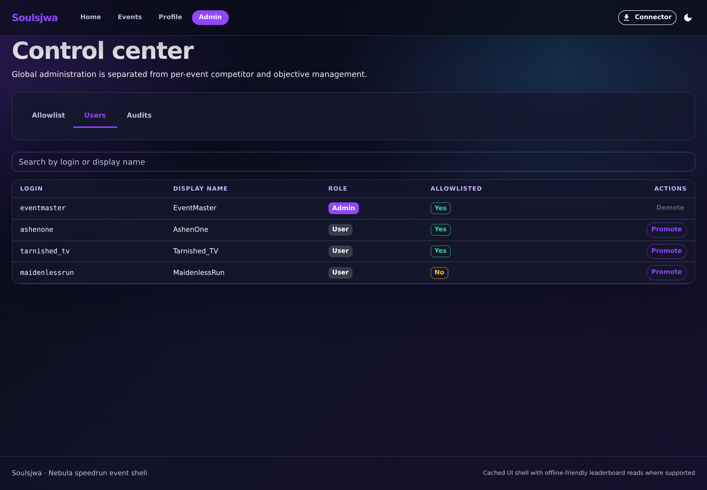
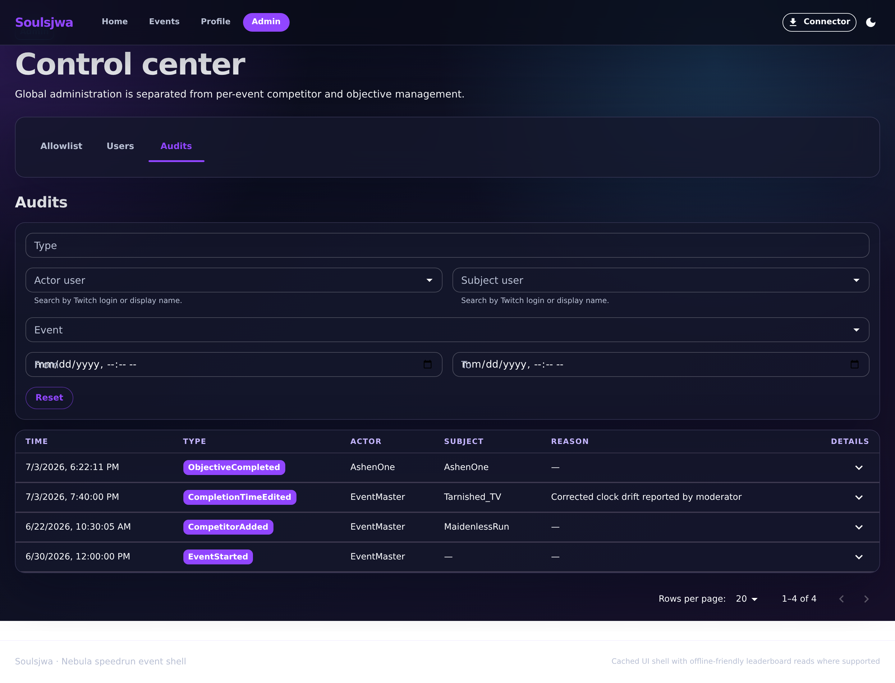

# Admin settings

The admin area is a dedicated control center for global settings and audit
visibility. Event-scoped competitors, moderators, games, objectives, and
completion work stay on event detail pages; only cross-cutting administration
lives here. Navigation uses the same router-driven tabs as the event detail
page, so each section is URL-addressable (`/admin`, `/admin/users`,
`/admin/audits`).

## 1. Allowlist

The Allowlist tab controls which Twitch logins may register.

**Clickable actions**

- **Add login** — allow a new Twitch handle.
- Per entry: **Remove**.

## 2. Users

The Users tab manages existing users and their roles.

**Clickable actions**

- **Role** control per user — promote/demote (e.g. User ↔ Admin).
- Search / filter the user list.

## 3. Audits

The Audits tab shows system-wide audit activity with filtering controls, giving
admins a global view of who changed what.

**Clickable actions**

- **Filter** controls — narrow by actor, action, or entity.
- **Pagination** through audit entries.

