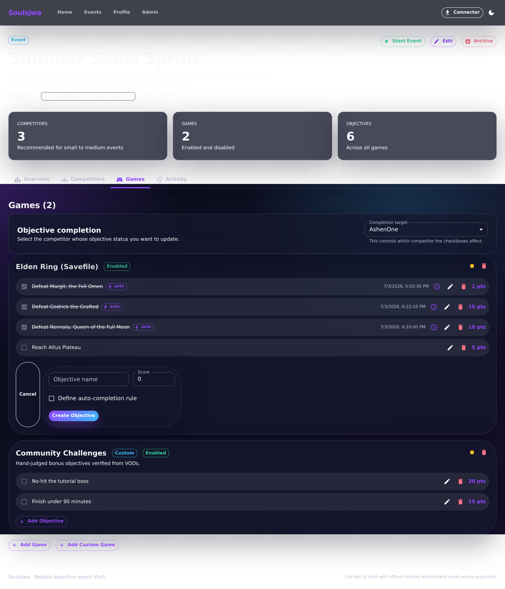
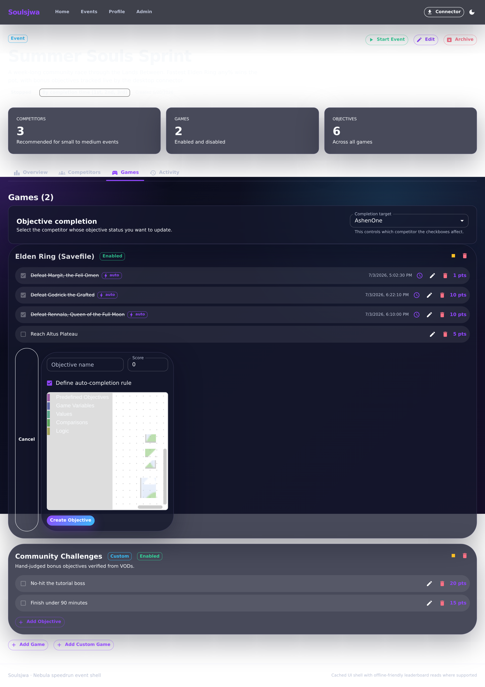
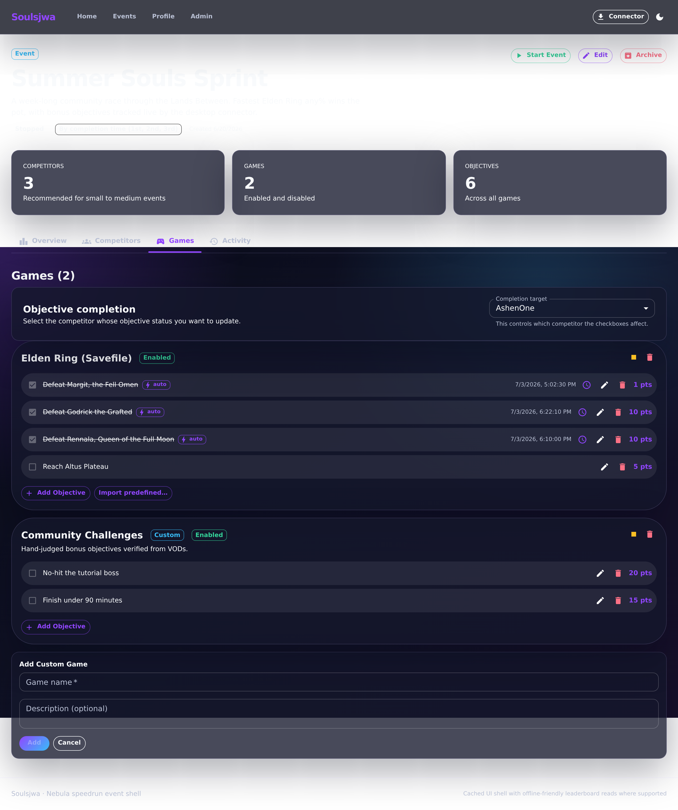

# Adding custom objectives

Beyond the predefined catalog, event owners can hand-author objectives per game
and — for connector-supported games — attach a visual auto-completion rule.

## 1. Create an objective

**Add Objective** opens a focused, properly sized dialog so the Games tab stays
readable and the rule builder has room to breathe.

**Clickable actions**

- **Name** and **Score** fields.
- **Define auto-completion rule** checkbox (connector-supported games only) —
  reveals the rule builder and widens the dialog.
- **Cancel** / **Create objective**. Existing objectives open in a focused edit
  dialog.

## 2. Build an auto-completion rule

For connector-supported games the Blockly-based rule builder composes a rule
from typed blocks inside the dialog. The toolbox groups **Predefined
Objectives**, **Game Variables**, **Values**, **Comparisons**, and **Logic** so
rules stay valid.

**Clickable actions**

- Drag blocks from the toolbox categories onto the canvas.
- Connect comparison/logic blocks to game variables and values.
- Zoom / delete controls on the workspace.

## 3. Add a custom game

**Add Custom Game** opens a dialog for titles not in the seeded catalog. Custom
games are not connector-supported, so they take manually toggled objectives
only.

