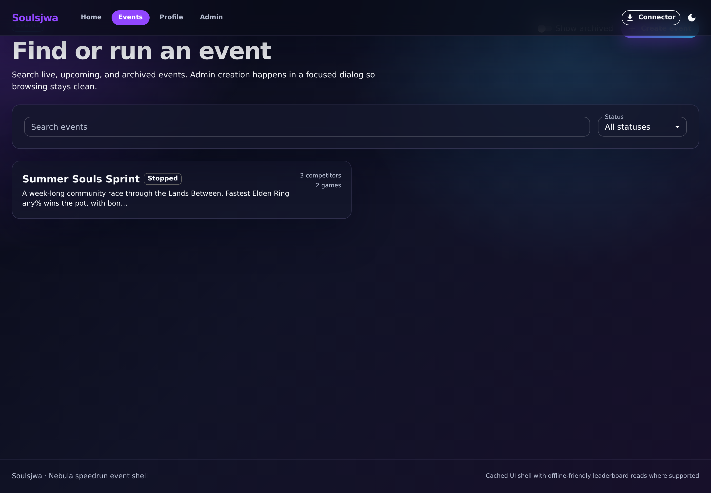
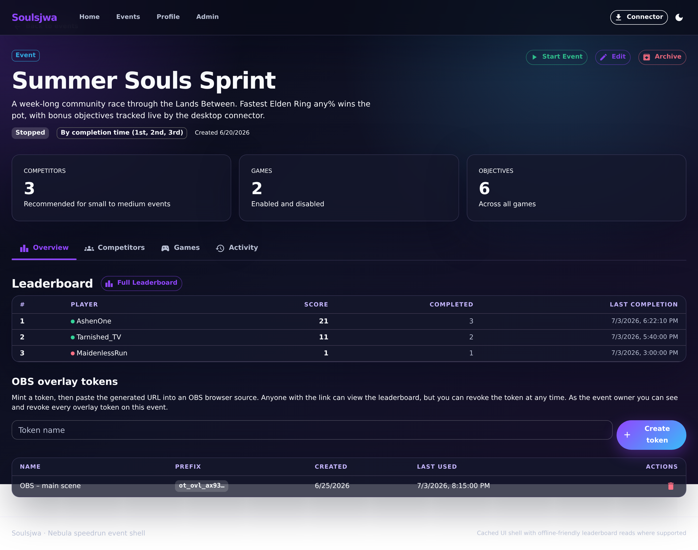
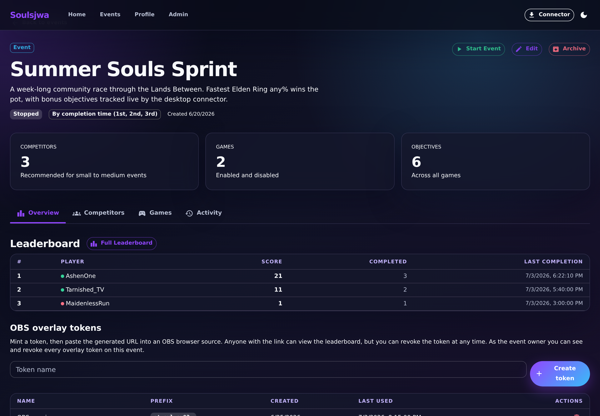
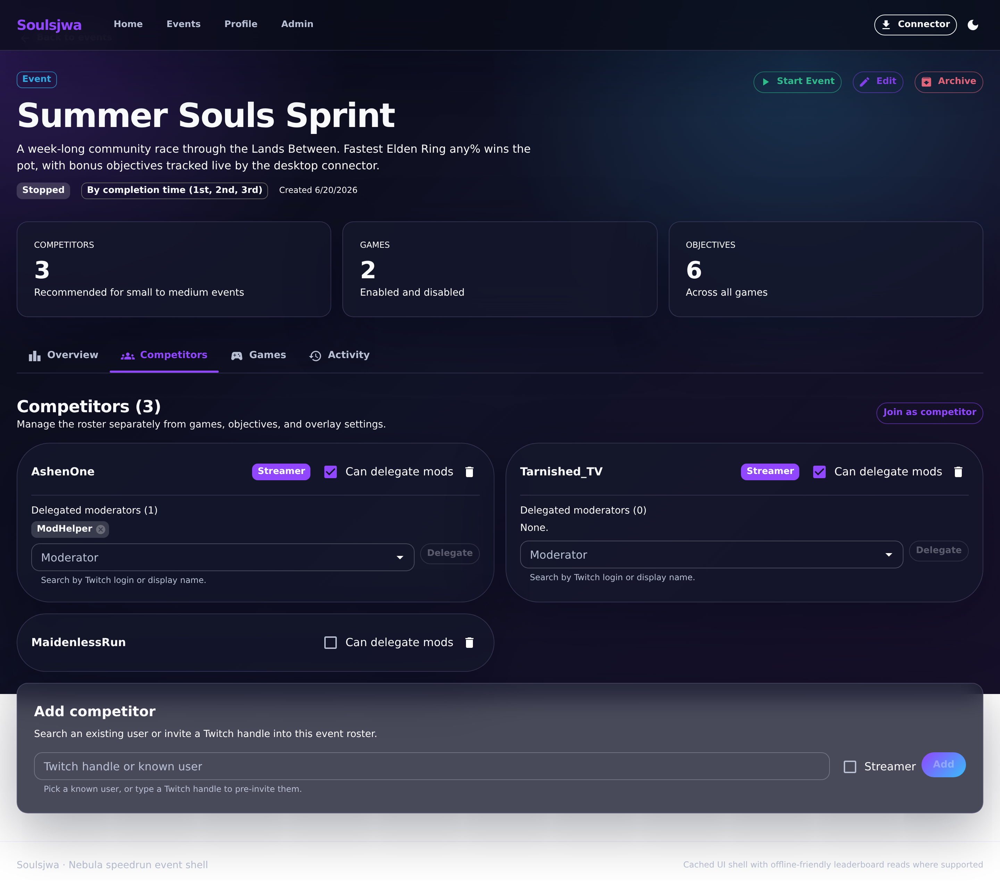

# Creating and managing an event

This flow covers the full lifecycle of an event: browsing the events list,
creating an event, and managing it from the event-detail page (overview,
editing, lifecycle actions, competitors, and delegated moderators).

## 1. Browse events

The Events page lists live, stopped, and archived events as responsive cards.

**Clickable actions**

- **Search events** — free-text filter (debounced).
- **Status** dropdown — `All statuses`, `Live`, `Stopped`, `Archived`.
- **Show archived** switch — admin-only, includes archived events.
- **Create event** — admin-only, opens the create dialog.
- **Event card** — navigates to the event detail page. Admins get an inline
  **Unarchive** action on archived cards.
- **Pagination** — Previous / Next when more than one page exists.

## 2. Create an event

The **Create event** button opens a focused dialog so browsing stays clean.

**Clickable actions**

- **Event name** (required) and **Description** fields.
- **Cancel** / **Create**.

## 3. Event overview

The detail header shows the status chip, tie-break mode, and creation date,
with summary stat cards and router-driven MUI tab navigation (Overview,
Competitors, Games, OBS Tokens, Activity). The overview embeds a scoreboard
preview.

**Clickable actions**

- **Back to events**.
- **Start Event** / **Stop Event** (owner) — see [Starting an event](start-event.md).
- **Edit** (owner/admin) — opens the edit dialog.
- **Archive** (owner) / **Unarchive** (admin).
- **Overview / Competitors / Games / OBS Tokens / Activity** tabs.
- **Full Scoreboard** — opens the [scoreboard](objective-completion.md).

## 4. Edit an event

The **Edit** button opens a dialog to change the name, description, and
tie-break mode (`By completion time` vs `Shared place`).

## 5. Competitors and delegated moderators

The Competitors tab manages the roster independently of games and objectives,
showing each competitor as a scannable card.

**Clickable actions**

- **Join as competitor** — eligible users self-join.
- **Add competitor** — sits next to **Join as competitor** and opens a dialog to
  pick a known user or type a Twitch handle to pre-invite, with a **Streamer**
  checkbox, then **Add**.
- Per competitor: **Streamer** (can-delegate-mods) switch and **Remove**.
- **Delegated moderators** — search a user and **Delegate**; remove a moderator
  chip with its **✕**.

## 6. OBS overlay tokens

The **OBS Tokens** tab (visible to the owner and competitors) manages the
tokens that gate the OBS browser-source overlay endpoint. Each token is listed
by name with a **Revoke** action.

**Clickable actions**

- **Create token** — opens a dialog. On create, the token URL is revealed
  **exactly once** with an overlay-link builder and a copy button; the raw
  secret is never shown again.
- Per token: **Revoke** (owner/admin can revoke any token; competitors only
  their own).

See [OBS overlay](obs-overlay.md) for the overlay itself.
