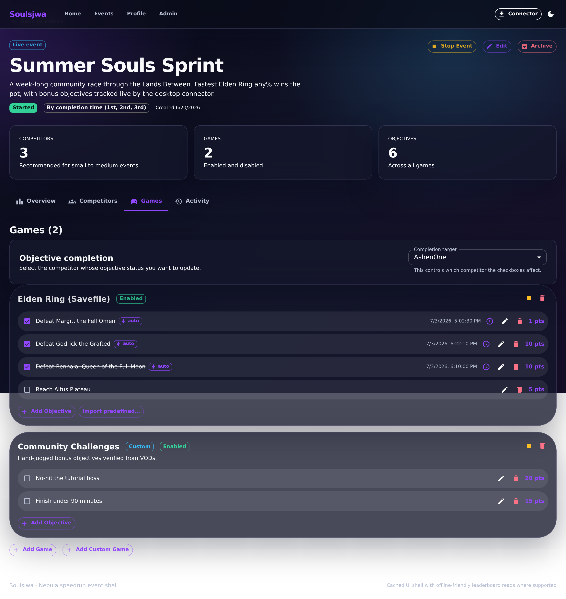
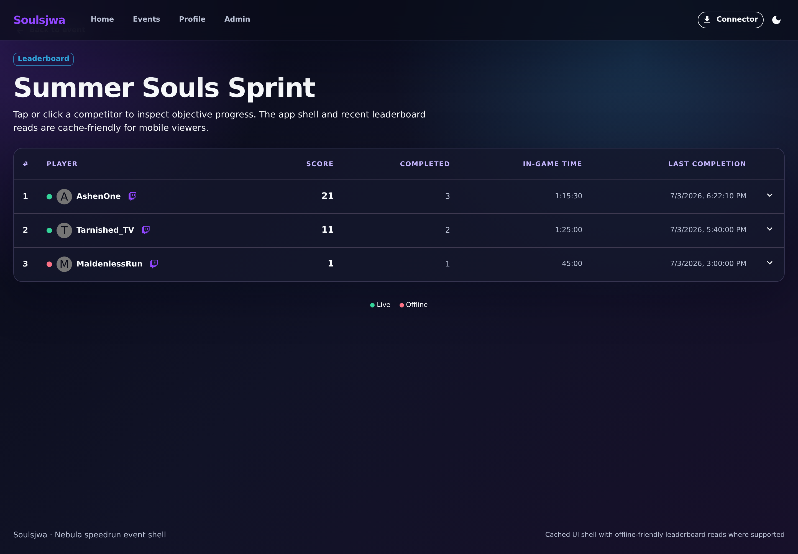
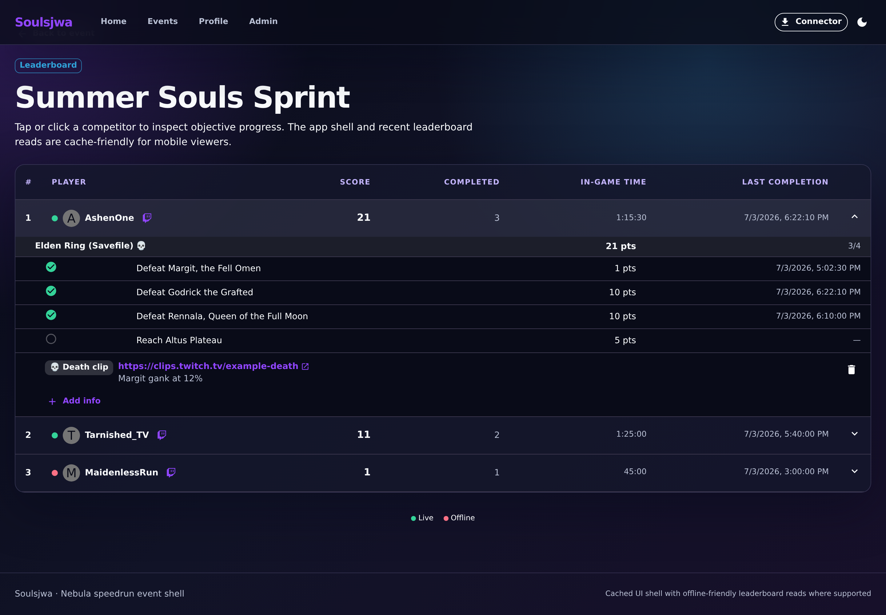

# Completing and uncompleting objectives

When an event is live, authorized users mark objectives complete, which updates
completion timestamps and recomputes the scoreboard. The target picker only
lists competitors the viewer may update: **self** for competitors, delegated
**streamer** competitors for moderators, and **all** competitors for admins.

## 1. Toggle objectives

The objective-completion section lists each game's objectives with a checkbox
per target competitor.

**Clickable actions**

- **Competitor / target** picker — choose whose progress to edit.
- **Objective checkbox** — mark complete (records a completion time) or toggle
  again to uncomplete.
- Completed rows show a checked box, timestamp, and strike-through text.

## 2. Scoreboard

The full scoreboard ranks competitors by score, applying the event's tie-break
mode (completion time or shared place). Each row's top-level metrics are
**Total score**, **Score / game**, and **objectives completed**.

**Clickable actions**

- **Row** — expand a competitor to reveal their per-game breakdown.
- Live status and score totals update as objectives are toggled.

## 3. Per-game breakdown

Expanding a row groups the competitor's objectives by game. Each game shows a
per-game overview (**score**, **objectives completed**, **last completed**),
followed by a per-objective list (**score** and **completion time**) plus any
attached competitor info (such as a death/clip link).

