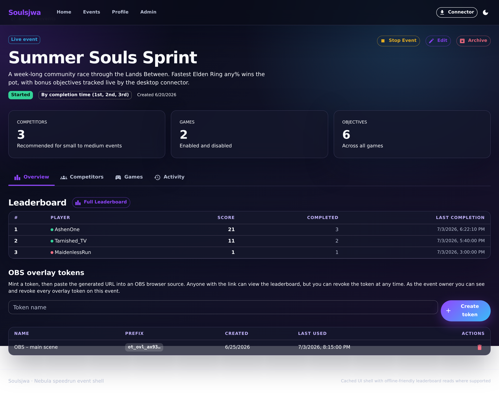
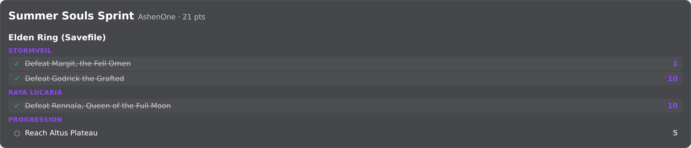

# OBS overlay

The OBS overlay is a token-gated browser-source view for streamers. It renders
without the main application chrome and shows ranks, live status, score totals,
and each competitor's own objective progress in an overlay-friendly layout.

## 1. Manage overlay tokens

The event overview hosts the overlay-token manager, which mints scoped tokens
for browser sources.

**Clickable actions**

- **Create token** — mint a new overlay token.
- Per token: **Copy** the URL, and **Revoke** to invalidate it.

## 2. Build the overlay link

The link builder composes the browser-source URL from display options so the
overlay can be tuned per scene.

**Clickable actions**

- **View** (e.g. objectives), **Pin** a competitor, **Show title / progress /
  pagination**, **Highlight**, **Animate**, **Theme**, **Page size**, **Cycle**,
  and **Refresh** controls.
- **Copy** the generated URL for OBS.

## 3. Overlay render

The overlay route (`/events/:id/overlay?token=…`) renders chrome-free for OBS,
showing ranks, live status, totals, and each competitor's objective progress.
The main application shell is PWA-enabled, but the overlay intentionally stays
chrome-free.

