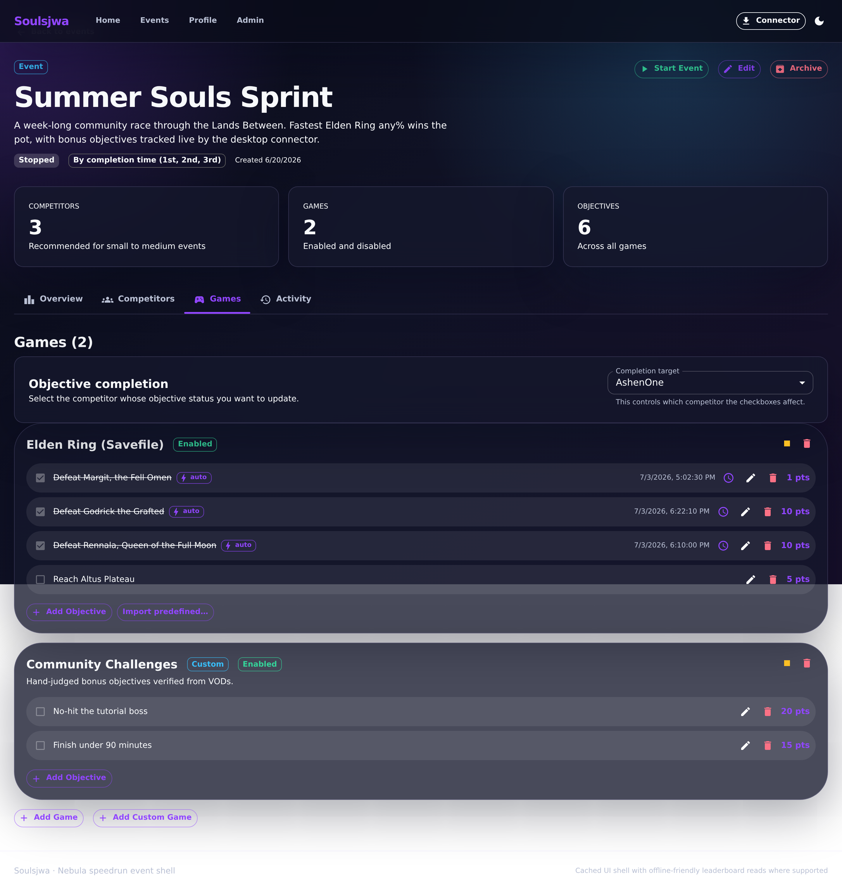
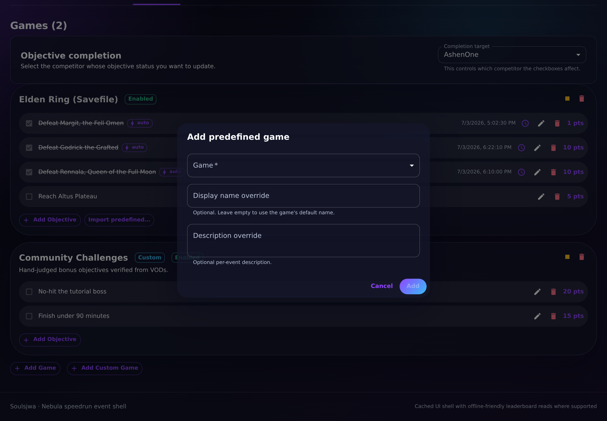
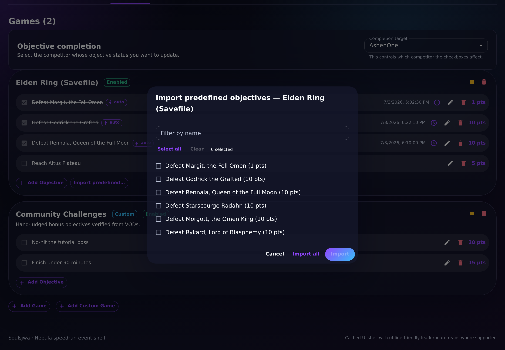

# Adding predefined objectives

Event owners import curated objectives for connector-supported games straight
from the event's **Games** tab, so a full soulslike checklist can be seeded in
seconds instead of typed by hand.

## 1. Games and objectives

The Games tab lists each attached game with its objectives, scores, and owner
controls.

**Clickable actions**

- **Add game** — opens the add-game dialog.
- Per game: **Import predefined objectives**, **Add Objective**, and per-row
  **Edit** / **Delete**.

## 2. Attach a game

The **Add game** dialog picks from the seeded catalog (Dark Souls, Dark Souls
II, Dark Souls III, Sekiro, Elden Ring). All seeded games are
connector-supported.

## 3. Import predefined objectives

The import dialog lists the catalog of predefined objectives for the selected
game.

**Clickable actions**

- **Filter** field — narrow the visible objectives.
- **Select** / **deselect** individual objectives (checkboxes).
- **Clear selection**.
- **Import selected** — import only the checked objectives.
- **Import all** — import every predefined objective for the game.
- **Cancel**.

