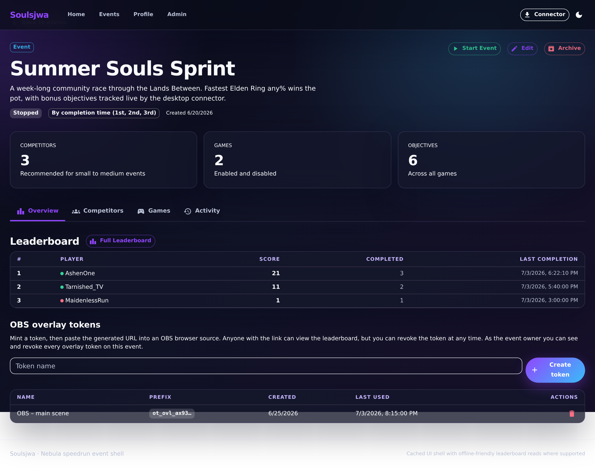
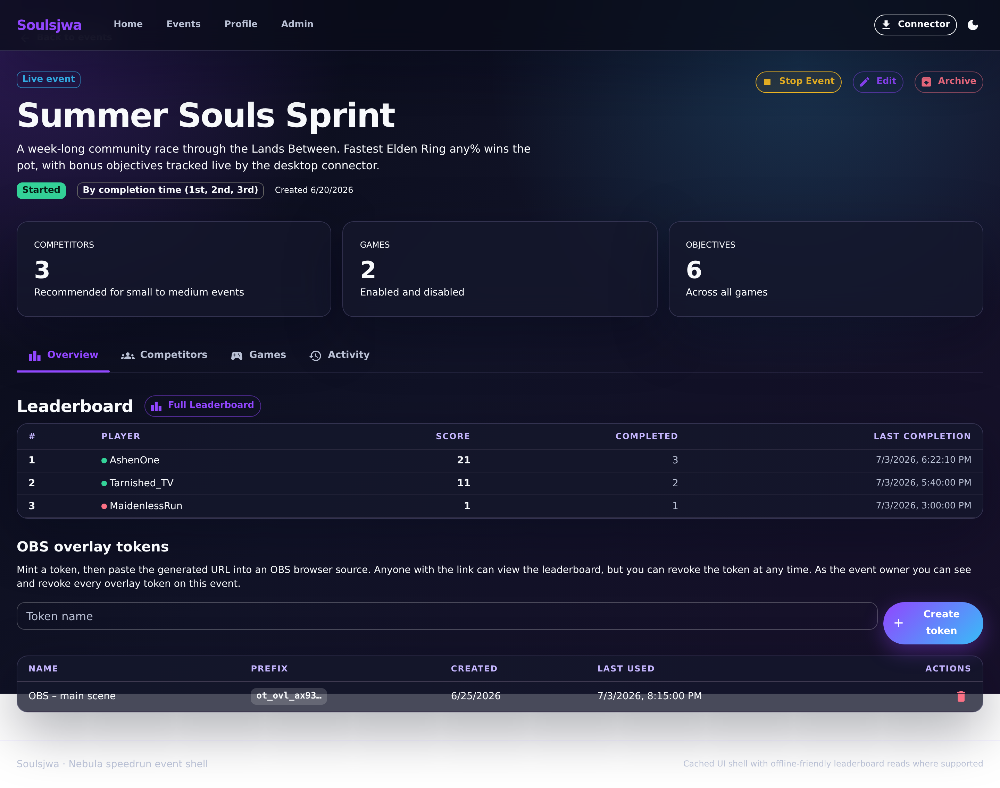
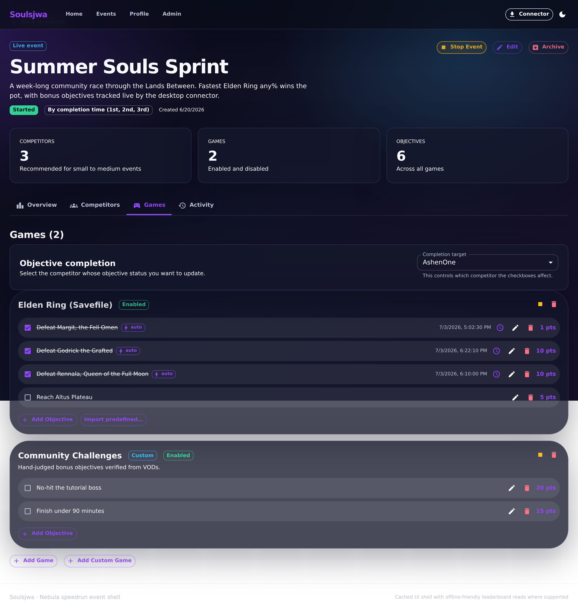

# Starting an event

Starting an event locks it into its live state: the status chip flips to
**Live**, competitors can complete objectives, and the scoreboard begins
tracking scores and completion times.

## 1. Before start

A stopped event shows a **Stopped** status chip. The owner sees the **Start
Event** action; objective completion is disabled until the event is live.

**Clickable actions**

- **Start Event** (owner) — transitions the event to live.
- **Edit**, **Archive**, and tab navigation remain available.

## 2. After start

Once live, the status chip reads **Live** and the owner action becomes **Stop
Event**. The objective-completion controls and scoreboard become active.

**Clickable actions**

- **Stop Event** (owner) — returns the event to the stopped state.
- **Full Scoreboard** and OBS overlay tokens are now meaningful.

## 3. Games are live

With the event live, each game's objectives can be toggled complete by
authorized users, feeding the scoreboard in real time.

