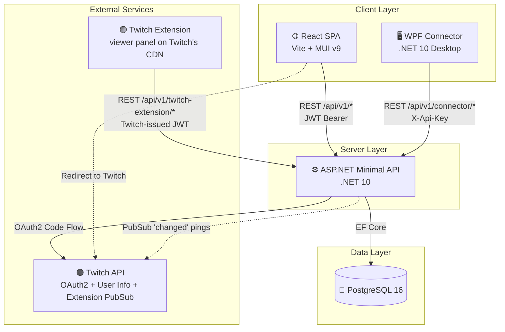
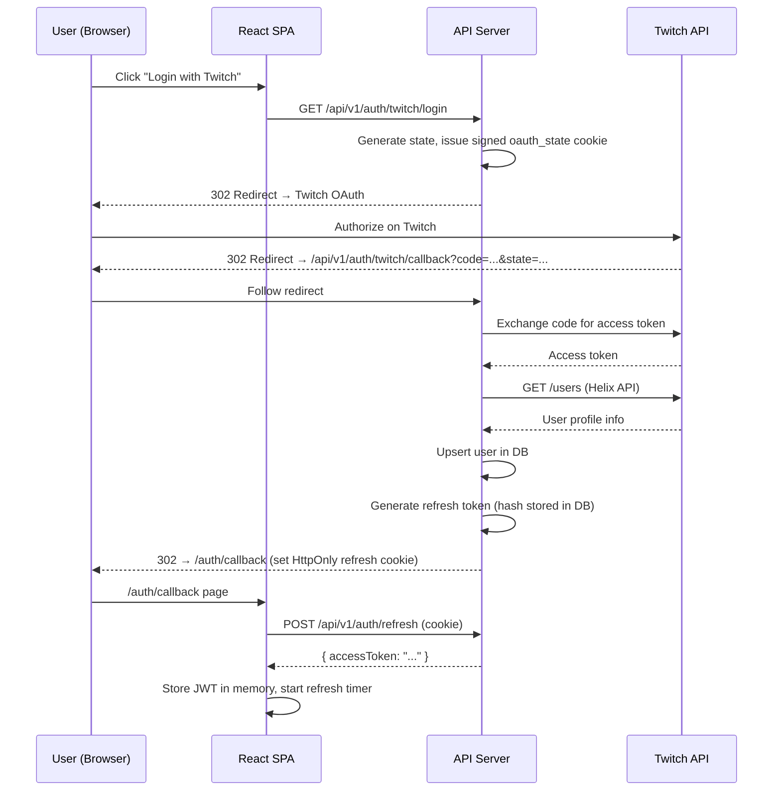
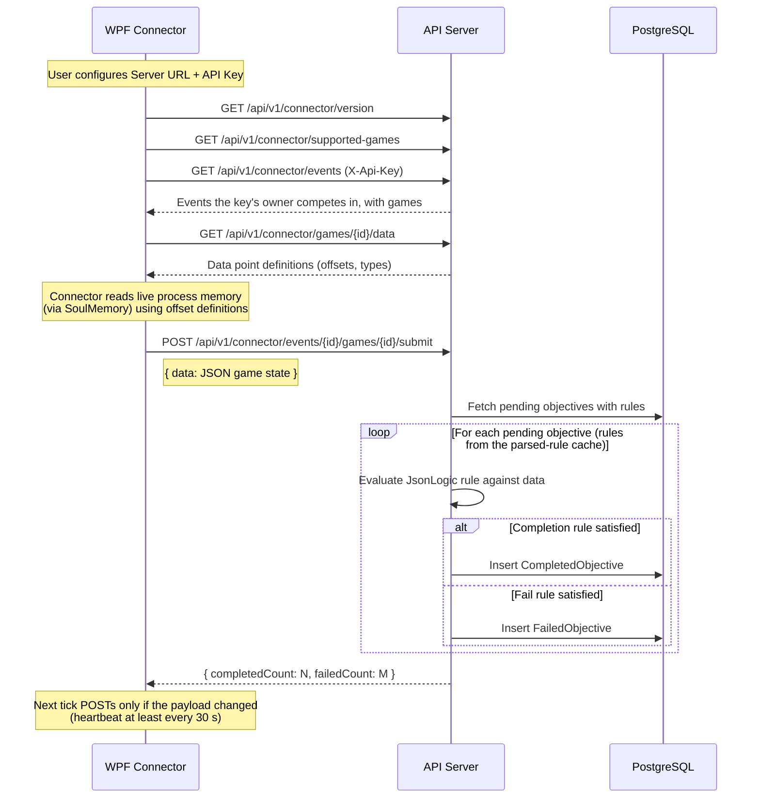
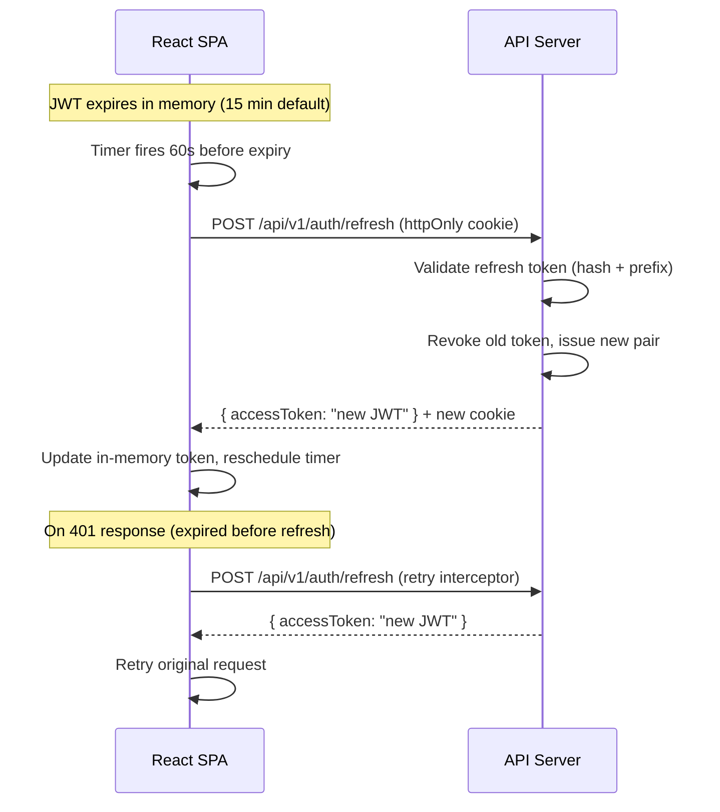
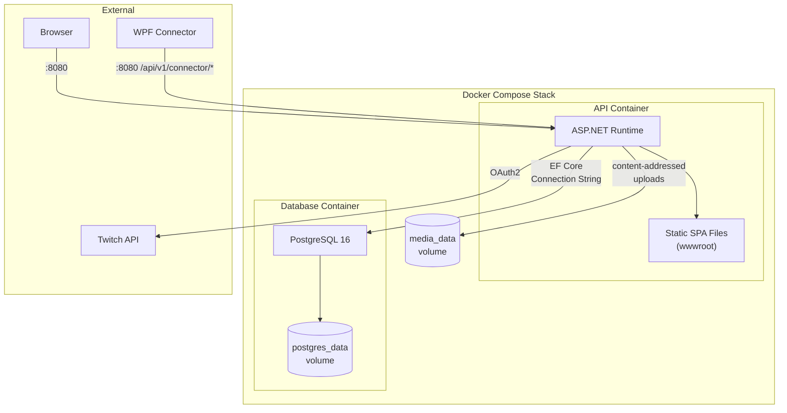
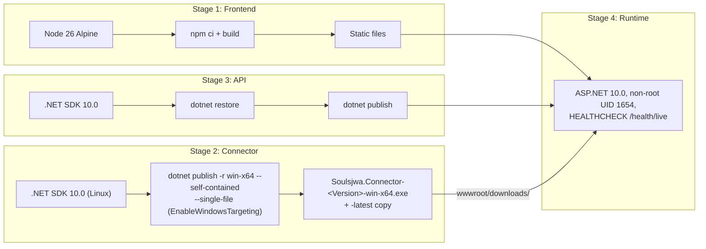

# System Overview

## High-Level Architecture

The Twitch extension ([twitch-extension.md](twitch-extension.md)) is optional: its routes exist only when `TwitchExtension:ClientId` and `:Secret` are configured, and push pings only when `TwitchExtension:OwnerUserId` is too.

## Authentication Flow

## Connector Data Submission Flow

## Token Refresh Flow

## Deployment Architecture

## Dockerfile Build Pipeline

## Security Architecture

| Layer | Mechanism | Details |
|-------|-----------|---------|
| **Authentication** | Twitch OAuth2 | Code flow with signed state cookie |
| **Access Tokens** | JWT Bearer | 15-min lifetime, HMAC-SHA256, stored in memory only |
| **Refresh Tokens** | httpOnly Cookie | 30-day lifetime, SHA256-hashed in DB, prefix-based lookup |
| **API Keys** | `X-Api-Key` header | `sk_` prefix, SHA256-hashed, optional expiry, revocable |
| **Rate Limiting** | Tiered | Global 100/min (auth'd) & 60/min (anon); 20/min on auth; 120/min on connector; 40/min per viewer on the Twitch extension |
| **Twitch extension tokens** | Second JWT bearer scheme | `TwitchExtension` scheme verifies the JWT Twitch issues per viewer (HS256 over the base64-decoded extension secret, several secrets allowed for rotation, 30 s skew, inbound claim mapping off); only the `/twitch-extension` group accepts it; the channel is always the token's `channel_id` claim; broadcaster routes require `role = broadcaster`; saving settings additionally requires a Soulsjwa account with the channel's Twitch id |
| **Response Compression** | Gzip + Brotli | Enabled for HTTPS responses |
| **Request Correlation** | Correlation ID middleware | Adds/propagates `X-Correlation-Id` for logs and diagnostics; an inbound value is accepted only if it is ≤128 chars and matches `^[A-Za-z0-9_.:-]+$` — anything else (oversized, malformed, or containing control characters like CR/LF) is discarded and a fresh id generated instead, so untrusted client input never reaches logs or the response header unvalidated |
| **Output Caching** | Tag-based | Score/scoreboard cached 1h; overlay scoreboard cached 5s per token; Twitch extension board cached 5s per channel (re-enabled for bearer-authenticated requests by `PerTwitchChannelCachePolicy`, safe because authentication runs before the cache) with a strong `ETag`; caches evicted on objective, live-status, and competitor-info changes; when push is configured the cache store is wrapped so a scoreboard-tag eviction also sends a PubSub ping |
| **CORS** | Configurable origin | Default: `http://localhost:5173`; a second named policy allows only the Twitch extension's `https://<clientId>.ext-twitch.tv` origin (bearer auth, no credentials) on the extension routes |
| **Headers** | Security headers | CSP, X-Content-Type-Options, X-Frame-Options, Referrer-Policy |
| **OAuth state** | Signed cookie | Short-lived (10 min) DataProtection-protected `oauth_state` cookie — no server-side session |
| **Twitch client resilience** | Timeout + retry + circuit breaker | 10s total request timeout (`Twitch:ClientTimeoutSeconds`), 4s per attempt (`Twitch:AttemptTimeoutSeconds`), up to 2 retries (`Twitch:RetryAttempts`) — retried only for the idempotent `GET /helix/users`, never for the single-use `POST /oauth2/token` code exchange; circuit breaker opens after ≥4 requests in a 30s window with a ≥50% failure ratio and stays open 15s. A failed exchange or a malformed/oversized user-info response redirects to `/auth/callback?error=twitch_unavailable` instead of a bare 500. |
| **Swagger** | Dev-only | Gated behind `IsDevelopment()` |
| **Secrets** | Environment vars | `Jwt:Secret` required; never committed to source |
| **Site Theme** | No remote resources | Background is an uploaded `MediaAsset` id, never a URL (no SSRF surface); fonts come from a server-side allowlist, no remote `@font-face`; palette colours are validated `#rrggbb` and WCAG AA (4.5:1) contrast-checked against each mode's `Default` slot; delivered to the frontend as MUI palette values only — never an injected `<style>` or `dangerouslySetInnerHTML`; every `PUT /theme` is audit-logged with the full before/after theme |
